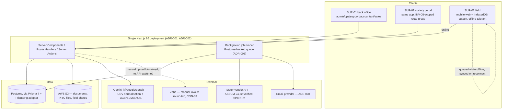

# Architecture & Technical Decisions
**Product:** FirsThing Platform · **Phase:** 7 (skill's Phase 9 — Architecture) · **Status:** Draft
**Last updated:** 2026-08-13 · **Mode:** Ecosystem

> **Numbering:** this is *this blueprint's* Phase 7. It follows the skill's
> `references/phase-09-architecture.md` template. See `00-intake.md` §11 for the offset between
> this project's phase numbers and the skill's reference filenames.

> **Inputs re-read before drafting:** `00-intake.md` (constraints §3, invariants §4, scale §7),
> `04-flows-system-map.md` (domain model §4, state machines §5, cross-surface contracts §6,
> external integrations §7, discovered features §8), `docs/backlog.yaml` (capabilities, releases,
> gates, spikes), `PROJECT_CONTEXT.md` (existing working foundations that survive the rebuild —
> NextAuth v5, Prisma 7, S3 presigned-PUT, Gemini Interactions API, admin/permission model).

---

## 1. Non-functional requirements

Targets are numbers, each traceable to a constraint, invariant, or flow rather than invented.
Where a flow names a timing rule (an SLA, a countdown, a window), that rule is a **product**
requirement already fixed in Phase 0 — the NFR below is the **system's** obligation to honor it
accurately, which is a narrower, architectural claim.

| ID | NFR | Category | Target | Measured by | Source | Applies to |
|----|-----|----------|--------|-------------|--------|-----------|
| NFR-01 | Back-office availability | availability | 99.5% monthly, business hours weighted | Uptime probe against `/api/health` | CON-33 (month-end billing bottleneck), GOAL-01 | SUR-01 back office |
| NFR-02 | Society portal availability | availability | 99% monthly | Same probe, portal route group | CON-46 (email is the designed backstop, so portal downtime is degraded, not critical) | SUR-01 portal |
| NFR-03 | Financial-record durability | durability | RPO ≤ 15 min, RTO ≤ 4h, restore drill quarterly | Postgres WAL/continuous backup + a documented restore test | INV-02, INV-03 | `MeterReading`, `Benchmark`, `MonthlyCalculation`, `Invoice`, `SavingsReport`, `Payment` |
| NFR-04 | Provenance completeness | compliance | 100% of writes to the tables in NFR-03 carry their source/version inputs | Code-path test asserting no write path bypasses the provenance field set | INV-02, GATE-01 | Billing & Calculation Engine |
| NFR-05 | Tenancy isolation | security | 0 cross-society reads/writes in a running automated test suite that probes every Server Action/Route Handler with a foreign `societyId` | CI test suite (new, Phase 8 work) | INV-05, GATE-03 | every component with society-scoped data |
| NFR-06 | Gate-pass departure latency | availability | A `submitted` gate pass auto-resolves to `provisional` within 60s of the 30-minute mark if unapproved | Sweep-job log timestamps vs. submission time | CON-40, XS-04/XS-05 | Field Operations, Background Job Runner |
| NFR-07 | SLA escalation accuracy | performance | Escalation raised within 5 minutes of a ticket/thread/visit SLA deadline passing | Alert-created-at minus deadline, sampled monthly | CON-27, CON-35, XC-03 | Service Desk, Field Operations, Background Job Runner |
| NFR-08 | Suspension-timer correctness | security/compliance | 0 suspensions fired against payment data older than the same calendar day | Automatic check inside the suspension job; any violation is a P1 bug, not a tuning issue | CON-13 | Billing & Calculation Engine, Background Job Runner |
| NFR-09 | Field offline durability | durability | 0 loss of locally-queued, not-yet-synced field captures across an app close/device restart, for up to 7 days offline | Outbox persistence test (IndexedDB survives reload) | XC-02, ASSUM-27 | SUR-02 field client |
| NFR-10 | Notification timeliness & bounce handling | performance/security | Send attempted within 5 min of the triggering event; a hard bounce on a contractually-weighted event halts its dependent clock within 1h | `NotificationDelivery` timestamps vs. event timestamp | CON-39, FLOW-X2 step 6 | Notification Service |
| NFR-11 | Portfolio scale | performance | 200 societies, ~800 meters, sub-daily vendor fetch (≤4×/day, ~3,200 calls/day), 800+ monthly CSV uploads, <1,000 concurrent users — no architecture change required at this ceiling | Load test against seeded 200-society fixture before GOAL-07 is declared reached | §7 scale table, GOAL-07 | whole system |
| NFR-12 | Field media throughput | performance | A 40-photo pump audit (ASSUM-26: ≤400KB/photo) completes upload over a 3G-equivalent link within one field session without blocking the next checklist step | Manual field test once built, per ASSUM-26's own validation plan | ASSUM-26 | SUR-02 field client, S3 |
| NFR-13 | Session boundaries | security | Field sessions: 7-day absolute lifetime, local cache purged on expiry or explicit sign-out (ASSUM-27). Portal sessions: 90-day remembered device (CON-46). Admin/back-office sessions: 24h idle timeout | Auth config, verified in code review | CON-46, ASSUM-27 | NextAuth session layer |
| NFR-14 | Dashboard / chart latency | performance | Portfolio dashboard (CAP-08) p95 ≤ 2s at 200-society scale; per-circuit deviation chart (FLOW-11 step 1) p95 ≤ 1.5s over full reading history | Server-timing headers sampled in staging against the 200-society fixture | GOAL-08, JTBD-01 | Portfolio Dashboard, Billing & Calculation Engine |
| NFR-15 | No in-app tax computation | compliance | 0 GST/tax figures computed or asserted by the app; the app only stores and displays what Zoho produced | Code review gate — no tax-rate constant or calculation anywhere in the codebase | CON-33, ASSUM-10 | Billing & Calculation Engine |

---

## 2. System overview



**Why this shape.** The three surfaces named in Phase 4 (§2 of `00-intake.md`, §3 of the flows
doc) are one deployable, not three services. The society portal is explicitly "a role-scoped
projection of SUR-01... separated by INV-05's tenancy boundary rather than by deployment"
(flows §3) — that sentence is the whole argument against splitting it out. SUR-02 is a harder
case (it has a real architectural asymmetry — offline tolerance, XC-02) but the decision is still
one app: see ADR-002. Splitting into services would buy isolation this team doesn't need yet
(solo owner + Claude Code, no fixed deadline, <1,000 concurrent users at 2 years — NFR-11) at the
cost of a distributed-systems tax (network calls where function calls would do, two deploys to
keep in sync, a second place auth/tenancy bugs can hide) this team can't afford to carry. The one
genuinely async, failure-tolerant boundary in the system — everything the vendor API, the email
provider, and time-driven state machines (SLA timers, the suspension countdown, the gate-pass
provisional-release timeout) touch — is pulled into a single background job runner (ADR-003)
rather than scattered across ad hoc `setTimeout`s or cron entries, because those are exactly the
paths where INV-02/INV-03/CON-13's guarantees would otherwise quietly rot.

**What this deliberately is not:** no microservices, no message broker, no separate mobile app
build/release train (CON-46, ASSUM-12), no GraphQL layer, no separate BFF per surface. Every one
of those is a real pattern with real justifications elsewhere — none of the justifications apply
at this team's size and this system's request volume.

---

## 3. Components

Grouped by the capability map (`backlog.yaml`'s `capabilities:`), not by framework layer. All
components share one tech stack unless noted: Next.js 16 Server Components/Route
Handlers/Server Actions, Prisma 7 against Postgres, deployed as one process.

| ID | Component | Responsibility | Owns capabilities | Owns data | Tech (if not the shared default) | Owner |
|----|-----------|---------------|-------------------|-----------|------|-----------|
| COMP-01 | Deal & Pipeline Engine | Runs the lead→survey→commissioning→offer→agreement→installation sequence; enforces CON-24's one-pipeline-per-(society, service line) rule and the single skippable-stage exception (CON-24/CON-25) | CAP-15, CAP-16, CAP-18, CAP-19, CAP-20, CAP-07, CAP-21 | `Pipeline`, `Offer`, `Document`, `Contract`, `Amendment`, `InstallationBatch`, `BatchReview` | — | PER-01/PER-07 tooling |
| COMP-02 | Circuit & Metering Registry | The per-circuit-per-light-type spine (CON-11); commissioning state machine (CON-19/CON-20) | CAP-01, CAP-02 | `Circuit`, `Meter`, `Benchmark`, `BenchmarkRescaleEvent` | — | PER-04 tooling |
| COMP-03 | Reading Ingest Pipeline | Both ingest paths (CON-43), AI-assisted normalisation, reconciliation (FEAT-107), anomaly/coverage gates (INV-09, CON-12) | CAP-03 | `RawReadingFile`, `MeterReading`, `ReadingConflict`, `IngestAlert` | Gemini for CSV shape inference; vendor API client behind an interface (ADR-010) | PER-01 tooling |
| COMP-04 | Billing & Calculation Engine | The monthly savings/compliance calculation, deviation review, invoice/report generation and release gate | CAP-04, CAP-05, CAP-06 | `MonthlyCalculation`, `CircuitFeeLine`, `DeviationReview`, `SavingsReport`, `Invoice`, `Payment` | — | PER-01/PER-08 |
| COMP-05 | Portfolio Dashboard | Read-only aggregation across every other component (CAP-08); owns no data of its own — a real architectural property, not an oversight | CAP-08 | — (reads) | Materialised/cached query layer for NFR-14's latency target | PER-01/management |
| COMP-06 | Field Scheduling & Operations | The one reusable scheduler (CAP-17) plus routine inspections (CAP-11); implements CON-44's team/area-claim model | CAP-17, CAP-11 | `FieldVisit`, `FieldVisitParticipant`, `FieldVisitAreaClaim`, `Inspection` | — | PER-01/PER-03/PER-04 |
| COMP-07 | Service Desk | Ticketing and support threads, sharing one SLA/escalation shape (CON-27, CON-32, CON-35) | CAP-09, CAP-12 | `Ticket`, `TicketSubTask`, `SupportThread`, `SupportMessage` | — | PER-01/PER-02 |
| COMP-08 | Hardware & Spare Inventory | On-site spare state plus the returns pool (CON-26, CON-36) and pump-room asset audit (CON-28c) | CAP-10 | `SpareUnit`, `PumpAsset` | — | PER-03 |
| COMP-09 | Account, Auth & Society Management | Society records incl. governance profile (CON-28a), portal accounts and authority (CON-45/FEAT-108), admin/permission model (INV-01) | CAP-13, CAP-14 | `Society`, `SocietyContact`, `Profile`, `AdminUser` | NextAuth v5 Credentials provider | PER-01 |
| COMP-10 | Notification Service | The single owner of "is notified" across all 89+ briefs (CON-39); event catalogue, templates, delivery log | CAP-22 | `NotificationEventDefinition`, `NotificationTemplate`, `NotificationDelivery` | Email provider client (ADR-008) | system |
| COMP-11 | Background Job Runner | Cross-cutting infrastructure, not a capability itself: scheduled vendor fetch, SLA/escalation sweeps, suspension countdown, gate-pass provisional-release timeout, notification retry/backoff | — (infrastructure) | `Job` (queue table) | Postgres-backed queue (ADR-003) | system |
| COMP-12 | SUR-02 Field Client | The offline-tolerant browser client: local capture, an IndexedDB outbox, sync-on-reconnect | — (client of COMP-01/02/06/08) | (client-local only: IndexedDB outbox, purged per NFR-13) | Service worker + IndexedDB, no native build | PER-03/PER-04 |

**Failure characteristics worth naming explicitly, per component:**
- COMP-04 (Billing Engine) is the one component where a bug has *financial* blast radius against
  INV-02/INV-03 — it is the only component whose writes are also gated by NFR-04's completeness
  check and are never mutated in place once released (ADR-005).
- COMP-05 (Portfolio Dashboard) owning no data of its own means it can be slow or briefly wrong
  without corrupting anything — the correct place to spend latency budget loosely and correctness
  budget on everything upstream of it.
- COMP-11 (Job Runner) is a new single point of coordination that doesn't exist in the current
  codebase at all; its own failure modes are analysed in §11.
- COMP-12 (Field Client) is the only component whose "down" state (no network) is a *designed,
  routine* condition (XC-02) rather than an incident — every contract it participates in (§4)
  reflects that.

---

## 4. Interface contracts

Every cross-surface contract from `04-flows-system-map.md` §6 (XS-01..XS-12), specified as a
concrete engineering contract. **All twelve are internal contracts inside one deployment**
(per §2) — "protocol" below means the mechanism used *inside* the Next.js app, not a
service-to-service network boundary. SUR-02's offline requirement (XC-02) is why Route Handlers
(a stable JSON contract a client-side retry queue can call) are used for these, rather than
Server Actions (which are bound to a live RSC render and don't suit a queued/retried offline
caller).

### CONTRACT-01 — Visit assignment (XS-01)
- **Producer → consumer:** SUR-01 (PER-01) → SUR-02 · **Protocol:** Route Handler, HTTPS/JSON, session-authenticated · **Sync/async:** async (push via notification + poll on app open)
- **Payload:** `{ visitId, type, sourceRef: {type, id}, societyId, proposedAt, participants: [] }`
- **Errors:** `409` if the target society is suspended (FLOW-12) and the visit type is field-servicing; `403` on a non-field-role caller
- **Idempotency:** `visitId` is server-generated and unique; re-delivery of the same push is a no-op client-side
- **Ordering:** none required — visits are independent
- **Retry policy:** notification retried per COMP-10's backoff; the poll-on-open path is the durable fallback
- **Versioning:** additive fields only; unknown fields ignored by older clients (there is no app-store lag to manage, per CON-46/ASSUM-12, so "older client" means an un-refreshed browser tab, not a stale binary)
- **Backward-compat window:** N/A — single deployment, no client/server version skew beyond a tab refresh

### CONTRACT-02 — Visit response (XS-02)
- **Producer → consumer:** SUR-02 (PER-03/04) → SUR-01 · **Protocol:** Route Handler · **Sync/async:** async
- **Payload:** `{ visitId, action: accept | reschedule, reason?, alternative? }`
- **Errors:** `422` if `reschedule` is requested inside the 24h lockout — **adjudicated server-side against the server clock, never the device's** (FLOW-X1's stated risk)
- **Idempotency:** re-sending `accept` on an already-accepted visit is a no-op; re-sending `reschedule` creates a new reschedule record (repeated reschedules matter for FEAT-019's faster escalation)
- **Retry policy:** client outbox retries with exponential backoff until a `2xx`
- **Versioning:** additive

### CONTRACT-03 — Survey capture (XS-03)
- **Producer → consumer:** SUR-02 → SUR-01 · **Protocol:** Route Handler, multipart for photos (separate presigned-PUT to S3, metadata posted as JSON) · **Sync/async:** async, **offline-queued**
- **Payload:** per-section — society profile, per-area lighting counts, circuit selections with `lightType`, pump assets, logbook photos. **Sectioned, not one envelope** — CON-28's checklist has independently-completable parts and the sync contract mirrors that so a partial sync is valid, not a failed one
- **Errors:** a section fails independently; the rest commit
- **Idempotency:** each section submission carries a client-generated section-version id; a re-sync of an already-applied version is a no-op
- **Ordering:** sections are unordered from the server's point of view; only within-section field edits need last-write-wins, and the surveyor is the sole writer of their own device's queue so no cross-device conflict exists here (contrast CONTRACT-06/09, where CON-44 changes this)
- **Retry policy:** outbox, per-section, indefinite until synced (this is the flow flagged **high** versioning need in the source table — CON-28's shape is expected to change, so each section is versioned independently rather than the whole survey payload)
- **Versioning:** **high** — section schemas are expected to evolve; each section carries its own schema version tag so a client on an older cached bundle still produces a payload the server can interpret or explicitly reject with a "refresh required" error rather than silently mis-mapping fields

### CONTRACT-04 — Gate-pass submission (XS-04)
- **Producer → consumer:** SUR-02 (PER-04) → SUR-01 · **Protocol:** Route Handler · **Sync/async:** **sync — the technician's screen blocks on the response**
- **Payload:** `{ fieldVisitId, lineItems: [], signatureImageKey, photoKeys: [] }` (images already uploaded to S3 via presigned PUT before this call)
- **Errors:** `503`/timeout is the case that matters — see below
- **Idempotency:** resubmission of the same `fieldVisitId` while `submitted` updates in place; once `approved`/`provisional` it is immutable
- **Retry policy:** **this call does not get a client-side retry-forever treatment** — CON-40's 30-minute provisional-release timer (ADR-006) is the actual failure handling. The technician is told the submission is in and may leave once either an explicit approval or the provisional timeout lands
- **Versioning:** low

### CONTRACT-05 — Gate-pass approval decision (XS-05)
- **Producer → consumer:** SUR-01 (PER-01) → SUR-02 · **Protocol:** Route Handler, plus the sweep job (ADR-006) as an alternate producer for the provisional path · **Sync/async:** **sync from the technician's perspective; the approval itself can arrive from a human action or a timeout**
- **Payload:** `{ gatePassId, decision: approved | rejected | provisional, decidedBy, decidedAt }`
- **Errors:** a decision on an already-decided gate pass is `409`
- **Idempotency:** decision is a one-way transition; repeat calls are no-ops after the first
- **Retry policy:** N/A (server-originated)
- **Versioning:** low

### CONTRACT-06 — Daily installation batch (XS-06)
- **Producer → consumer:** SUR-02 (PER-04) → SUR-01 · **Protocol:** Route Handler, presigned-PUT for photos · **Sync/async:** async, offline-queued
- **Payload:** `{ installationBatchId, day, areaClaims: [{areaKey, claimedBy}], counts, photoKeys }`
- **Errors:** an `areaKey` already claimed by a different participant on the same visit is **not** an error — CON-44 makes this a `contested` state, not a rejection (see CONTRACT-06's sibling behavior in COMP-06)
- **Idempotency:** batch id + day is the natural key; resubmission merges by area, never sums
- **Ordering:** two participants' submissions for the *same* area are never merged or summed — this is the specific rule CON-44 exists to enforce, because summing would double-count lights and inflate `representedLightCount`
- **Retry policy:** outbox, indefinite until synced; submission of the *containing* installation day is blocked while any area is `contested` or any participant has unsynced work (CON-44)
- **Versioning:** medium

### CONTRACT-07 — Batch approval / dispute (XS-07)
- **Producer → consumer:** SUR-01 (PER-06, the society onlooker) → SUR-02 · **Protocol:** Route Handler · **Sync/async:** async, **time-bound**
- **Payload:** `{ installationBatchId, decision: approved | disputed, evidencePhotoKeys?, reviewedAt }`
- **Errors:** an approval landing less than 3h before the next day's scheduled start is accepted but flagged — CON-21's gate is evaluated server-side against `reviewedAt`, not against when the reviewer opened the screen
- **Idempotency:** one decision per batch; a dispute can be followed by a resolution record, not a second decision on the same review
- **Retry policy:** standard web retry (this side is typically the society's own device, online)
- **Versioning:** low

### CONTRACT-08 — Ticket assignment + SLA deadline (XS-08)
- **Producer → consumer:** SUR-01 → SUR-02 · **Protocol:** Route Handler · **Sync/async:** async
- **Payload:** `{ ticketId, slaDeadline, category }`
- **Errors:** none specific — assignment always succeeds; SLA breach is evaluated by COMP-11, not by this contract
- **Idempotency:** ticket id is the key
- **Ordering:** N/A
- **Retry policy:** standard
- **Versioning:** low
- **Note (the flow's own stated risk):** the SLA clock reads **capture time**, not sync time, off the resolution record produced by CONTRACT-09 below — this contract only carries the deadline down to the device, it doesn't own the clock

### CONTRACT-09 — Inspection / ticket-resolution results (XS-09)
- **Producer → consumer:** SUR-02 (PER-03) → SUR-01 · **Protocol:** Route Handler, presigned-PUT for photos · **Sync/async:** async, offline-queued
- **Payload:** `{ inspectionId | ticketId, checklistResults, faults, spareReconciliation, capturedAt }`
- **Errors:** none block the sync; downstream validation (e.g. a spare count contradicting the last known on-site count) is surfaced as an ops review item, not a sync-time rejection
- **Idempotency:** `capturedAt` (device-clock, recorded at capture) is the field every SLA and every stock-state calculation keys off — **sync time is never used for a business decision**, exactly the rule the source flow calls out
- **Retry policy:** outbox, indefinite
- **Versioning:** medium

### CONTRACT-10 — Society suspension state (XS-10)
- **Producer → consumer:** SUR-01 → SUR-02 · **Protocol:** Route Handler, polled on app open + cached locally with a short TTL · **Sync/async:** async
- **Payload:** `{ societyId, suspended: boolean, asOf }`
- **Errors:** none
- **Idempotency:** state read, not an event — always safe to re-fetch
- **Retry policy:** on failure, the field client falls back to its last cached value **but flags it as stale in the UI** rather than assuming "not suspended" — a stale cache silently reading "not suspended" is exactly the failure mode the source flow warns about
- **Versioning:** low

### CONTRACT-11 — Circuit registry (XS-11)
- **Producer → consumer:** SUR-01 → SUR-02 · **Protocol:** Route Handler, read-mostly, cached · **Sync/async:** async
- **Payload:** `{ circuitId, lightType, meteredLightCount, representedLightCount, benchmarkSavingsPct, eligibilityChecklist }`
- **Errors:** none — reference data
- **Retry policy:** best-effort refresh; staleness is explicitly tolerable per the source table
- **Versioning:** medium

### CONTRACT-12 — Notification events (XS-12)
- **Producer → consumer:** system (any component) → COMP-10 → both surfaces (as delivered content, not a live push) · **Protocol:** in-process event emission (a typed function call/event-bus inside the single deployment) enqueued to COMP-11 for async send · **Sync/async:** async
- **Payload:** `{ eventCode, societyId?, variables: {} }` — the *catalogue* is closed (CON-39: "an unregistered event means a feature bypassed CAP-22"), so this contract's real enforcement is a compile-time/lint-time check that every "is notified" call site references a known `eventCode`, not a runtime one
- **Errors:** an unresolvable recipient set raises an internal alert (FEAT-092 AC-2) rather than silently dropping
- **Idempotency:** delivery rows are append-only (XC-04); a resend is a new linked row, never an overwrite (FLOW-X2 step 7)
- **Retry policy:** COMP-11's backoff, per NFR-10
- **Versioning:** template version is recorded at send time and never retroactively reinterpreted

---

## 5. Data architecture

### 5.1 Entity summary

| Entity | Store | Source of truth | Access pattern | Volume at 2y | Retention | PII? |
|--------|-------|----------------|----------------|--------------|-----------|------|
| `Society` | Postgres | app | read-heavy, low write | 200 rows | indefinite (customer record) | yes (address, coords) |
| `SocietyContact` | Postgres | app | read-heavy | ~2,000 rows | indefinite; `active` flag, never deleted (FEAT-092 AC-5) | yes (name, email, phone) |
| `Pipeline` | Postgres | app | moderate | ~400 rows (200 societies × ~2 service lines) | indefinite | no |
| `Circuit` | Postgres | app | read-heavy | ~800 rows | indefinite | no |
| `Meter` | Postgres | app | low write, replacement events | ~800+ (history) | indefinite | no |
| `Benchmark` | Postgres | app, versioned | read-heavy at billing time | ~1,000+ (versions) | indefinite — versions never deleted (INV-07) | no |
| `RawReadingFile` | S3 (bytes) + Postgres (metadata) | app | write-once, rarely re-read | 800+/month | indefinite (CON-30's audit requirement) | no |
| `MeterReading` | Postgres | app, supersession-tracked | very read/write-heavy | ~800 circuits × ~30 rows/month = ~24,000/month | indefinite | no |
| `IngestAlert` | Postgres | app | write on event, read on ops home | low-moderate | 2 years rolling, then archive | no |
| `MonthlyCalculation` | Postgres | app, immutable once released | one per society per month | ~200/month at scale | indefinite | no |
| `CircuitFeeLine` | Postgres | app, immutable once released | fan-in per calculation | ~800/month | indefinite | no |
| `DeviationReview` | Postgres | app | low-moderate | variable, spikes seasonally (ASSUM-22 dependent) | indefinite | no |
| `Invoice` | Postgres (metadata) + S3 (PDF) | app | read-heavy from portal | ~200/month | indefinite (tax/legal) | no |
| `Payment` | Postgres | app, manually entered from Zoho | low write | ~200/month | indefinite | no |
| `SavingsReport` | Postgres | app | read-heavy from portal | ~200/month | indefinite | no |
| `FieldVisit` / `FieldVisitParticipant` / `FieldVisitAreaClaim` | Postgres | app | high write during active field days | thousands/month at scale | 2 years, then archive | no |
| `GatePass` | Postgres (metadata) + S3 (signature/photos) | app | write-once per visit needing one | hundreds/month | indefinite (CON-18 evidentiary requirement) | yes (signature image) |
| `InstallationBatch` / `BatchReview` | Postgres + S3 (photos) | app | write-heavy during active installs | project-bound bursts | indefinite for the contract term, then archive | no |
| `Ticket` / `TicketSubTask` | Postgres | app | moderate | variable | 2 years rolling, then archive | possibly (fault descriptions may name people) |
| `SupportThread` / `SupportMessage` | Postgres | app | moderate | variable | 2 years rolling, then archive | yes (message content) |
| `Inspection` | Postgres + S3 (photos) | app | ~monthly per society | ~2,400/year at scale | indefinite (warranty/audit trail) | no |
| `SpareUnit` | Postgres | app | moderate | thousands | indefinite while active, archived on disposal | no |
| `PumpAsset` | Postgres + S3 (photos) | app | low write, survey-time | ~thousands | indefinite | no |
| `Document` (KYC/contractual) | Postgres (metadata) + S3 | app | low write, high read at verification time | thousands | indefinite (legal) | yes |
| `NotificationDelivery` | Postgres | app, append-only | very high write | tens of thousands/month at scale | 2 years rolling, then archive/cold storage | yes (recipient address, rendered content) |
| `Profile` / `AdminUser` | Postgres | app | low write, every-request read (session) | low hundreds | indefinite while active | yes |
| `Job` (COMP-11's queue) | Postgres | app, ephemeral | very high write/read (the busiest table in the system) | churns constantly, small at rest | 30 days completed-job retention, then purge | no |

**Migration strategy.** Prisma Migrate, additive-first — new nullable columns/tables ship ahead of
the code that populates them, backfills run as a separate step, and a column is only dropped once
nothing reads it (the repo's own precedent: `Invoice.issueDate`'s migration, `PROJECT_CONTEXT.md`).
Every migration that touches a table listed as "immutable once released" above gets a written note
in the migration file explaining why the change doesn't violate that immutability, since Prisma
itself cannot enforce it. **Multi-file schema organization** (splitting `schema.prisma` by bounded
context, one file per component in §3) is worth using given the ~40-model size below, but Prisma 7's
exact support for it wasn't verified in this session (no bundled docs found under
`node_modules/prisma`) — confirm against Prisma's own current docs before the first schema file is
written, per this repo's research-gate rule, rather than assuming.

**Backup & recovery.** RPO ≤ 15 minutes (NFR-03), via continuous WAL archiving on whichever Postgres
host is chosen (ADR-009). RTO ≤ 4 hours, tested by an actual restore-and-verify drill at least
quarterly once production carries real customer data — not simulated, since the legacy Supabase
project's RLS-off incident (`PROJECT_CONTEXT.md`, Current Blockers) is a standing reminder that an
untested assumption about a data-layer guarantee is exactly the kind of thing that survives
unnoticed until it matters. S3 objects (photos, documents) rely on AWS's own durability guarantee
and are not separately backed up; the bucket's public-read/`PutObject`-only IAM design (already
live, `PROJECT_CONTEXT.md`) carries forward unchanged.

### 5.2 Schema design

The domain model in `04-flows-system-map.md` §4 is the vocabulary; this is its translation into a
concrete (if not yet literally-written) Prisma schema, organized by the bounded contexts in §3.
Field lists are representative, not exhaustive — implementation (Phase 8) fills in the rest against
this shape. Three structural decisions recur across every context and are recorded once here rather
than repeated per model:

1. **Versioned, not mutated.** Anything a released calculation depends on (`Benchmark`,
   `MeterReading`) is superseded, never overwritten in place — a new row or a `superseded*` field
   set, with the old value retained (ADR-005).
2. **No native polymorphism.** Prisma/Postgres has no first-class polymorphic association.
   `FieldVisit.sourceType/sourceId` (referencing `Pipeline`, `Ticket`, `DeviationReview`, or
   `Inspection`) is a weak reference enforced at the application layer, not by a foreign key — a
   known, accepted tradeoff (see the Repository & Code Organization section's testing note).
3. **Enums over free text** wherever Phase 0-6 named a closed set (states, root-cause categories,
   pricing basis) — Postgres native enums via Prisma, so an invalid state is a database-level
   rejection, not just an application bug.

```prisma
// ── Society & account (COMP-09) ──────────────────────────────────────────
model Society {
  id                String   @id @default(cuid())
  name              String
  flatCount         Int
  location          String
  latitude          Float?
  longitude         Float?
  status            SocietyStatus // prospect | active | suspended | terminated
  nextElectionDate  DateTime?     // CON-28a — surfaced as a prompt, never enforced (FEAT-108 rule 4)
  contacts          SocietyContact[]
  circuits          Circuit[]
  pipelines         Pipeline[]
  contracts         Contract[]
}

model SocietyContact {
  id        String   @id @default(cuid())
  societyId String
  name      String
  post      String?  // committee post, e.g. "Secretary"
  email     String?
  phone     String?
  active    Boolean  @default(true) // never deleted — FEAT-092 AC-5
}

model Profile {
  // existing model, extended:
  portalAuthority   PortalAuthority? // office-bearer | committee | manager — FEAT-108
  societyId         String?
}

// ── Deal & pipeline (COMP-01) ────────────────────────────────────────────
model Pipeline {
  id            String   @id @default(cuid())
  societyId     String
  serviceLine   ServiceLine // lighting | pumps | solar | wastewater — CON-24
  stage         PipelineStage
  demoSkipped   Boolean  @default(false)
  demoSkipApprovedBy String?
  demoSkipReason     String?
  demoSkipDate       DateTime?
  @@unique([societyId, serviceLine]) // CON-24's structural guarantee, enforced at the DB
  followUps     PipelineFollowUp[]
  offers        Offer[]
  contract      Contract?
}

model PipelineFollowUp {
  id          String   @id @default(cuid())
  pipelineId  String
  step        String   // which pipeline step this follow-up concerns — CON-23
  loggedBy    String
  loggedAt    DateTime @default(now())
}

model Offer {
  id            String   @id @default(cuid())
  pipelineId    String
  version       Int
  status        OfferStatus // draft | shared | countered | accepted | rejected
  circuitTerms  Json     // per-circuit benchmark table snapshot at offer time — CON-11
  tolerancePct  Float
  revenueSharePct Float
  respondedBy   String?  // office-bearer only — GATE-04, enforced server-side, not by this field
}

model Contract {
  id                String   @id @default(cuid())
  pipelineId        String   @unique
  societyId         String
  tolerancePct      Float    // CON-01a — see §11 risk on per-contract vs per-circuit scope
  revenueSharePct   Float
  unitElectricityRate Float
  exclusions        Json     // CON-01b's list, contract-specific wording
  termStart         DateTime
  termEnd           DateTime
  amcTerms          Json?    // no default rate — CON-15
  spareStockCount   Int      // per-society contracted figure — CON-15
  status            ContractStatus // active | amended | expired | terminated
  amendments        Amendment[]
}

model Amendment {
  id            String   @id @default(cuid())
  contractId    String
  change        Json
  direction     AmendmentDirection // society-favouring | firsthing-favouring — CON-37
  signedAt      DateTime?
  effectiveFrom DateTime // forward-only, never restates prior months
}

model Document { // KYC/contractual
  id           String   @id @default(cuid())
  pipelineId   String?
  societyId    String
  type         String
  status       DocumentStatus // outstanding | received | verified
  receiptChannel String  // portal | call | whatsapp
  s3Key        String?
}

// ── Circuit & metering (COMP-02) ─────────────────────────────────────────
model Circuit {
  id                    String   @id @default(cuid())
  societyId             String
  serviceLine           ServiceLine
  lightType             String   // basement | stilt | lift-lobby | staircase | external — CON-11
  meteredLightCount     Int
  representedLightCount Int      // scoped to this lightType only — CON-11
  wattage               Float
  workingHours          Float?   // metadata only, never triggers a rescale — CON-10
  eligibilityChecklist  Json     // CON-16
  state                 CircuitState
  meters                Meter[]
  benchmarks            Benchmark[]
  readings              MeterReading[]
}

model Meter {
  id          String   @id @default(cuid())
  circuitId   String
  serial      String
  vendor      String
  installedAt DateTime
  replacedAt  DateTime?
  isCurrent   Boolean  @default(true)
}

model Benchmark {
  id                 String   @id @default(cuid())
  circuitId          String
  benchmarkSavingsPct Float   // exact measured, never rounded — CON-20
  benchmarkSource    BenchmarkSource // measured | negotiated-fixed — CON-25
  preWindowData      Json?
  postWindowData     Json?
  effectiveFrom      DateTime
  effectiveTo        DateTime? // null = current
  isCurrent          Boolean  @default(true)
}

model BenchmarkRescaleEvent { // INV-07 — deterministic, distinct from a reviewed decision
  id           String   @id @default(cuid())
  circuitId    String
  benchmarkId  String
  oldLightCount Int
  newLightCount Int
  oldConsumptionBaseline Float
  newConsumptionBaseline Float
  occurredAt   DateTime @default(now())
}

// ── Reading ingest (COMP-03) ─────────────────────────────────────────────
model RawReadingFile {
  id         String   @id @default(cuid())
  circuitId  String
  s3Key      String
  vendor     String
  uploadedBy String
  uploadedAt DateTime @default(now())
}

model MeterReading {
  id                 String   @id @default(cuid())
  circuitId          String
  date               DateTime
  kWh                Float
  source             ReadingSource // csv | api
  validityFlag       Boolean  @default(true)
  anomalyFlag        Boolean  @default(false)
  supersededValue    Float?
  supersededAt       DateTime?
  supersededByUserId String?
  usedInCalculationId String? // set once consumed by a released MonthlyCalculation — blocks further overwrite, INV-03
  @@unique([circuitId, date, source]) // interval-level identity for FEAT-107's classification
}

model ReadingConflict {
  id            String   @id @default(cuid())
  circuitId     String
  date          DateTime
  storedValue   Float
  incomingValue Float
  incomingSource ReadingSource
  status        ConflictStatus // open | applied | left-alone | blocked-released
  resolvedBy    String?
  resolvedAt    DateTime?
}

model IngestAlert {
  id          String   @id @default(cuid())
  meterId     String?
  circuitId   String
  cause       IngestAlertCause // api-error | meter-offline | period-gap
  severity    AlertSeverity
  raisedAt    DateTime @default(now())
  resolvedAt  DateTime?
  resolvedBy  String?
  resolutionNote String?
}

// ── Billing & calculation (COMP-04) ──────────────────────────────────────
model MonthlyCalculation {
  id               String   @id @default(cuid())
  societyId        String
  month            String   // "YYYY-MM"
  status           CalculationStatus // draft | calculated | released
  inputVersionSnapshot Json // INV-02 — every reading/benchmark version used
  calculatedAt     DateTime?
  releasedAt       DateTime?
  releasedBy       String?  // PER-08 accountant — CON-33
  @@unique([societyId, month])
  feeLines         CircuitFeeLine[]
  invoice          Invoice?
  savingsReport    SavingsReport?
}

model CircuitFeeLine {
  id                    String   @id @default(cuid())
  monthlyCalculationId  String
  circuitId             String
  extrapolatedConsumption Float
  measuredSavingsPct    Float
  complianceResult      ComplianceResult // in-band | out-of-band
  pricingBasis          PricingBasis     // fixed | actual-metered — CON-01c
  amount                Float
  consecutiveBreachCount Int     @default(0) // CON-01c's streak state, survives recalculation
  deviationReview        DeviationReview?
}

model DeviationReview {
  id              String   @id @default(cuid())
  circuitFeeLineId String  @unique
  rootCause       RootCause? // CON-01b's list
  decision        String?
  ownerId         String?
  state           DeviationReviewState // raised | assigned | investigated | decided | closed | escalated
  raisedAt        DateTime @default(now())
  decidedAt       DateTime?
}

model Invoice {
  id                  String   @id @default(cuid())
  monthlyCalculationId String  @unique
  number              String
  issueDate           DateTime
  dueDate             DateTime
  amount              Float
  s3Key               String
  uploadedBy          String
  reconciliationStatus ReconciliationStatus // matched | mismatched | unchecked — FEAT-101
  status              InvoiceStatus // uploaded | shared | overdue | warning | extended | suspended | paid
  payments            Payment[]
}

model Payment {
  id            String   @id @default(cuid())
  invoiceId     String
  amount        Float
  recordedAt    DateTime @default(now())
  confirmedAsOf DateTime // freshness timestamp — CON-13
  recordedBy    String
}

model SavingsReport {
  id                    String   @id @default(cuid())
  monthlyCalculationId  String   @unique
  generatedAt           DateTime @default(now())
  reviewedBy             String?
  releasedAt             DateTime?
  provenanceLinks         Json    // INV-02
}

// ── Field operations (COMP-06) ───────────────────────────────────────────
model FieldVisit {
  id           String   @id @default(cuid())
  type         String
  sourceType   String   // "Pipeline" | "Ticket" | "DeviationReview" | "Inspection" — app-level reference, see §5.2 note 2
  sourceId     String
  societyId    String
  state        FieldVisitState
  proposedAt   DateTime @default(now())
  scheduledFor DateTime?
  participants FieldVisitParticipant[]
  areaClaims   FieldVisitAreaClaim[]
}

model FieldVisitParticipant { // CON-44 — a team, not one assignee
  id           String   @id @default(cuid())
  fieldVisitId String
  userId       String
  joinedAt     DateTime @default(now())
  acceptedAt   DateTime?
}

model FieldVisitAreaClaim { // CON-44 — advisory, optimistic, contestable
  id           String   @id @default(cuid())
  fieldVisitId String
  areaKey      String
  claimedBy    String
  claimedAt    DateTime
  status       AreaClaimStatus // claimed | contested
  contestedReason String?
  @@unique([fieldVisitId, areaKey, claimedBy])
}

model GatePass {
  id           String   @id @default(cuid())
  fieldVisitId String
  lineItems    Json
  signatureKey String
  photoKeys    Json     // string[]
  state        GatePassState // submitted | provisional | approved | rejected
  submittedAt  DateTime @default(now())
  decidedBy    String?
  decidedAt    DateTime?
}

model InstallationBatch {
  id          String   @id @default(cuid())
  pipelineId  String
  day         Int
  areaKey     String
  counts      Json
  photoKeys   Json
  state       BatchState // awaiting-review | approved | disputed
  submittedAt DateTime @default(now())
  review      BatchReview?
}

model BatchReview {
  id                  String   @id @default(cuid())
  installationBatchId String   @unique
  decision            BatchDecision // approved | disputed
  evidencePhotoKeys   Json?
  reviewedAt          DateTime
}

model Inspection {
  id               String   @id @default(cuid())
  societyId        String
  scheduledFor     DateTime?
  checklistResults Json
  faults           Json
  capturedAt       DateTime // SLA/state calculations key off this, never sync time
  state            InspectionState
}

// ── Service desk (COMP-07) ───────────────────────────────────────────────
model Ticket {
  id             String   @id @default(cuid())
  societyId      String
  category       String
  origin         String   // committee | manager | inspector
  state          TicketState
  raisedAt       DateTime @default(now())
  acknowledgedAt DateTime?
  ackDeadline    DateTime // now + 24h, CON-27
  resolutionDeadline DateTime // raisedAt + 48h, CON-27
  subTasks       TicketSubTask[]
}

model TicketSubTask {
  id          String   @id @default(cuid())
  ticketId    String
  description String
  slaHours    Int      @default(72) // configurable per CON-35
  state       String
  assignedTo  String?
}

model SupportThread {
  id             String   @id @default(cuid())
  societyId      String
  channel        String
  state          ThreadState
  lastActivityAt DateTime @default(now())
  silenceDeadline DateTime // 48h configurable, CON-35
  messages       SupportMessage[]
}

model SupportMessage {
  id        String   @id @default(cuid())
  threadId  String
  direction String   // inbound | outbound
  body      String
  loggedBy  String
  loggedAt  DateTime @default(now())
}

// ── Hardware & inventory (COMP-08) ───────────────────────────────────────
model SpareUnit {
  id             String   @id @default(cuid())
  societyId      String
  state          SpareUnitState // fresh | faulty | collected | warranty-claimed | disposed
  warrantyStatus String?
}

model PumpAsset {
  id        String   @id @default(cuid())
  societyId String
  type      String
  brand     String?
  model     String?
  condition String?
  photoKey  String?
}

// ── Notifications (COMP-10) ──────────────────────────────────────────────
model NotificationEventDefinition {
  code                 String   @id
  description          String
  contractuallyWeighted Boolean @default(false) // FLOW-X2 step 6 — halts a dependent clock on bounce
  defaultChannels       Json    // ["email"] at launch — CON-39
}

model NotificationTemplate {
  id         String   @id @default(cuid())
  eventCode  String
  version    Int
  subject    String
  body       String
  activeFrom DateTime
}

model NotificationDelivery { // append-only — XC-04
  id             String   @id @default(cuid())
  eventCode      String
  templateVersion Int
  societyId      String?
  recipientAddress String
  renderedContent  String // content as sent — FLOW-X2 step 7
  providerResult String   // queued | sent | delivered | bounced | failed
  sentAt         DateTime?
  bouncedAt      DateTime?
}

// ── Background jobs (COMP-11) ────────────────────────────────────────────
model Job {
  id        String   @id @default(cuid())
  type      String   // vendor-fetch | sla-sweep | suspension-sweep | gatepass-sweep | notification-send
  payload   Json
  runAt     DateTime
  status    JobStatus // pending | running | succeeded | failed
  attempts  Int      @default(0)
  lastError String?
}
```

**On the `tolerancePct`-at-`Contract`-level choice:** the source constraints place this field
differently depending on which passage is read literally — CON-01a ties it to `Society`/`Contract`
(singular), while CON-11's "each metered circuit... is compared against its own band" could be read
as implying a per-circuit percentage rather than a shared one evaluated per circuit independently.
This schema takes the literal field placement (one `tolerancePct` per `Contract`, applied
independently to each circuit's own reading) as the working assumption. **Flagged in §11 as a
technical risk to confirm before CAP-04/CAP-05 are built**, not silently resolved by picking a
schema and moving on.

---

## 6. Security & privacy

- **AuthN:** NextAuth v5, Credentials provider, JWT sessions — unchanged from the working
  foundation (`PROJECT_CONTEXT.md`), and deliberately the **one mechanism for every population**
  per CON-46 (no magic links, no OTP). Session lifetimes differ by population per NFR-13.
- **AuthZ:** Two orthogonal models, neither collapsed into the other: (1) `AdminUser.permissions`
  (existing named-permission array — `manage_admins`, `manage_users`, extended with `fetch_readings`
  per FEAT-105) for back-office staff; (2) `Profile.portalAuthority`
  (`office-bearer | committee | manager`, FEAT-108) for society accounts, with binding acts
  (accept offer, sign completion, dispute an invoice) checked server-side against it — GATE-04's
  explicit statement that "a disabled button is a courtesy; this is the guarantee" carries forward
  unchanged as the governing principle for every authorization check in this system, not just
  FEAT-108's.
- **Tenancy (INV-05 / GATE-03):** every query and Server Action/Route Handler checks the acting
  account's `societyId` against the resource server-side. This is a **named platform-wide
  convention**, not a per-feature judgment call — implemented as a required query-layer helper
  (a thin Prisma wrapper that injects the `societyId` filter) rather than left to each handler to
  remember, since "every handler remembers to add a WHERE clause" is exactly the kind of rule that
  degrades under time pressure. `src/proxy.ts`'s existing optimistic-only route matching stays a
  UX courtesy, never the enforcement point (this is already the documented convention —
  `PROJECT_CONTEXT.md`'s Route protection decision).
- **Secrets management:** unchanged from the working foundation — `.env*` gitignored, no secrets
  committed, host env vars in each deployment. The one lesson worth restating from the legacy
  system: the Supabase project referenced by `NEXT_PUBLIC_SUPABASE_URL` still has RLS off and its
  anon key readable with no session at all (`PROJECT_CONTEXT.md`, Current Blockers) — this
  greenfield build's server-side tenancy scoping is the direct, deliberate answer to that specific
  prior failure, not a generic best practice.
- **Data classification:** PII — `SocietyContact` (name/email/phone), `Profile`/`AdminUser`
  (login identity), `NotificationDelivery` (recipient address + rendered content), `GatePass`
  (signature images), field/inspection photos where a person or their premises is incidentally
  visible. Financial figures (benchmarks, fees, revenue share) are commercially sensitive but not
  personal data. Location data (`Society.latitude/longitude`, field-visit locations) is sensitive
  enough to scope the same way as PII even though it doesn't identify a natural person directly.
- **Threat model summary:**
  | Threat | Mitigation | Residual risk accepted |
  |---|---|---|
  | Cross-tenant data leak | GATE-03's server-side scoping convention + NFR-05's test suite | A missed handler before the test suite exists in CI (Phase 8 gap) |
  | Forged binding act (a non-office-bearer accepting an offer) | GATE-04, server-side authority check | None named — this is the one FEAT-108 was built specifically to close |
  | Stolen/lost field device | Bounded session (NFR-13), local-cache purge (ASSUM-27) | A window between theft and expiry/sign-out where cached society data is exposed |
  | Notification phishing lookalike (a fake "FirsThing" email) | SPF/DKIM/DMARC on the sending domain (ADR-008) | Standard email-spoofing risk, not eliminable, only reduced |
  | Vendor API credential leakage | Stored as a secret, not in the repo; rotated on suspicion | Depends on the vendor's own key-rotation support — unverified (ASSUM-24) |
  | Job runner starving OLTP queries | Bounded query timeouts, a separate worker process from the request-serving process (§11) | A misbehaving job can still degrade shared-DB latency briefly |
- **Compliance obligations:** ASSUM-10 records "no regulatory regime beyond ordinary Indian GST
  invoicing, no data-residency mandate" as validated at Phase 0. **This session did not re-verify
  that against India's Digital Personal Data Protection Act (DPDP, 2023)** — the system stores
  committee members' personal contact details, field-staff location data, and photographs of
  private premises at a scale (200 societies, thousands of contacts) where DPDP's consent/purpose-
  limitation/breach-notification obligations plausibly apply. This is recorded as a genuine,
  unassessed gap in §11 rather than asserted either way — verifying it needs a compliance review,
  not an architectural guess.

---

## 7. Observability & operations

Sized for the actual team (solo owner + Claude Code, `00-intake.md` §5) — proportionate
instrumentation, not an enterprise observability stack this team would be the sole operator of.

| Concern | Approach | Tool | Alert threshold | Who responds |
|---|---|---|---|---|
| Logging | Structured JSON logs to stdout, captured by pm2 (existing convention) | pm2 logs, rotated | N/A — logs, not alerts | Yugesh (manual review) |
| Metrics | A small set of counters/gauges the job runner and calculation engine emit (job queue depth, calculation duration, notification bounce rate) | A lightweight metrics endpoint (`/api/metrics`) scraped by an external free-tier monitor (e.g. an uptime-monitor add-on) rather than standing up Prometheus/Grafana for one operator | Queue depth > 500 pending jobs; any `MonthlyCalculation` taking > 5 min | Yugesh |
| Tracing | Not built — request volume (<1,000 concurrent users, NFR-11) doesn't justify distributed tracing infrastructure for a single-process deployment | — | — | — |
| Alerting | Email + the in-app ops home (CAP-08) surfaces `IngestAlert`/escalations natively; no separate paging tool | Existing email path (COMP-10) | Per NFR-06/07/08/10 | Yugesh |
| Health checks | `/api/health` — DB reachable, job runner's last-tick timestamp recent | Uptime probe (NFR-01/02's measurement mechanism) | No successful check in 5 min | Yugesh |

**Key SLIs:** (1) job queue depth and oldest-pending-job age — the earliest signal that COMP-11 is
falling behind before any downstream SLA (NFR-06/07/08) is actually breached; (2) notification
bounce rate on contractually-weighted events — a rising rate means the suspension clock (NFR-08) is
about to start halting more often than it should, which is itself worth knowing even though halting
is the *correct* behavior; (3) `MonthlyCalculation` count reaching `released` state by a fixed day
of the month — the direct measurement of GOAL-01's "billing decision is a system output," and the
number that would have caught the old spreadsheet-era failure mode earliest.

---

## 8. Deployment & environments

| Environment | Purpose | Data | Deploy trigger | Rollback method |
|---|---|---|---|---|
| Development | Local iteration | Docker Postgres, seeded fixtures | Manual (`pnpm dev`) | N/A |
| Staging | Pre-release verification against realistic data volume | `firsthing_prod` Postgres on `zenovaa`, or a fresh equivalent seeded to NFR-11's 200-society scale for load-testing | Manual deploy from `blueprint`/successor branch, mirroring the existing `stage.firsthing.earth` pattern | `git revert` + `pnpm build` + `pm2 restart`, per the already-exercised procedure (`PROJECT_CONTEXT.md`'s 2026-08-06 staging deploy) |
| Production | `firsthing.earth` | Real customer/society data | Manual deploy, gated by staging verification | Same mechanism as staging; migrations must be additive-first (§5.1) so a code rollback never strands the DB ahead of the app |

**Production hosting target is the one open item this document does not resolve unilaterally** —
`CON-06` names it explicitly as carried into Phase 7, and it is a recurring-cost, vendor-lock-in
decision the solo owner should confirm rather than one this document should assume. §10/ADR-009
records a recommended default and the reasoning; see the question raised alongside this document's
delivery.

**Per-surface release mechanics:** none of CON-46/ASSUM-12's usual mobile-app concerns apply — no
app-store review lag, no OTA update policy, no binary signing, no staged rollout mechanism beyond
the one deploy above, since SUR-02 is mobile *web*, not a native app. The nearest equivalent risk is
a mid-session schema/contract change while field staff are actively offline (CONTRACT-03's "high"
versioning need exists specifically for this) — mitigated by additive-only contract changes and
per-section schema version tags, not by a release-train mechanism.

---

## 9. Repository & code organization

**One repository, one deployable app** — not a pnpm-workspace split into `apps/web` +
`apps/field`, per ADR-002. A split would suggest an independence between SUR-01 and SUR-02 that
doesn't exist: they share auth, most of the domain logic, and the entire Prisma schema; splitting
the repo would just relocate the coupling into cross-package imports without removing it.

Proposed structure, extending the existing `src/` layout rather than replacing it:

```
src/
  app/
    (admin)/          # SUR-01 back office — sales, ops, billing, support, accountant
    (portal)/         # SUR-01 society portal — INV-05-scoped route group
    (field)/          # SUR-02 — mobile web, offline shell
    api/               # Route Handlers — the CONTRACT-01..12 sync endpoints, plus /health, /metrics
  lib/
    domain/
      pipeline/        # COMP-01
      metering/        # COMP-02
      ingest/          # COMP-03 — Gemini + vendor-API client behind one interface (ADR-010)
      billing/         # COMP-04
      field-ops/        # COMP-06
      service-desk/    # COMP-07
      inventory/       # COMP-08
      accounts/        # COMP-09
      notifications/   # COMP-10
    jobs/              # COMP-11 — the queue table client + per-job-type handlers
    scoping.ts         # the GATE-03 query-layer helper — every domain module imports this, nothing queries Prisma directly against a society-scoped table without it
  components/shell/    # existing, reusable across all three route groups
prisma/
  schema.prisma        # single file initially; revisit multi-file organization per §5.1's flagged research gap
docs/
  engineering/
    09-architecture.md # this document
    adr/               # ADR-001..010
```

**Testing convention this schema design requires:** because `FieldVisit`'s `sourceType`/`sourceId`
(§5.2 note 2) is an application-level reference rather than a foreign key, the test suite that
exercises NFR-05's tenancy check must also cover "does every write to a polymorphic reference point
at a record that actually exists and belongs to the same society" — Postgres won't catch a wrong
reference here the way a real foreign key would, so the test suite is the substitute guarantee, not
an optional nicety.

**Naming convention:** entity names match the domain model in `04-flows-system-map.md` §4
verbatim (`CircuitFeeLine`, not `BillingLine` or `FeeItem`) — the blueprint's own vocabulary is the
shared language between the product docs and the code, and renaming at implementation time would
break that traceability for no benefit.

**AGENTS.md/CLAUDE.md implications:** the invariants in `00-intake.md` §4 (INV-01 through INV-09)
belong in the root `AGENTS.md` once implementation begins, the same way this repo's existing
Research Gate and Repository Rules sections already encode prior hard-won decisions — an invariant
that only lives in a Phase 0 document nobody re-reads mid-implementation is not actually enforced.
This is Phase 8 work, noted here so it isn't lost.

---

## 10. Architecture decision records

| ID | Decision | Status | Date | Reversibility |
|----|----------|--------|------|---------------|
| ADR-001 | Reconfirm the existing stack (Next.js 16, React 19, Tailwind v4, Postgres+Prisma 7, NextAuth v5, S3, Gemini); one deployable monolith, not microservices | Accepted | 2026-08-13 | costly |
| ADR-002 | SUR-02 (field) is a client of the same app, not a separate service; offline via a client-side IndexedDB outbox syncing against Route Handlers | Accepted | 2026-08-13 | costly |
| ADR-003 | Postgres-backed job queue for background/scheduled work, not an external broker | Accepted | 2026-08-13 | cheap |
| ADR-004 | Per-circuit billing model as first-class schema (`CircuitFeeLine`/`Benchmark`/`DeviationReview` keyed to `Circuit`, not `Society`) | Accepted | 2026-08-13 | permanent |
| ADR-005 | Append-only/versioned entities for provenance — `MeterReading` supersession, `Benchmark` versioning, `Invoice`/`SavingsReport` immutability once released | Accepted | 2026-08-13 | permanent |
| ADR-006 | Gate-pass blocking approval resolved via a 30-minute provisional-release sweep job, not a synchronous wait or a push-required design | Accepted | 2026-08-13 | costly |
| ADR-007 | Field-visit team/area-claim model (many-to-many participants + advisory area claims) replacing a single-assignee `FieldVisit` | Accepted | 2026-08-13 | costly |
| ADR-008 | Email provider selection for CAP-22 | Proposed | 2026-08-13 | cheap |
| ADR-009 | Production hosting target for `firsthing.earth` | Proposed — **needs the user's confirmation** | 2026-08-13 | costly |
| ADR-010 | Vendor meter API integration built behind a provider-agnostic ingest interface, pending SPIKE-01 | Accepted | 2026-08-13 | cheap |

Full text of each: `docs/engineering/adr/ADR-00N-*.md`.

---

## 11. Technical risks

| ID | Risk | Component | Likelihood | Impact | Mitigation | Spike needed? |
|----|------|-----------|-----------|--------|-----------|---------------|
| RISK-01 | Vendor meter API doesn't exist, or exists but can't sustain 800-meter scale (ASSUM-24) | COMP-03 | medium | high — FEAT-104/105/106 don't exist; CON-30's manual path stays permanently load-bearing | ADR-010's interface isolation; CON-30 already the accepted fallback | **Yes — SPIKE-01, already scheduled in `backlog.yaml`** |
| RISK-02 | `tolerancePct`'s schema placement (Contract-level, applied per circuit) may not match the actual per-circuit intent in CON-11 | COMP-04 | low-medium | high if wrong — every out-of-band determination for every circuit under a contract would use the wrong percentage | Confirm with the user before CAP-04/CAP-05 implementation begins (Phase 8); the schema in §5.2 is a stated assumption, not a silent resolution | Recommend a short confirmation pass, not a full spike |
| RISK-03 | India's DPDP Act obligations unassessed against the system's actual PII footprint (§6) | whole system | medium | medium-high — a compliance gap discovered post-launch is expensive to retrofit, especially consent/purpose-limitation record-keeping | A legal/compliance review before scaling past the R0 pilot society | Not a technical spike — a compliance review |
| RISK-04 | Job runner (COMP-11) is a new single point of coordination for every time-driven guarantee (SLA timers, suspension, gate-pass timeout, notification retries) with no precedent in the current codebase | COMP-11 | medium | high — a stuck or crashed job runner silently defeats NFR-06/07/08/10 simultaneously | Separate worker process from the request-serving process; a health check on the runner's own tick (§7); alerting on queue-depth/oldest-pending-job age | Recommend a design/build spike early in Phase 8, before it becomes load-bearing for CON-13's suspension guarantee |
| RISK-05 | CON-44's area-claim/contested-reconciliation UI is genuinely intricate to build correctly — multiple offline devices, advisory locks, a submission-blocking gate | COMP-06, COMP-12 | medium | medium — a bug here causes double-counted lights, which (per CON-11) directly biases a benchmark and therefore a bill | Build and test this in isolation before wiring it into the full FLOW-02/FLOW-07 UI | Recommend a focused build spike |
| RISK-06 | Alert fatigue on `IngestAlert` (FEAT-106's own named risk) — an ops team that sees too many alerts stops reading them | COMP-03, COMP-11 | medium | medium | Deduplication per meter per cause; close-window-proportional severity (already specified in FEAT-106); tune against real data post-launch | No — needs real usage data, not a pre-build spike |
| RISK-07 | Email deliverability at a cold-start sending domain could degrade NFR-10's bounce-detection timeliness and, transitively, CON-13's suspension-clock accuracy | COMP-10 | low-medium | medium | SPF/DKIM/DMARC configured at domain setup (ADR-008); warm the sending domain gradually before relying on it for the first real suspension cycle | No |
| RISK-08 | Multi-file Prisma schema support for Prisma 7 was not verified against primary docs in this session (§5.1) | tooling | low | low — worst case, one large `schema.prisma` file, which is inconvenient, not broken | Verify against Prisma's own docs before the first schema file is written, per this repo's research-gate rule | No — a documentation check, not a spike |
| RISK-09 | `FieldVisit`'s polymorphic `sourceType`/`sourceId` has no database-level referential integrity (§5.2 note 2, §9) | COMP-06 | low-medium | medium — a bad reference is invisible until something tries to follow it | The NFR-05 test suite is extended to also assert referential validity, per §9's testing convention | No |

---

## 12. Backlog enrichment

`docs/backlog.yaml` updated in the same change as this document:

- **FEAT-104/105/106** (`architecture_notes` added): now explicitly reference COMP-03 and ADR-010's
  provider-agnostic ingest interface, so building them ahead of SPIKE-01's finding doesn't require
  ripping out COMP-04's calculation engine if the vendor API turns out to be unviable.
- **FEAT-090/091/093** (`architecture_notes` added): reference COMP-10/ADR-008 and NFR-10's bounce-
  handling timeliness target.
- **FEAT-047/048/059** (`architecture_notes` added): reference NFR-04's provenance-completeness
  test and GATE-01's enforcement point (the query-layer helper in §9, not per-handler discipline).
- **FEAT-108** (`architecture_notes` added): references GATE-04 and the two-authorization-model
  split in §6 (permissions vs. portal authority, deliberately not unified).
- **New SPIKE-02** added: a short DPDP-Act compliance review (RISK-03), distinct from SPIKE-01's
  technical vendor-API spike — flagged as non-technical so Phase 8 doesn't schedule it as a Claude
  Code build session by mistake.
- **`meta.phases_complete`** extended to include `7`.

Applied below.

---

## Exit criteria check

- Every NFR has a numeric target and a measurement method — §1, 15/15.
- Every component maps to a Phase 4 capability; no orphans — §3; COMP-11/COMP-12 are the two
  infrastructure/client exceptions, named as such rather than force-fit onto a capability ID.
- Every cross-surface contract (XS-01..12) has error/versioning semantics specified — §4, 12/12.
- Significant/irreversible choices have ADRs — §10, 10 ADRs, full text in `docs/engineering/adr/`.
- Technical risks needing spikes are flagged for Phase 8 (skill's Phase 11, this project's next
  numbered phase) — §11.
- `docs/backlog.yaml` updated — §12.
- **User approval: pending** — this is a first draft; see the question accompanying its delivery
  (production hosting, ADR-009) and the open confirmation flagged in RISK-02.
