# Development Plan
**Product:** FirsThing Platform · **Phase:** 8 (skill's Phase 11 — Development Plan) · **Status:** Approved (2026-08-14, after a full review pass — see `docs/README.md`)
**Last updated:** 2026-08-13 · **Mode:** Ecosystem

> **Numbering:** this is *this blueprint's* Phase 8. It follows the skill's
> `references/phase-11-development-plan.md` template. See `00-intake.md` §11 for the offset
> between this project's phase numbers and the skill's reference filenames.

> **Inputs re-read before drafting:** `docs/product/08-prioritization.md` (§5–10: the R0 walking
> skeleton, release slices, capacity check), `docs/engineering/09-architecture.md` (§10–11: ADRs
> and technical risks), `docs/backlog.yaml` (`releases:`, `spikes:`, feature-level
> `effort_sessions`), `AGENTS.md` (the validation commands CI must run).

---

## 1. Approach

**Delivery method.** Solo product owner directing Claude Code sessions (`00-intake.md` §5) —
there is no second human to hand work to, so "workstreams" below are logical groupings for
sequencing and traceability, not parallel human teams. The unit of work is the **agent-session**
(`backlog.yaml meta.capacity_assumption`): one focused build-and-review cycle ending in something
that can be accepted or rejected, roughly half a day of attention.

**Cadence.** Session-based, not calendar sprints — a milestone closes when its exit criteria pass,
not on a fixed date. `08-prioritization.md` §10 already established the honest spread (6/week
nominal, 4/week conservative, 10/week aggressive) and flagged it **unobserved**. This plan doesn't
narrow that spread further — it can't, without real data — but it does add one refinement the
prioritization phase deliberately left for here: **the 175 R0 feature-sessions don't include
platform scaffolding or the 30–50% non-feature-work allowance** the method's own estimation
discipline requires (setup, CI, integration debugging, review turnaround). Applying that:

| | Raw sessions | +30% (low allowance) | +50% (high allowance) |
|---|---|---|---|
| R0 (175 feature + 8 scaffold = 183) | 183 | 238 | 275 |

| Pace | Low estimate | High estimate |
|---|---|---|
| 6/week (nominal) | ~40 weeks | ~46 weeks |
| 4/week (conservative) | ~60 weeks | ~69 weeks |
| 10/week (aggressive) | ~24 weeks | ~28 weeks |

This is a wider, more honest range than "~29 weeks" (§10's raw-feature-only figure) — the gap
between them **is** the non-feature-work this method warns is the most common reason plans slip.
**Recalibrate after MS-01–MS-03 land** (§11) — three milestones is enough real data to replace this
whole table with an observed number, per `08-prioritization.md` §10's own instruction.

**Branching model.** Feature branches off `blueprint` (this project's current working branch),
one PR-equivalent (a reviewed, accepted session) per branch, merged after the session's acceptance
criteria pass. `blueprint` itself becomes the new `main` once R0 reaches its exit condition and the
old Supabase-backed `main` is retired — that cutover is itself a Definition of Done item for MS-08,
not an assumption.

**Environment promotion path.** Local dev (Docker Postgres) → staging (`stage.firsthing.earth`,
`zenovaa`) → production (a self-managed VPS per ADR-009, confirmed 2026-08-13). Full mechanics in
`09-architecture.md` §8; §6 below restates only what CI must enforce at each promotion.

**What this plan deliberately doesn't do:** assign calendar dates. Every duration below is a
session-count range converted through the three-pace spread — a specific date would imply a
precision this team's actual, unmeasured pace doesn't support yet.

---

## 2. Workstreams

Grouped by bounded context (matching `09-architecture.md` §3's components), not by person — useful
for tracking which part of the system a milestone touches and which pieces of infra a later
milestone can reuse rather than rebuild, since there's one builder threading through all of them
in sequence.

| ID | Workstream | Scope (components) | Owner | Depends on | Can run parallel with |
|----|-----------|-------|-------|-----------|----------------------|
| WS-1 | Platform foundation | COMP-09 (accounts/auth), infra scaffold | Yugesh + Claude Code | — | — (everything else depends on it) |
| WS-2 | Deal & pipeline | COMP-01 (deal engine), COMP-02 (circuit registry) | Yugesh + Claude Code | WS-1 | — |
| WS-3 | Billing engine | COMP-03 (ingest), COMP-04 (calculation) | Yugesh + Claude Code | WS-2 (a circuit must exist before it can be metered) | — |
| WS-4 | Background infrastructure | COMP-11 (job runner) | Yugesh + Claude Code | WS-1 | Threaded into WS-2 (gate-pass timeout, MS-04) and reused by WS-3 (suspension clock, MS-08) rather than a separate milestone — see §3 |
| WS-5 | Field client | COMP-12 (offline shell) | Yugesh + Claude Code | WS-1 | Can be scaffolded alongside WS-2's early screens once auth (MS-02) is done, since the offline outbox mechanics (ADR-002) don't depend on which domain data it's queuing |

**The one real parallelism opportunity for a solo builder:** WS-5's offline-sync plumbing (the
IndexedDB outbox, the IdentityContract-04/05 blocking-call handling) is domain-agnostic — it can be
built and tested against a stub payload before MS-03's survey screens need it for real, rather than
becoming a MS-06 bottleneck. Flagged as an option, not a commitment, since a solo builder gains
little from working two things "at once" in the way a team would — the value here is *sequencing*
it earlier, not literal concurrency.

---

## 3. Milestone plan

R0 only, broken into 8 sequential milestones (`backlog.yaml milestones:`). R1–R3 are intentionally
**not** decomposed to this granularity yet — per §1, that waits for an observed pace from R0's own
first few milestones, matching `08-prioritization.md` §10's explicit deferral ("No milestone/sprint
breakdown yet — that's Phase 8... once R0's stories have a real, observed pace"). §12 places R1–R3
on the roadmap at release granularity only.

| ID | Milestone | Release | Features | Sessions (raw) | Depends on | Demoable outcome |
|----|-----------|--------------|----------|----------|-----------|------------------|
| MS-01 | Platform scaffold & walking-skeleton proof | R0 | — (infra) | 8 | — | An admin logs in and sees one real DB-backed page; the build deploys to staging |
| MS-02 | Accounts, roles & portal authority | R0 | FEAT-085, 086, 108 | 13 | MS-01 | Admin + office-bearer/committee/manager accounts each show role-correct access; a non-office-bearer is refused a binding act server-side |
| MS-03 | Lead to confirmed survey | R0 | FEAT-001, 002, 006, 007 | 15 | MS-02 | A lead becomes an accepted proposal becomes a confirmed survey with one circuit per light type selected |
| MS-04 | Circuit registry & benchmark commissioning | R0 | FEAT-039, 040, 041, 011–014 | 27 | MS-03 | A circuit is metered, load-validated, gate-passed (with the 30-min provisional timeout live), and benchmarked within CON-20's range |
| MS-05 | Demo report, KYC, offer & agreement | R0 | FEAT-020, 024, 026, 027, 028, 029, 062 | 27 | MS-04 | The society sees a demo report, clears KYC, accepts an offer, and a Contract activates |
| MS-06 | Full installation execution | R0 | FEAT-033–037 | 20 | MS-05 | A daily batch is installed, reviewed under CON-21's gate, and a completion certificate starts prorated billing |
| MS-07 | Reading ingest | R0 | FEAT-043–047 | 21 | MS-06 | A real CSV is AI-normalised, anomaly-checked, coverage-checked, and marked ready |
| MS-08 | Calculation, compliance, release & delivery | R0 | FEAT-048–051, 053–055, 059, 060, 087 | 52 | MS-07 | The month calculates, releases past the accountant gate, and the society sees its invoice + savings report in portal — **R0's own exit condition** |

**183 sessions raw, matching §1's allowance table.** Sequence is deliberately linear — R0 walks
*one* deal start to finish (`08-prioritization.md` §5.1), so each milestone's output is the next
milestone's precondition by construction, not by scheduling choice.

### MS-01 — Platform scaffold & walking-skeleton proof
- **Goal:** prove the whole pipeline works end to end — Next.js 16 app initialized (there is
  currently no `src/` on this branch; the pre-blueprint app is fully in `archive/`), Prisma 7
  schema migrated for the accounts/society/circuit subset of `09-architecture.md` §5.2, NextAuth v5
  wired, S3/Gemini clients reconnected per the already-proven patterns in `PROJECT_CONTEXT.md`,
  and the build deployed to staging — **before** any feature-specific work starts, so integration
  problems surface at their cheapest point.
- **Entry criteria:** Phase 7 approved (done, 2026-08-13); a Postgres instance available (local
  Docker, existing convention).
- **Scope:** infra only, no `FEAT-` id — rarely the highest-value milestone, per the method's own
  guidance, but the one that de-risks everything after it.
- **Exit criteria:** see `backlog.yaml milestones: MS-01`.
- **Risks:** RISK-08 (`09-architecture.md` §11 — verify Prisma 7's multi-file schema support
  against primary docs before committing to a schema file layout, per this repo's research-gate
  rule).
- **Estimate:** 8 sessions raw · **Assumes:** no blocking dependency; a working local Postgres.

### MS-02 — Accounts, roles & portal authority
- **Goal:** every persona type R0's walk needs (admin, and a society office-bearer/committee/
  manager) can log in with role-correct access, and GATE-04's binding-act check is real, not just
  a hidden button.
- **Entry criteria:** MS-01 done.
- **Scope:** FEAT-085 (society record), FEAT-086 (accounts/roles/permissions), FEAT-108 (portal
  accounts & authority).
- **Exit criteria:** see `backlog.yaml`. Notably includes standing up the first slice of NFR-05's
  tenancy-scoping test suite — this is the earliest point that guarantee can be tested for real.
- **Risks:** none named beyond standard build risk.
- **Estimate:** 13 sessions raw · **Assumes:** MS-01's auth wiring is solid.

### MS-03 — Lead to confirmed survey
- **Goal:** the first real slice of the deal loop — a lead becomes a confirmed survey with a
  circuit selected per light type, ready for commissioning.
- **Entry criteria:** MS-02 done.
- **Scope:** FEAT-001, 002, 006, 007.
- **Exit criteria:** see `backlog.yaml`.
- **Risks:** CON-44's team/area-claim model (ADR-007, RISK-05) is schema-present from here but the
  demoable outcome only needs single-participant behavior, since R0 walks one deal by one surveyor
  — full multi-participant contested-area handling isn't load-bearing until R1+ scale.
- **Estimate:** 15 sessions raw · **Assumes:** the field client (WS-5) has at least a thin shell to
  capture survey data, even if not yet offline-hardened.

### MS-04 — Circuit registry & benchmark commissioning
- **Goal:** a circuit exists as a first-class registry entity and earns a real, measured benchmark.
  **This is where the background job runner (COMP-11, ADR-003) has to exist and work for the first
  time** — the gate-pass 30-minute provisional-release timeout (ADR-006, CON-40) is exercised here,
  not deferred to a later "infrastructure" milestone.
- **Entry criteria:** MS-03 done.
- **Scope:** FEAT-039, 040, 041 (registry), FEAT-011–014 (commissioning).
- **Exit criteria:** see `backlog.yaml`.
- **Risks:** RISK-04 (`09-architecture.md` §11 — the job runner is a new single point of
  coordination with no precedent in the codebase; this milestone is its first real load-bearing
  test, worth extra review attention rather than assuming it "just works" because it passed a unit
  test).
- **Estimate:** 27 sessions raw · **Assumes:** the job runner is built as part of this milestone's
  scope, not received as a finished dependency from elsewhere.

### MS-05 — Demo report, KYC, offer & agreement
- **Goal:** the society sees real evidence and a real commercial offer, and a Contract activates
  carrying the confirmed per-contract `tolerancePct` (00-intake.md CON-01a, resolved 2026-08-13).
- **Entry criteria:** MS-04 done (every circuit in the deal is benchmarked).
- **Scope:** FEAT-020, 024, 026, 027, 028, 029, 062.
- **Exit criteria:** see `backlog.yaml`. Offer acceptance must be refused server-side for a
  non-office-bearer account — the second real test of GATE-04, after MS-02's first.
- **Risks:** none named beyond standard build risk.
- **Estimate:** 27 sessions raw · **Assumes:** MS-04's benchmark output is in a shape the offer
  builder (FEAT-027) can consume directly — the per-circuit benchmark table CON-11 requires.

### MS-06 — Full installation execution
- **Goal:** the physical installation completes and billing has a real, prorated start date.
- **Entry criteria:** MS-05 done (agreement signed, contract active).
- **Scope:** FEAT-033–037.
- **Exit criteria:** see `backlog.yaml`.
- **Risks:** RISK-05 (`09-architecture.md` §11 — CON-44's area-claim reconciliation is genuinely
  intricate; this milestone is where FLOW-07's daily batch capture makes it load-bearing for real,
  even under MS-03's note that only single-participant behavior is demoed).
- **Estimate:** 20 sessions raw · **Assumes:** no scope change discovered mid-install (FLOW-07
  step 4's own named failure branch) — if one occurs, it routes to a contract amendment, which is
  R1 territory (FEAT-064), and would be a genuine trigger to pause and replan this milestone (§11).

### MS-07 — Reading ingest
- **Goal:** a real vendor CSV becomes validated, coverage-checked readings — proving CON-30's
  AI-assisted normalisation pattern (reused from the existing Gemini invoice-extraction) against
  meter data for the first time.
- **Entry criteria:** MS-06 done (a circuit is billable).
- **Scope:** FEAT-043–047.
- **Exit criteria:** see `backlog.yaml`.
- **Risks:** none named — FEAT-107's reconciliation logic (the harder part of ingest) is R1, not
  R0, so this milestone only needs the single-upload path.
- **Estimate:** 21 sessions raw · **Assumes:** at least one real vendor CSV export is available to
  test against, not only synthetic fixtures — worth confirming before this milestone starts.

### MS-08 — Calculation, compliance, release & delivery
- **Goal:** R0's own exit condition, reached for real — a released, defensible first invoice and
  savings report the society can see in its own portal, with zero manual arithmetic.
- **Entry criteria:** MS-07 done (a month's readings are validated).
- **Scope:** FEAT-048–051, 053, 054, 055, 059, 060, 087.
- **Exit criteria:** see `backlog.yaml`. Also the point at which the job runner (built in MS-04)
  takes on its second responsibility — the suspension countdown (CON-13) — reused, not rebuilt.
- **Risks:** none new — this milestone is where every risk named in MS-01–07 either paid off or
  didn't, which makes it the highest-value point for a genuine go/no-go review before committing to
  R1's decomposition.
- **Estimate:** 52 sessions raw (the largest single milestone by a wide margin — it's where 10
  features and the entire calculation engine converge) · **Assumes:** every prior milestone's exit
  criteria actually held, not just "mostly worked."

---

## 4. Sequence

```mermaid
gantt
    dateFormat  X
    axisFormat  session %s
    section Foundation
    MS-01 Scaffold                 :ms01, 0, 8d
    MS-02 Accounts & authority     :ms02, after ms01, 13d
    section Deal loop
    MS-03 Lead to survey           :ms03, after ms02, 15d
    MS-04 Registry & commissioning :ms04, after ms03, 27d
    MS-05 Demo, KYC, offer, agree  :ms05, after ms04, 27d
    MS-06 Installation             :ms06, after ms05, 20d
    section Monthly loop
    MS-07 Reading ingest           :ms07, after ms06, 21d
    MS-08 Calculation & release    :crit, ms08, after ms07, 52d
```

*(Axis units are session-counts, not calendar days — the `dateFormat`/`axisFormat` trick renders a
session-ordered bar chart without implying a calendar commitment this plan deliberately avoids per
§1.)* Every bar is strictly sequential — R0's own nature (§3) leaves no real parallel path within
it; §2's one flagged exception (WS-5's offline shell) is a few sessions of head-start work inside
MS-01–03, not a separate track.

---

## 5. Spikes

| ID | Question to answer | Time box | Blocks | Output | Owner | Scheduling |
|----|-------------------|----------|--------|--------|-------|-------|
| SPIKE-01 | Does the meter vendor expose a usable, documented, rate-tolerant reading API? (ASSUM-24) | 3d | FEAT-104/105/106 (all R1+, spike-gated per `backlog.yaml`) | Written finding: viable / not viable / viable but limited | Yugesh | Doesn't block any R0 milestone — schedule opportunistically alongside MS-04–MS-07, since it needs vendor contact, not engineering time |
| SPIKE-02 | Does India's DPDP Act (2023) impose obligations this system's PII footprint doesn't yet meet? (`09-architecture.md` RISK-03) | 2d | Nothing in R0 directly, but should land before R1 (a second and third society means materially more PII in the system) | Written finding from a legal/compliance review — explicitly non-technical | Yugesh (or an engaged reviewer) | Before R1 begins, not before R0 — R0 is one pilot society under presumably direct relationship terms; R1's "run the book" scale is where a compliance gap would actually bite |

---

## 6. Environments & pipeline

| Stage | Trigger | Checks run | Promotes to | Rollback |
|-------|---------|-----------|-------------|----------|
| Local dev | `pnpm dev` (via `scripts/run-next.mjs`) | Manual | — | N/A |
| Staging | Manual deploy per milestone acceptance | `pnpm exec tsc --noEmit`, `pnpm lint`, `pnpm build` (existing `AGENTS.md` Validation commands) + a manual click-through against the milestone's exit criteria | Production | `git revert` + `pnpm build` + `pm2 restart`, the already-exercised procedure |
| Production | Manual, gated on staging sign-off | Same three checks, re-run against production env vars before restart | — | Same mechanism; migrations additive-first (`09-architecture.md` §5.1) so a code rollback never strands the DB ahead of the app |

**CI must enforce:** the three existing `AGENTS.md` commands at minimum. Phase 9 (Test & Quality
Plan) will define the test levels (unit/contract/integration) that get added to this list — this
plan doesn't invent test-strategy specifics ahead of that phase, per the method's own phase
boundary (`SKILL.md`: "phases 7–9 are engineering... nothing after phase 6 introduces new scope").
One check worth naming now because it's structural, not a test-strategy choice: **NFR-05's
tenancy-scoping suite and NFR-04's provenance-completeness check (`09-architecture.md` §1) should
be wired into CI as soon as MS-02/MS-04 create something for them to check**, not held for a later
"add tests" milestone — these two are invariant-enforcement, not incidental coverage.

---

## 7. Definition of ready

A backlog item can start when:
- Acceptance criteria are written and testable — true for all 41 R0 features already (`03-features.md`).
- Dependencies are met per the milestone's `depends_on` (§3), or explicitly stubbed with a recorded reason.
- Contracts it consumes are specified — true for all 12 cross-surface contracts (`09-architecture.md` §4) that any R0 milestone touches.
- Estimate is agreed and open questions are resolved or accepted as risks — both open items from Phase 7 (hosting, `tolerancePct` scope) are resolved as of 2026-08-13; no open item currently blocks any R0 milestone.

## 8. Definition of done

An item is done when:
- All acceptance criteria pass, verified by the tests Phase 9 will specify the levels for.
- Code reviewed and merged to `blueprint`.
- Automated tests written at the levels Phase 9 requires (interim: the three `AGENTS.md` checks, §6).
- Documentation and contract specs updated — this repo's own convention (`AGENTS.md`'s Research
  Gate) already requires `PROJECT_CONTEXT.md` updated in the same change as any meaningful
  architectural work; that convention continues unchanged through implementation.
- Deployed to the target environment for the milestone (staging at minimum; production once R0
  reaches its exit condition and the cutover decision is made).
- No known regression to a prior milestone's exit criteria.
- **Invariants from `00-intake.md` §4 verified where the change touches them** — INV-01/05 (tenancy,
  admin isolation) from MS-02 onward; INV-02/03/07 (provenance, immutability, rescale events) from
  MS-04 onward; INV-09 (anomaly detection) from MS-07.

---

## 9. External dependencies

| Dependency | Needed by | Lead time | Owner | Status | Fallback if late |
|-----------|-----------|-----------|-------|--------|------------------|
| A real (or realistic synthetic) vendor meter CSV export | MS-07 | Unknown — depends on getting one from the pilot society's meter vendor | Yugesh | Not yet confirmed available | Build MS-07 against the sample shape already referenced in CON-30/FLOW-09 and re-verify once a real file arrives — the AI-normalisation step (Gemini) is designed for exactly this kind of shape uncertainty |
| AWS SES production-sending access | R2 (FEAT-090/091), not R0 | Typically 24–48h per AWS's own approval process, unverified for this account | Yugesh | Not started | None needed for R0 — the whole notification group is R2 |
| A legal/compliance reviewer for SPIKE-02 | Before R1 | Unknown | Yugesh | Not started | R0 proceeds regardless (one pilot society); flag before R1 scheduling begins in earnest |
| Meter vendor API access/documentation (SPIKE-01) | FEAT-104+ (R1+, spike-gated) | Unknown, vendor-dependent | Yugesh | Not started | CON-30's manual CSV path (already all of R0's ingest scope) stays load-bearing indefinitely if this never resolves — no R0 or R1 feature requires it |

---

## 10. Risk register

| ID | Risk | Likelihood | Impact | Milestone at risk | Mitigation | Trigger for contingency | Owner |
|----|------|-----------|--------|-------------------|-----------|------------------------|-------|
| PLAN-RISK-01 | Pace is genuinely unobserved (`08-prioritization.md` §10) — the 6/week nominal figure has zero real sessions behind it yet | high | high — every duration in §1 is provisional | All | Recalibrate after MS-01–03 (§1); the 4–10/week spread already brackets the honest uncertainty rather than hiding it | Actual pace across MS-01–03 falls outside the 4–10/week bracket in either direction | Yugesh |
| PLAN-RISK-02 (= RISK-04) | Background job runner (COMP-11) has no precedent in this codebase and becomes load-bearing at MS-04 | medium | high — a stuck runner silently defeats the gate-pass timeout (MS-04) and later the suspension clock (MS-08) | MS-04, MS-08 | Extra review attention at MS-04 specifically (§3); the health-check/alerting design already specified in `09-architecture.md` §7 | The job runner's own health check fails to catch a real stall during MS-04's build-and-test cycle | Yugesh |
| PLAN-RISK-03 (= RISK-05) | CON-44's area-claim reconciliation is genuinely intricate to build correctly | medium | medium — a bug here double-counts lights, biasing a benchmark and therefore a bill | MS-03, MS-06 | Single-participant demo scope for R0 (§3's MS-03 note) narrows what has to work correctly *now*; full multi-participant contest handling can hedge into early R1 if MS-06 overruns | MS-06 overruns its estimate specifically on the batch-capture/review-gate portion | Yugesh |
| PLAN-RISK-04 | Solo-builder bus factor — no second person can pick up mid-milestone if Yugesh is unavailable for an extended period | low | high if it occurs | All | None built into the plan itself — an accepted, named cost of the confirmed team-of-one model (`00-intake.md` §5), not a gap to engineer around | N/A — a business-continuity question, not a technical one | Yugesh |
| PLAN-RISK-05 | Scope creep against §5.4's deliberate MVP omissions — a thorough Phase 0–7 blueprint can tempt "just adding" something R0 explicitly decided to do badly | medium | medium — directly inflates the 175/183-session estimate this whole plan is built on | All | `08-prioritization.md` §5.4's list is the standing reference; any addition to an R0 milestone's scope should be checked against it first | A milestone's actual scope, at build time, includes something not in its `backlog.yaml features:` list | Yugesh |
| RISK-01 (carried from Phase 7) | Vendor meter API may not exist or scale (ASSUM-24) | medium | high for R1+, none for R0 | none in R0 | ADR-010's provider-agnostic interface; SPIKE-01 | SPIKE-01 returns a negative finding | Yugesh |

---

## 11. Replan triggers

Conditions under which this plan is revisited rather than pushed through:
- Any milestone overruns its raw-session estimate by more than **50%** — the high end of §1's own
  allowance — since that means the estimate itself, not just execution, was wrong.
- **MS-01 specifically** overrunning at all is the earliest, cheapest signal available that the
  whole 183-session base is miscalibrated — treat it as a mandatory pace check, not just another
  milestone close-out.
- SPIKE-01 or SPIKE-02 returns a finding that invalidates an ADR (per `09-architecture.md` §10's
  own "Revisit when" clauses).
- An invariant (`00-intake.md` §4) is found violated in a built milestone — this is a stop-and-fix
  event, never a "note it and continue" one, given INV-02/INV-03's direct link to what a society is
  billed.
- Real observed pace across MS-01–03 falls outside the 4–10 sessions/week bracket §1 already
  named — narrowing the bracket is expected; falling outside it means the bracket itself was wrong.

---

## 12. Roadmap

Stakeholder-facing view — today, "stakeholder" means the product owner's own high-level tracking,
and any future collaborator or investor who reads this without wanting the milestone-level detail
above.

### Now (in progress)
| Initiative | Outcome for users | Release | Confidence | Status |
|-----------|-------------------|---------|-----------|--------|
| R0 — First real bill | FirsThing ops can take one real deal from a first meeting to a released invoice the society can see, with the billing decision computed by the system, not assembled by hand | R0 | medium — scope and dependencies are fully specified; pace is not yet observed | MS-01 not yet started |

### Next (committed, not started)
| Initiative | Outcome for users | Target | Confidence | Depends on |
|-----------|-------------------|--------|-----------|------------|
| R1 — Ready to run the book | A second and third society go through the same loop without ops improvising; the ops home queue is where a day starts | R0 + ~18 weeks nominal (`08-prioritization.md` §6, not yet re-derived with §1's allowance) | medium | R0 complete; pace recalibrated |
| SPIKE-01 — vendor API viability | Determines whether automatic reading ingest is ever buildable, or the manual CSV path stays permanent | Opportunistic within R0's timeframe | high (the spike itself is well-scoped, its *outcome* is unknown by design) | Vendor contact, not engineering |

### Later (directional)
| Initiative | Why it matters | Rough horizon | What would pull it forward |
|-----------|---------------|---------------|---------------------------|
| R2 — The service loop exists | Tickets, inspections, and support close without a phone call | R1 + ~17 weeks nominal | R1 complete |
| R3 — Full lifecycle | Contracts renew, transfer, and terminate through the product | R2 + ~4 weeks nominal | R2 complete |
| SPIKE-02 — DPDP compliance review | Confirms whether the PII footprint at R1's multi-society scale needs consent/purpose-limitation work not yet built | Before R1 begins in earnest | A reviewer engaged; not gated on engineering capacity |

### Not doing
| Item | Why | Revisit when |
|------|-----|--------------|
| Calendar-dated milestones | Pace is unobserved (`08-prioritization.md` §10); a date would be false precision | After MS-01–03 give a real observed pace (§1) |
| R1–R3 milestone-level decomposition | Premature before R0's pace is known — would need redoing anyway | Once R0 completes or MS-01–03 give enough signal to decompose confidently |
| A second parallel builder/track | Team is confirmed solo (`00-intake.md` §5) | If team composition changes |

**Confidence key:** high = committed and dependency-clear · medium = intended, some unknowns ·
low = directional only.

**Last reviewed:** 2026-08-13 · **Next review:** after MS-01–03 close, per §1/§11's recalibration trigger.

---

## 13. Backlog enrichment

`docs/backlog.yaml` updated in the same change as this document:
- New top-level `milestones:` section — 8 entries (MS-01..MS-08), each with `release`, `features`,
  `depends_on`, `estimate_sessions_raw`, and `exit_criteria`.
- Every R0 feature (41 of 41) gained a `milestone:` field pointing at its assigned milestone.
- Validator re-run after every edit: **15 errors / 263 warnings, unchanged** — the same
  documented/accepted class as every prior phase; `Milestones: 8` now appears in the validator's
  own stats output, confirming the new section parses and cross-references cleanly.

---

## Exit criteria check

- Every backlog item in the near-term release (R0) is assigned to a milestone — §3, 41/41.
- Milestone 1 is a walking skeleton (MS-01, explicitly) — §3.
- Every milestone has entry criteria, exit criteria, and a demoable outcome — §3.
- Spikes precede the work they unblock — §5; neither spike blocks an R0 milestone, both are
  scheduled before the release that would actually need their answer.
- Estimates are ranges with the non-feature-work allowance stated — §1.
- Risk register carries owners and contingency triggers, not just mitigations — §10.
- Roadmap written in outcomes, with confidence levels, agreeing with the milestone plan — §12.
- **User approval: granted 2026-08-14**, after a full review pass across the whole blueprint (see
  `docs/README.md`'s Handoff entry and `PROJECT_CONTEXT.md`). No corrections raised against this
  document specifically.
