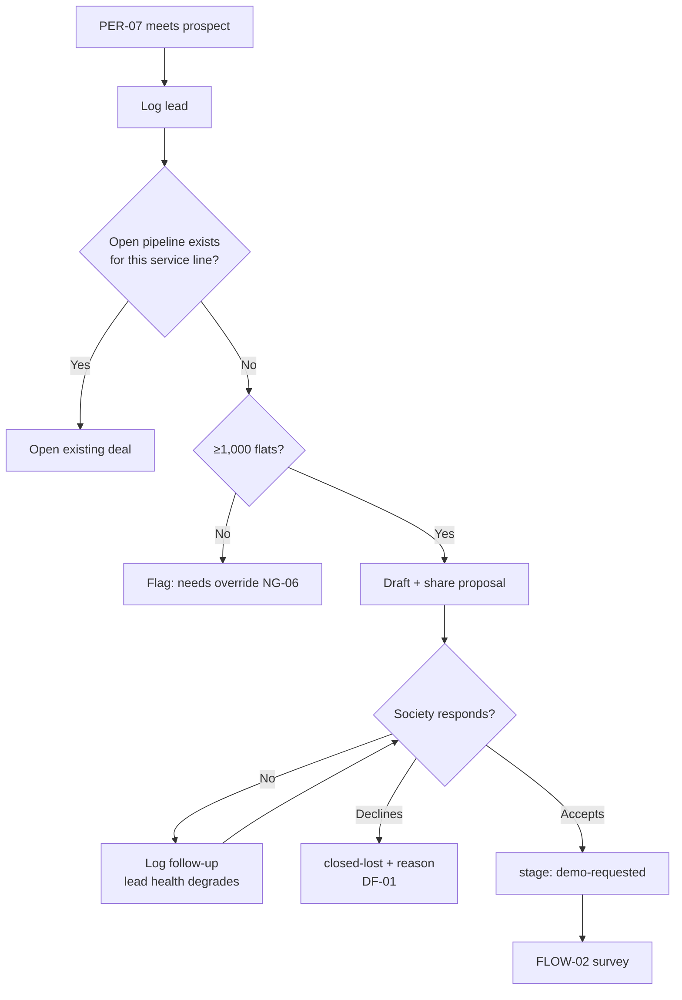
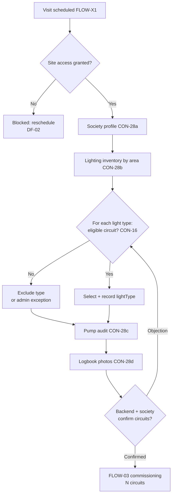
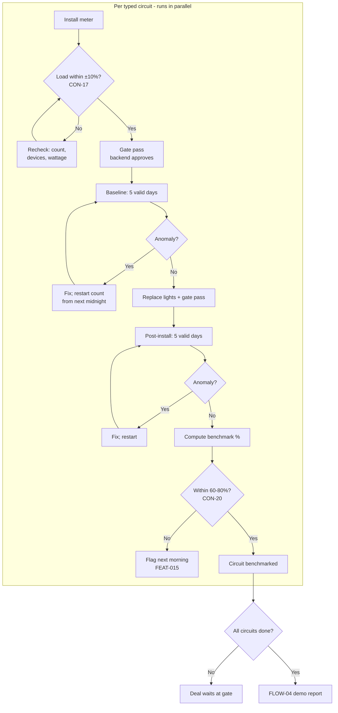
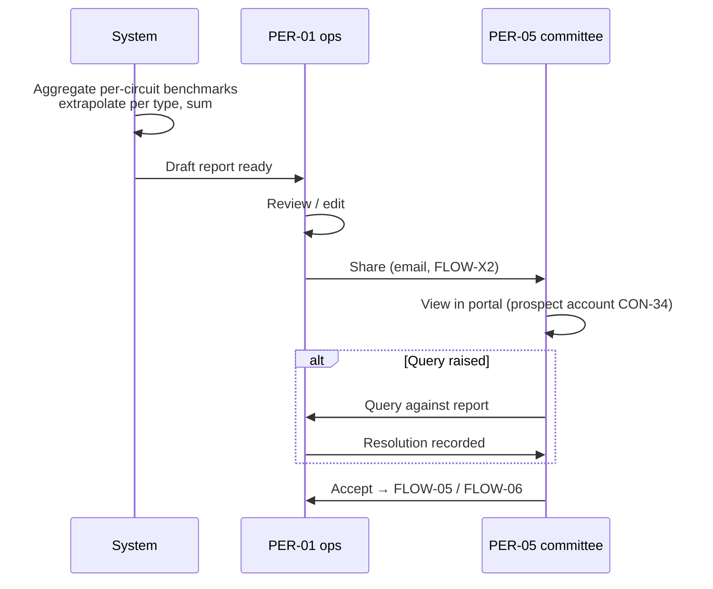
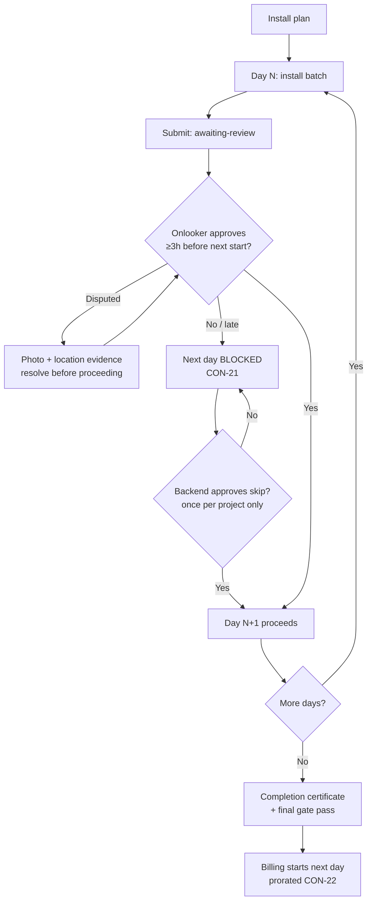
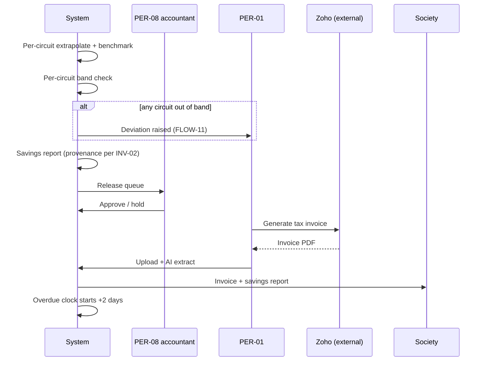
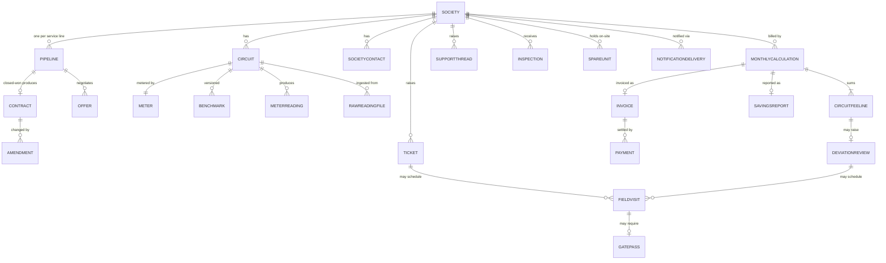

# Flows & System Map
**Product:** FirsThing Platform · **Phase:** 4 — Flows & System Map · **Status:** Approved
**Last updated:** 2026-08-12 · **Mode:** Ecosystem

> **Numbering:** this document is *this blueprint's* Phase 4. It follows the skill's
> `references/phase-05-flows-system-map.md` template — the on-disk reference filenames are offset
> from the phase map by one. See `00-intake.md` §11.

---

## 1. Flow index

Derived from the 22 capabilities and 94 feature briefs in `03-features.md`, organised into the
three loops the business actually runs: a **deal loop** that happens once per (society, service
line), a **monthly loop** that repeats forever once a deal is live, and a **service loop** that
runs continuously alongside it. Two further flows are cross-cutting — invoked from inside other
flows rather than standing alone.

**Coverage ledger: 19 of 19 flows detailed** (17 numbered + 2 cross-cutting). Every flow has a
step table with failure branches, first-run/offline/abandonment/handoff/timing/alternate-path
notes, and — where the shape is non-obvious — a diagram.

### Deal loop — once per (society, service line), per CON-24's `Pipeline` entity

| ID | Flow | Persona | Trigger | Features involved | Criticality |
|----|------|---------|---------|-------------------|-------------|
| FLOW-01 | Lead capture to demo request | PER-07 | Sales meets a prospective society | FEAT-001–004 | core |
| FLOW-02 | Site survey & circuit selection | PER-03/04 | Demo request approved | FEAT-005–010 | critical |
| FLOW-03 | Benchmark commissioning (per typed circuit) | PER-04 | Survey confirmed, circuits chosen | FEAT-011–015 | **critical** |
| FLOW-04 | Demo savings report & query resolution | PER-01, PER-05 | Post-install window completes | FEAT-020–023 | core |
| FLOW-05 | KYC / document collection | PER-01, PER-05 | Society signals intent | FEAT-024–026 | core |
| FLOW-06 | Offer, negotiation & agreement execution | PER-07, PER-05 | Demo report accepted | FEAT-027–032, 062 | **critical** |
| FLOW-07 | Full installation execution | PER-04, PER-06 | Agreement signed | FEAT-033–038 | **critical** |
| FLOW-08 | Demo-skip variant | PER-04, management | Society declines a demo | FEAT-032, 094, 052 | edge |

### Monthly loop — repeats per society per month, forever

| ID | Flow | Persona | Trigger | Features involved | Criticality |
|----|------|---------|---------|-------------------|-------------|
| FLOW-09 | Meter reading ingest & validation | PER-01 | Month closes; CSVs exported from vendor app | FEAT-043–047 | **critical** |
| FLOW-10 | Billing run, accountant release & invoice | PER-01, PER-08 | Readings validated | FEAT-048–054, 059–060 | **critical** |
| FLOW-11 | Deviation review to billing decision | PER-01, PER-03, management | A circuit lands out of band | FEAT-055–058, 050 | **critical** |
| FLOW-12 | Non-payment, suspension & restore | PER-01, PER-05 | Invoice unpaid past terms | FEAT-087 | core |

### Service loop — continuous, independent of the billing month

| ID | Flow | Persona | Trigger | Features involved | Criticality |
|----|------|---------|---------|-------------------|-------------|
| FLOW-13 | Ticket raised to resolution | PER-05/06, PER-01, PER-03 | Society or inspector reports a fault | FEAT-070–074 | core |
| FLOW-14 | Routine inspection & spare reconciliation | PER-03 | Inspection cadence due | FEAT-078–080, 075–077 | core |
| FLOW-15 | Support thread & escalation | PER-02 | Society calls or messages | FEAT-081–084 | core |
| FLOW-16 | Committee's monthly portal check | PER-05 | Savings report released | FEAT-088–089, 060 | core |
| FLOW-17 | Contract lifecycle: amendment, renewal, term end | PER-01, management | Amendment needed, or term approaching end | FEAT-062–065 | core |

### Cross-cutting — invoked from inside other flows, never standalone

| ID | Flow | Persona | Trigger | Features involved | Criticality |
|----|------|---------|---------|-------------------|-------------|
| FLOW-X1 | Field visit scheduling, accept/reschedule, escalation | PER-01, PER-03/04 | Any flow needing someone on site | FEAT-016–019 | **critical** |
| FLOW-X2 | Notification dispatch & delivery | system | Any registered event fires | FEAT-090–093 | core |

### Deliberately not flows

- **CAP-08 portfolio monitoring** (FEAT-066–069) is a *view*, not a journey — it has no trigger,
  no completion, and no failure branch. It becomes a screen in Phase 5, fed by the flows above.
- **CAP-13 account/user management** (FEAT-085–086) is CRUD. Only its suspension behaviour is a
  real flow, and that is FLOW-12.
- **CAP-06 cross-sell projection** (FEAT-061) is deferred per `03-features.md`; when built it
  re-enters at FLOW-01 as an alternate trigger, not as its own flow.

---

## 2. Flow details

Every step names an actor, because "the system does X" hides whether a human triggered it. Screen
IDs (`SCR-###`) are placeholders that Phase 5 will specify; they are assigned here so the screen
inventory has a source. Failure branches are the point of this phase — a step with no failure
branch is usually a step nobody has thought about yet.

### FLOW-01 — Lead capture to demo request
**Persona:** PER-07 (sales/BD) · **Trigger:** sales meets or is referred to a prospective society ·
**Success:** a `Pipeline` record for `(society, serviceLine)` sitting at stage `demo-requested`
with an accepted demo proposal

| # | Step | Actor | Surface | Screen | System response | Decision point | Failure branch | Feature |
|---|------|-------|---------|--------|----------------|----------------|----------------|---------|
| 1 | Log the lead: society name, location, flat count, contact | PER-07 | SUR-01 | SCR-001 lead form | Creates `Pipeline` at stage `lead`, keyed `(societyId, serviceLine)` | Which service line is this lead for? | Society already has an open pipeline for this service line → show the existing deal rather than creating a second (CON-24) | FEAT-001 |
| 2 | Minimum-size check | system | — | — | Compares flat count against NG-06's 1,000-flat floor | — | Below 1,000 flats → flagged, cannot advance without a recorded management override; the unit economics don't work (NG-06) | FEAT-001 |
| 3 | *(alternate)* PER-01 logs the lead on PER-07's behalf | PER-01 | SUR-01 | SCR-001 | Creates the record in a `pending-approval` sub-state; notifies PER-07 (FLOW-X2) | — | PER-07 never confirms → the lead sits unowned; surfaced by the follow-up counter at step 6 | FEAT-001 |
| 4 | Draft the demo proposal | PER-07 | SUR-01 | SCR-002 proposal editor | Saves a proposal against the pipeline | What is being proposed, at what indicative savings? Needs comparable societies' figures to sound credible | Proposal references a savings figure with no basis — no live demo exists yet, so this is inherently a claim, not evidence | FEAT-002 |
| 5 | Share the proposal with the society | PER-07 | SUR-01 | SCR-002 | Records the share event; dispatches via FLOW-X2 | — | Contact bounces or is stale → society unreachable (FEAT-092 AC-2/3) | FEAT-002, FEAT-090 |
| 6 | Log each follow-up on a stalled proposal | PER-07 | SUR-01 | SCR-003 pipeline board | Increments the per-step follow-up counter feeding lead health (CON-23) | Is this deal stalled or progressing? | High follow-up count with no movement → deal health degrades and surfaces on CAP-08's queue | FEAT-004 |
| 7 | Society accepts → demo requested | PER-07 | SUR-01 | SCR-003 | Advances to `demo-requested`; hands to FLOW-02 | — | Society declines → `closed-lost` with a recorded reason **(gap — see DF-01)** | FEAT-003 |

**First-run vs returning:** PER-07's first lead requires picking a service line and confirming the
society doesn't already exist; the hundredth is mostly the contact fields, since the society
directory autocompletes and the service line defaults to the one they sell most.
**Offline behavior:** N/A — SUR-01, office conditions (02-users §5).
**Abandonment:** A half-entered lead persists as a draft `Pipeline` at stage `lead`; on return
PER-07 sees it in their own queue rather than losing it. A lead abandoned for good is the exact
case DF-01 covers — today it would simply sit at `lead` forever, inflating the pipeline.
**Handoffs:** To FLOW-02 (survey) on acceptance. Backend-logged leads hand from PER-01 to PER-07
at step 3, which is a real approval boundary, not a notification.
**Timing:** No SLA. Lead health (CON-23) is the only time pressure and it is advisory.
**Alternate paths:** Backend-logged lead (step 3); society below the flat minimum (step 2); a
society already active on one service line being cross-sold another — same flow, different
`serviceLine` key, and the society record already exists.

---

### FLOW-02 — Site survey & circuit selection
**Persona:** PER-03/PER-04 (field) · **Trigger:** demo request approved · **Success:** society
profile captured, one eligible circuit chosen **per light type**, confirmed with backend and the
society

The survey is mandatory and can never be skipped (CON-24) — it is the only flow that produces the
data every later flow depends on.

| # | Step | Actor | Surface | Screen | System response | Decision point | Failure branch | Feature |
|---|------|-------|---------|--------|----------------|----------------|----------------|---------|
| 1 | Visit scheduled | PER-01 | SUR-01 | — | Invokes FLOW-X1 | — | See FLOW-X1 | FEAT-016 |
| 2 | Arrive on site, gain access | PER-03/04 | — (physical) | — | — | — | **Facility/security staff block entry** — a named blocker with no product support today **(gap — see DF-02)** | — |
| 3 | Capture society profile: coordinates, committee list with posts, RWA members, next election date | PER-03/04 | SUR-02 | SCR-010 survey: society | Persists CON-28a profile; seeds the contact directory (FEAT-092) | — | Committee list unavailable on the day → partial save, flagged incomplete | FEAT-005 |
| 4 | Count lighting inventory by area: basement/stilt parking (separately if both), lift lobby, staircase, external | PER-03/04 | SUR-02 | SCR-011 survey: lighting | Persists per-area counts — this is the whole-society figure, distinct from the metered sample (CON-28b) | Which distinct light types exist here? **This answer determines how many circuits get metered** (CON-11) | Miscount propagates into `representedLightCount` and biases billing for the term — no downstream check catches it | FEAT-006 |
| 5 | Select one eligible circuit **per light type** | PER-03/04 | SUR-02 | SCR-012 circuit selection | Validates each against CON-16: ≥50 lights, no shared appliances, WiFi/LAN within 20-40m, fixtures ≤15ft, not on a driveway/ramp | Is this circuit *typical* of the lights it will represent? (CON-16, added at the audit) | No eligible circuit for a light type → that type is either excluded from the deal or needs an explicit <50-light admin exception; both are recorded, neither is silent | FEAT-007 |
| 6 | Pump room equipment audit, per unit | PER-03/04 | SUR-02 | SCR-013 survey: pumps | Persists CON-28c per-unit assets: type, brand, model, condition, photo | — | Pump room locked / no access → partial survey; the pump service line cannot be quoted, the lighting one still can | FEAT-008 |
| 7 | Photograph the pump-room logbook, current month + up to 12 back | PER-03/04 | SUR-02 | SCR-013 | Stores images against the society; feeds CON-29's projection | — | No logbook kept → cross-sell projection loses its cross-check and falls back to specs + industry data (CON-29) | FEAT-009 |
| 8 | Confirm circuit choices with backend and society | PER-01, PER-05/06 | SUR-01 | SCR-014 survey review | Locks the circuit set; advances to commissioning | Does the society agree to these circuits being metered and modified? | Society objects to a chosen circuit → return to step 5 for that type only, not the whole survey | FEAT-010 |

**First-run vs returning:** A surveyor's first visit walks the full CON-28 checklist in order; an
experienced one wants to jump between sections and finish the pump audit while standing in the
pump room. The checklist must be navigable, not a wizard.
**Offline behavior:** This is the single most offline-critical flow (XC-02) — basements, pump
rooms, and stairwells, with heavy photo capture. Every step must capture locally and sync later;
a survey lost to connectivity is a wasted site visit and a re-booked appointment.
**Abandonment:** A partial survey persists with per-section completion flags. On return the
surveyor resumes at the first incomplete section. A survey abandoned mid-visit is common and
normal — pump room locked, committee member unavailable — so partial state is a first-class
outcome, not an error.
**Handoffs:** Field (SUR-02) → backend (SUR-01) at step 8 for confirmation, then to the society
for agreement. Three parties, two boundaries.
**Timing:** No SLA on the survey itself. Step 8's confirmation is a blocking wait on two other
parties and is a common stall point.
**Alternate paths:** Pump-only survey for a lighting-existing customer being cross-sold;
lighting-only where the pump room is inaccessible; a light type with no eligible circuit (step 5).

---

### FLOW-03 — Benchmark commissioning, per typed circuit
**Persona:** PER-04 (installer/commissioning) · **Trigger:** survey confirmed, circuit set locked ·
**Success:** every selected circuit carries a measured `benchmarkSavingsPct` inside CON-20's valid
60–80% range

**This flow fans out.** Since the audit's CON-11 correction, a society has one circuit per light
type, and steps 1–7 below run independently per circuit. Circuits progress at different speeds
because each has its own anomaly-restart clock (CON-19). The deal cannot price (FLOW-06) until
every circuit has a benchmark, but one circuit stalling does not block its siblings' progress.

| # | Step | Actor | Surface | Screen | System response | Decision point | Failure branch | Feature |
|---|------|-------|---------|--------|----------------|----------------|----------------|---------|
| 1 | Install the smart meter on the circuit | PER-04 | SUR-02 | SCR-020 meter install | Registers the meter against the circuit | — | Meter faulty / no connectivity at the location → circuit blocked, reschedule | FEAT-011 |
| 2 | Load validation | PER-04 | SUR-02 | SCR-020 | Compares theoretical load (count × wattage) against the meter's displayed load; ±10% passes (CON-17) | — | **Outside ±10%** → hard gate. PER-04 rechecks: miscounted lights, an extra device on the circuit, wrong wattage. Cannot proceed without a passing result or a recorded PER-01 override | FEAT-011 |
| 3 | Gate pass before departure | PER-04, PER-01 | SUR-02 → SUR-01 | SCR-021 gate pass | Itemized equipment list, society signature, photo, structured re-entry; **backend approval gates PER-04 leaving the premises** (XC-01, CON-18) | Does the list match what was physically installed? | Backend unreachable at approval time → PER-04 is blocked on site. A real operational failure mode with no current escape hatch **(gap — see DF-03)** | XC-01, FEAT-011 |
| 4 | Baseline monitoring: 5 consecutive valid days | system | — | SCR-022 commissioning monitor | Accumulates daily readings; meter-install day excluded as partial (CON-19) | — | **Anomaly on any day** → investigate, fix, and the 5-day count restarts from the midnight after the fix. Only genuinely normal days count | FEAT-012 |
| 5 | Light replacement (demo installation) | PER-04 | SUR-02 | SCR-023 demo install | Records the swap; triggers a second gate pass (XC-01) | — | Partial replacement (stock short) → the post window would measure a mixed state; must complete before step 6 starts | FEAT-013 |
| 6 | Post-install monitoring: 5 consecutive valid days | system | — | SCR-022 | Same rules; replacement day excluded (CON-19) | — | Same anomaly-restart as step 4 | FEAT-014 |
| 7 | Compute the benchmark | system | — | SCR-024 benchmark result | % difference between the two measured averages becomes `Circuit.benchmarkSavingsPct` — the exact measured figure, never rounded (CON-20, ASSUM-19) | — | **Outside 60–80%** → flagged to backend/installation next morning for investigation rather than accepted (FEAT-015). Below 60% suggests a real problem; above 80% suggests a measurement error | FEAT-014 |
| 8 | Deal-level gate: all circuits benchmarked | system | SUR-01 | SCR-025 deal commissioning status | Aggregates per-circuit results; releases the deal to FLOW-04 | Are all typed circuits complete? | One circuit stuck in restart loops holds the whole deal at this gate while siblings sit finished — the fan-out's main new failure mode | FEAT-014, FEAT-011 |

**First-run vs returning:** PER-04's first commissioning needs the full CON-19 rules explained in
the UI (why the count restarted, why today doesn't count); by the tenth they need the day counter
and the anomaly reason, nothing else.
**Offline behavior:** Steps 1–3 and 5 are on-site and must work offline (XC-02), with the notable
exception that step 3's *backend approval* is inherently online — which is exactly why DF-03 is a
real gap. Steps 4, 6, 7 are server-side and unaffected.
**Abandonment:** A circuit abandoned mid-commissioning holds its state (`meter-installed`,
`baseline-in-progress`, etc.) indefinitely. There is no timeout, and the deal-level gate at step 8
means a forgotten circuit silently stalls a deal — worth a staleness alert on CAP-08.
**Handoffs:** PER-04 → PER-01 twice (load-validation override, gate-pass approval), and the
morning-after review on an out-of-range result (step 7 → FEAT-015).
**Timing:** Minimum 10 valid days plus two excluded install days, so ~12 days in the best case
per circuit; anomaly restarts routinely push this to 3+ weeks. Circuits run in parallel, so the
deal's commissioning time is the *slowest* circuit, not the sum.
**Alternate paths:** Demo-skip (FLOW-08) replaces steps 4–7 entirely; a <50-light circuit
proceeding under admin exception (CON-16); a circuit failing load validation twice, which in
practice means re-surveying that light type.

---

### FLOW-04 — Demo savings report & query resolution
**Persona:** PER-01 (prepares), PER-05 (reads) · **Trigger:** all circuits benchmarked ·
**Success:** the society has seen a savings report they believe, with any queries resolved

| # | Step | Actor | Surface | Screen | System response | Decision point | Failure branch | Feature |
|---|------|-------|---------|--------|----------------|----------------|----------------|---------|
| 1 | Report auto-generated | system | — | — | Aggregates **each circuit's** measured benchmark, extrapolates per light type, and sums to a whole-society projection (CON-11) | — | A circuit with an out-of-range benchmark (FEAT-015) must not silently enter the aggregate — the report should refuse rather than average the problem away | FEAT-020 |
| 2 | Backend reviews and edits | PER-01 | SUR-01 | SCR-030 demo report editor | Saves a reviewed version | Are these numbers defensible to a committee? | Edits that contradict the measured data would undermine INV-02 — edits should be presentational, and material changes should be traceable | FEAT-021 |
| 3 | Share with the society | PER-01 | SUR-01 | SCR-030 | Dispatches via FLOW-X2 (email); WhatsApp remains a manual out-of-band channel at launch (CON-39) | Which channel does this committee actually read? | Report shared to a stale contact → unreachable (FEAT-092) | FEAT-022 |
| 4 | Society views it in the portal | PER-05 | SUR-01 (customer) | SCR-031 demo report view | Renders against their **prospect account** (CON-34) | — | Prospect account never issued → society only ever sees the emailed artefact, losing the in-system query trail CON-34 exists to create | FEAT-023, CON-34 |
| 5 | Society raises a query | PER-05 | SUR-01 (customer) | SCR-031 | Creates a query thread against the report | What exactly are they disputing — the measurement, the extrapolation, or the projection? | Query raised out-of-band (WhatsApp) → lands in FLOW-15's support thread instead, and the report-linked context is lost | FEAT-023 |
| 6 | Resolve the query | PER-01 | SUR-01 | SCR-030 | Records the resolution against the report version it concerned | — | Unresolved queries block nothing structurally, but a deal advancing to offer with an open query is a dispute waiting to happen | FEAT-023 |

**First-run vs returning:** This is a first-run experience by definition — a society sees exactly
one demo report, ever. It is also the society's first impression of the product's credibility, so
the "how was this measured" explanation is load-bearing rather than optional detail.
**Offline behavior:** N/A — SUR-01 both sides.
**Abandonment:** A generated-but-unshared report sits in draft. A shared report with an open query
and no follow-up is the silent failure here; queries need the same follow-up counter as CON-23's
pipeline steps.
**Handoffs:** system → PER-01 → society, then society → PER-01 on a query. The prospect account
(CON-34) is what keeps the last hop in the system rather than in a chat thread.
**Timing:** No SLA. In practice this is the step where deals stall longest, since it waits on a
committee meeting.
**Alternate paths:** Demo-skip deals (FLOW-08) skip this flow entirely — there is no measured
demo to report, which is precisely why CON-25's agreed percentage carries the commercial weight
instead.

---

### FLOW-05 — KYC / document collection
**Persona:** PER-01, PER-05 · **Trigger:** society signals intent to proceed · **Success:** every
required document received and verified

| # | Step | Actor | Surface | Screen | System response | Decision point | Failure branch | Feature |
|---|------|-------|---------|--------|----------------|----------------|----------------|---------|
| 1 | Required-document checklist raised | system | SUR-01 | SCR-040 KYC checklist | Creates outstanding items: GST document, recent electricity bill | Which documents does this deal actually need? | Checklist is currently fixed; a deal needing something unusual has no path to add an item | FEAT-024 |
| 2a | Society uploads directly | PER-05 | SUR-01 (customer) | SCR-041 document upload | Item → `received`; notifies PER-01 (FLOW-X2) | — | Wrong file type or unreadable scan → rejected at verification (step 3), not at upload | FEAT-025 |
| 2b | *(alternate)* Backend enters a document received by call/WhatsApp | PER-01 | SUR-01 | SCR-040 | Same `received` state, with the receipt channel recorded | — | This path is **mandatory to keep** regardless of CON-34's prospect accounts — many societies will never use the portal | FEAT-025 |
| 3 | Verify | PER-01 | SUR-01 | SCR-040 | Item → `verified` or back to `outstanding` with a reason | Is this the right document, legible, and current? | Rejected → society must re-upload; the reason must reach them or they will re-send the same file | FEAT-026 |
| 4 | All items verified | system | — | — | Releases the KYC gate on the offer (FLOW-06) | — | A single outstanding item blocks agreement execution — correct, but needs to be visible on the pipeline board or it reads as an unexplained stall | FEAT-026 |

**First-run vs returning:** First-run for the society every time (one KYC per deal). A society
being cross-sold a second service line should not be asked to re-upload its GST certificate —
document reuse across pipelines of the same society is expected but not currently specified.
**Offline behavior:** N/A.
**Abandonment:** Partial KYC persists indefinitely; this is one of the most common real stall
points and feeds CON-23's follow-up counter.
**Handoffs:** Society → PER-01 for verification, both directions on rejection.
**Timing:** No SLA; blocks FLOW-06's agreement step.
**Alternate paths:** Backend entry (2b) is the dominant path today, not the exception.

---

### FLOW-06 — Offer, negotiation & agreement execution
**Persona:** PER-07, PER-05 · **Trigger:** demo report accepted · **Success:** a signed, notarised
agreement and an active `Contract`

| # | Step | Actor | Surface | Screen | System response | Decision point | Failure branch | Feature |
|---|------|-------|---------|--------|----------------|----------------|----------------|---------|
| 1 | Generate the offer | PER-07 | SUR-01 | SCR-050 offer builder | Assembles from confirmed demo numbers: **a per-circuit benchmark table** (CON-11 as corrected — not a single society figure), the per-type extrapolation, revenue-share split, tolerance band, CON-01b exclusions, term, AMC terms | What revenue-share split and tolerance band is this deal worth? | An offer carrying one blended benchmark instead of the per-circuit table would be unenforceable against the per-circuit compliance check the system actually runs (FEAT-049) | FEAT-027 |
| 2 | Society reviews; accepts, counters, or rejects | PER-05 | SUR-01 (customer) | SCR-051 offer view | Records the response against the offer version | Committee decision — needs the demo evidence beside the commercial terms | Counter-offer → new offer version; prior versions retained, since which version was signed matters later | FEAT-028 |
| 3 | Negotiate to agreement | PER-07 | SUR-01 | SCR-050 | Versions the offer per round | — | Endless counter rounds → CON-23's follow-up counter is the only signal; no structural limit | FEAT-028 |
| 4 | Print and notarise | PER-07 | — (physical) | SCR-052 agreement tracker | Records the physical artefact's existence | — | The signed paper is the legal instrument; the system holds a scan, not the original | FEAT-029 |
| 5 | Field executive delivers / collects the document | PER-07 | SUR-01 | SCR-052 | Logs each handoff: who received/handed over, contact, timestamp, location ("maintenance office", "main gate") per CON-23 | — | Document lost in transit between handoffs — the per-handoff log is what makes this recoverable rather than a mystery | FEAT-030 |
| 6 | Contract activated | PER-01 | SUR-01 | SCR-053 contract record | Creates `Contract` with the per-circuit benchmark table, tolerance band, exclusions, revenue share, term, AMC | — | Terms transcribed rather than carried forward from the offer would let the signed paper and the system diverge — the single most dangerous data-entry point in the product | FEAT-062 |
| 7 | Prospect account becomes a customer account | system | SUR-01 | — | Should widen the CON-34 scoped login into a full portal account | — | **No feature covers this transition (gap — see DF-04)** | — |

**First-run vs returning:** Once per deal. A society signing a second service line already has a
contract record and an account — the flow should recognise that and not re-run step 7.
**Offline behavior:** N/A, except step 5 which is inherently physical and logged after the fact.
**Abandonment:** An offer with no response sits indefinitely and is the single largest population
on the pipeline board. `closed-lost` (DF-01) applies here as much as at FLOW-01.
**Handoffs:** Four — PER-07 → society (offer), society → PER-07 (response), PER-07 → field
executive → society (physical document), PER-07 → PER-01 (contract activation).
**Timing:** No SLA. Step 5's physical logistics are days-to-weeks and are the least visible part
of the pipeline without CON-23's handoff log.
**Alternate paths:** Demo-skip deals arrive here with an *agreed* percentage and
`benchmarkSource: negotiated-fixed` instead of measured numbers (FLOW-08); rejection at step 2.

---

### FLOW-07 — Full installation execution
**Persona:** PER-04 (installs), PER-06 (society onlooker) · **Trigger:** agreement signed ·
**Success:** completion certificate signed; billing starts the following day

| # | Step | Actor | Surface | Screen | System response | Decision point | Failure branch | Feature |
|---|------|-------|---------|--------|----------------|----------------|----------------|---------|
| 1 | Plan the installation across days/areas | PER-01 | SUR-01 | SCR-060 install plan | Creates the batch schedule | How many days, which areas per day? | Plan not matching real site conditions → daily blockers at step 3 | FEAT-033 |
| 2 | Install a day's batch | PER-04 | SUR-02 | SCR-061 batch capture | Records areas, counts, photos; submits to `awaiting-review`; notifies the onlooker | — | Stock short mid-batch → partial batch, recorded as a blocker | FEAT-034 |
| 3 | Society onlooker reviews the day's batch | PER-06 | SUR-01 or SUR-02 | SCR-062 batch review | Approves, or disputes with photo + location evidence | Does the recorded count match what was actually installed? | **Not approved at least 3 hours before the next day's start → the next day cannot begin** (CON-21). Skippable **once per project only**, with explicit backend approval | FEAT-035 |
| 4 | Handle blockers and requirement changes | PER-04, PER-01 | both | SCR-063 blockers | Records the blocker; adjusts the plan | Does this change the contracted scope? | A scope change discovered mid-install (more lights than surveyed) affects `representedLightCount` and therefore billing — must route to a contract amendment (FLOW-17), not a silent edit | FEAT-036 |
| 5 | Completion certificate | PER-04, PER-06 | SUR-02 | SCR-064 completion | Signed; triggers a final gate pass (XC-01) | — | Certificate signed with outstanding disputed batches → billing would start on contested work | FEAT-037 |
| 6 | Billing starts | system | — | — | Billing begins the **day after** the certificate's signature date; first month prorates on actual days (CON-22) | — | Off-by-one on the start date is the specific error CON-22's wording anticipates | FEAT-037, FEAT-051 |

**First-run vs returning:** Once per deal, but PER-04 runs it constantly — the daily batch capture
is their highest-frequency screen and deserves the most optimisation.
**Offline behavior:** Steps 2 and 5 are on-site, photo-heavy, and must work offline (XC-02).
Step 3's review is the society's, often done from home on a phone — online is a fair assumption
there, but the 3-hour rule means a delayed sync directly halts the next day's work.
**Abandonment:** A stalled installation leaves the deal mid-flight with partial hardware
installed and no billing. This is FirsThing's capital sitting on a site with no revenue against
it — the most financially exposed state in the product.
**Handoffs:** Daily, both directions, between PER-04 and PER-06. This is the highest-frequency
cross-surface handoff in the whole system and the clearest case for FEAT-038's shared live state.
**Timing:** CON-21's 3-hour pre-start deadline is the only hard SLA in the deal loop, and it
gates physical work rather than a notification.
**Alternate paths:** The once-per-project skip of the daily review gate; scope change at step 4.

---

### FLOW-08 — Demo-skip variant
**Persona:** PER-04, management · **Trigger:** society explicitly declines a demo ·
**Success:** circuits metered, contract active on an agreed benchmark, first post-install month
captured as the reference

The demo is the **only** skippable stage (CON-24). Everything else in the deal loop still runs.

| # | Step | Actor | Surface | Screen | System response | Decision point | Failure branch | Feature |
|---|------|-------|---------|--------|----------------|----------------|----------------|---------|
| 1 | Management approves the skip | management | SUR-01 | SCR-070 skip exception | Sets `demoSkipped` with approver, reason, date — a single named exception, not stage configuration | Is the society's reason good enough to give up measured evidence? | An operator setting this on their own would bypass the only control on the product's evidence base | FEAT-032 |
| 2 | Survey runs normally | PER-03/04 | SUR-02 | — | FLOW-02 unchanged and mandatory | — | — | FEAT-005–010 |
| 3 | Meter install + load validation + gate pass, per circuit | PER-04 | SUR-02 | SCR-020/021 | Identical to FLOW-03 steps 1–3; circuit → `metered-awaiting-installation` | — | Load validation still a hard gate — skipping the demo never means skipping validation (FEAT-094 AC-3) | FEAT-094, FEAT-011 |
| 4 | Pre-install readings accumulate | system | — | SCR-022 | Recorded from meter install until installation completes; **retained as evidence, never as a benchmark** (CON-25d) | — | If the gap is too short to yield usable readings, the report shows the agreed percentage alone and says so rather than an empty chart (FEAT-094 AC-5) | FEAT-094 |
| 5 | Offer on the agreed percentage | PER-07 | SUR-01 | SCR-050 | Offer marked `benchmarkSource: negotiated-fixed`, carrying the agreed % (60–80% range, e.g. 65%) | What percentage will the society accept without evidence? | — | FEAT-027 |
| 6 | Agreement, installation | — | — | — | FLOW-06 and FLOW-07 unchanged | — | — | — |
| 7 | First full post-install month sets the reference | system | — | — | Captured once, then fixed; every later month compares against it under the normal tolerance band | — | **Poor coverage in that month** (below CON-12's 20-day floor) makes the reference unreliable and every later comparison inherits it — must roll forward to the next complete month | FEAT-052 |

**First-run vs returning:** Rare by design (CON-25 calls it exceptional). If it stops being rare,
the measured-savings positioning erodes — flagged as a business metric on FEAT-052 and FEAT-094.
**Offline behavior:** Same as FLOW-03 steps 1–3.
**Abandonment:** Same exposure as FLOW-07 — meter installed pre-agreement on a deal that may never
sign. That hardware cost is accepted deliberately, mirroring the normal path where a full demo
installation also precedes signature.
**Handoffs:** management → PER-04 (the approved exception travels with the deal, and PER-04 cannot
set or clear it — FEAT-094 AC-4).
**Timing:** Faster to contract than FLOW-03 (no 10-valid-day wait), which is the whole point.
**Alternate paths:** A gap long enough to produce 5+ valid pre-install days still does **not**
convert this into a measured benchmark — the commercial terms were agreed on the negotiated
percentage, and re-deriving them would reopen a signed agreement (FEAT-094 AC-5).

---

### FLOW-09 — Meter reading ingest & validation
**Persona:** PER-01 · **Trigger:** month closes; CSVs available in the meter vendor's app ·
**Success:** every active circuit has validated readings and the month is marked billable

**Two ingest paths since 2026-08-12 (CON-43).** Path A is the manual monthly CSV below. Path B is a
scheduled vendor-API fetch plus permission-gated on-demand refresh (steps 0/0a), which supplements
rather than replaces it — on a same-circuit-same-day conflict the **CSV wins**, because the
vendor's own export is what a dispute would be settled against. Path B rests on ASSUM-24, which is
unverified; path A stays load-bearing until a spike proves the API exists and scales.

**Volume note:** this flow runs **once per circuit**, not once per society. At today's 22
societies with several typed circuits each that is roughly 90 files a month; at GOAL-07's 200
societies it is 800+. FEAT-043 is specified as a single-file upload — see DF-05.

| # | Step | Actor | Surface | Screen | System response | Decision point | Failure branch | Feature |
|---|------|-------|---------|--------|----------------|----------------|----------------|---------|
| 0 | *(path B, added 2026-08-12)* Scheduled API fetch | system | — | SCR-084 | Pulls every active meter's readings from the vendor API on a schedule; raw response retained as CON-30 retains a raw file (CON-43) | — | API erroring, meter offline, or a period missing → three distinguishable alerts (FEAT-106), not one generic failure | FEAT-104, FEAT-106 |
| 0a | *(path B)* On-demand refresh | PER-01 with `fetch_readings` | SUR-01 | SCR-084, SCR-251 | Fetches one meter or a selected set immediately | — | Partial failure names the failed meters individually; the rest still commit | FEAT-105 |
| 1 | *(path A)* Download CSVs from the vendor app | PER-01 | — (external) | — | Outside the product entirely | — | Vendor app down or export changed shape → nothing to ingest. **Since 2026-08-12 this is no longer invisible** — FEAT-106 alerts on readings that fail to arrive against the expected schedule | — |
| 2 | Upload a circuit's CSV | PER-01 | SUR-01 | SCR-080 reading upload | Stores the **raw file** against society+circuit before any interpretation (CON-30) | Which circuit is this file for? | Wrong circuit selected → readings attach to the wrong benchmark and the error surfaces only as an implausible deviation weeks later | FEAT-043 |
| 3 | AI-assisted normalisation | system | SUR-01 | SCR-080 | Gemini analyses the file's structure and maps it to the canonical reading shape (CON-30, same pattern as invoice extraction) | — | Format unrecognised → falls through to step 4's clarifying questions rather than guessing | FEAT-043 |
| 4 | Clarifying questions on ambiguous shape | system → PER-01 | SUR-01 | SCR-080 | Asks which column is which, what the timestamp format is | Does PER-01 actually know the answer? | Wrong answer produces confidently wrong readings — the raw file being retained (step 2) is the only recovery path | FEAT-043 |
| 5 | Persist normalised readings | system | — | — | Hourly rows aggregated to daily; **both raw and normalised retained** (CON-30) | — | — | FEAT-044 |
| 6 | Anomaly detection | system | SUR-01 | SCR-081 anomaly review | Flags missing days and out-of-range readings (INV-09) | Is this a real anomaly or a genuine consumption change? | **Unresolved anomalies block billing** for that month (INV-09, FEAT-048 AC-3) — a gate, not an advisory | FEAT-045 |
| 7 | Coverage check | system | — | SCR-081 | Excludes missing days; **below 20 days the month is flagged unusable** (CON-12) | Accept a low-coverage month explicitly, or wait? | Days are never interpolated at any coverage level; ops may accept explicitly but the system will not compute a billing-grade figure unprompted | FEAT-046 |
| 8 | Mark the month ready | PER-01 | SUR-01 | SCR-082 month-close board | Releases the circuit's readings to FLOW-10 | Are all circuits for all societies in? | **No cockpit exists for "which societies are ready to bill"** — see DF-06 | FEAT-047 |

**First-run vs returning:** The first upload for a new vendor format triggers step 4's clarifying
questions; subsequent months with the same vendor should reuse the learned mapping and skip
straight to step 5. Nothing currently specifies that the mapping is remembered — worth confirming
in Phase 7, since without it PER-01 answers the same questions 800 times a month.
**Offline behavior:** N/A.
**Abandonment:** A partially-ingested month leaves some circuits validated and others not. The
month-close board (step 8) is what makes that visible; without it, a forgotten circuit means a
society silently misses a billing cycle.
**Handoffs:** None between people — but a hard dependency on an external system (the vendor app)
that the product cannot observe.
**Timing:** Monthly, concentrated in the first days after month end. This is a genuine peak-load
pattern, not steady state.
**Alternate paths:** A circuit with no readings at all (meter failure) → the month cannot be
computed for it, and since bands are per circuit (CON-11) that circuit's fee line is unresolvable
while its siblings bill normally — a mixed-state invoice that FEAT-053 must handle.

---

### FLOW-10 — Billing run, accountant release & invoice
**Persona:** PER-01, PER-08 · **Trigger:** a society's circuits all validated · **Success:** the
society has an invoice and a savings report, and the overdue clock has started

| # | Step | Actor | Surface | Screen | System response | Decision point | Failure branch | Feature |
|---|------|-------|---------|--------|----------------|----------------|----------------|---------|
| 1 | Savings calculation runs automatically | system | — | — | Per circuit: extrapolate across its own light type, apply that circuit's benchmark %, unit rate, revenue share; sum to the society total (CON-11, CON-33). Every input version recorded (INV-02) | — | Runs on unresolved anomalies → blocked by FLOW-09 step 6 | FEAT-048 |
| 2 | Per-circuit compliance check | system | — | SCR-090 compliance view | Each circuit compared against **its own** benchmark and band; in-band → fixed fee line | — | Out of band → FLOW-11 for that circuit only; siblings continue | FEAT-049 |
| 3 | Apply any adjustment | system | — | — | A second consecutive FirsThing-attributable breach flips **that circuit's** fee line to `actual-metered` (CON-01c, OQ-10) | — | Adjustment applied without a completed review is barred (FEAT-050 AC-4) | FEAT-050 |
| 4 | Proration if partial | system | — | — | First or final month prorated by actual days (CON-22) | — | Missing completion date → bill held with a clear reason | FEAT-051 |
| 5 | Savings report generated | system | SUR-01 | SCR-091 savings report | Native to the app (unlike the invoice); every figure links to its provenance (INV-02); states the basis **per circuit** on a mixed-basis month | — | A mixed-basis month presented as one number would hide why the total moved — a real presentation problem, flagged on FEAT-050 | FEAT-059 |
| 6 | Accountant reviews and releases | PER-08 | SUR-01 | SCR-092 release queue | Blocking gate before anything reaches the society (CON-33) | Do these figures look right? | **At 200 societies a one-at-a-time gate becomes the month-end bottleneck** (FEAT-054's stated risk, JTBD-09) — only flagged months should need real attention | FEAT-054 |
| 7 | Invoice produced in Zoho | PER-01 | — (external) | — | The formal tax invoice is generated outside the app (CON-33) | — | Zoho unavailable → the manual path is the *designed* path, not a fallback of last resort | — |
| 8 | Invoice uploaded back into the app | PER-01 | SUR-01 | SCR-093 invoice upload | Existing AI-extraction upload flow; links the invoice to the month's calculation | — | Uploaded invoice's total disagreeing with the computed total is the check that matters most here, and nothing currently performs it — **see DF-07** | FEAT-053 |
| 9 | Released to the society | system | SUR-01 (customer) | SCR-100 | Society sees invoice + savings report; notified via FLOW-X2 | — | — | FEAT-060 |
| 10 | Overdue clock starts | system | — | — | Begins 2 days after the invoice is generated/shared (CON-13) | — | Release, not generation, is the event downstream keys off | FEAT-087 |

**First-run vs returning:** A society's first invoice is prorated and is their first experience of
the billing model — the savings report carries disproportionate weight. Steady-state months should
be near-invisible to ops for in-band societies.
**Offline behavior:** N/A.
**Abandonment:** A calculated-but-unreleased month sits in the accountant queue. Since suspension
timers key off release (step 10), an unreleased month simply never starts a clock — safe, but
silent.
**Handoffs:** system → PER-08 (release gate) → PER-01 (Zoho) → society. The Zoho hop leaves the
product entirely and comes back, which is why step 8's reconciliation gap matters.
**Timing:** Monthly peak. Step 6 is the human bottleneck; steps 1–5 are automatic.
**Alternate paths:** `negotiated-fixed` contracts bill flat against a first-month reference
(FLOW-08 step 7, FEAT-052); a month with an unresolvable circuit (FLOW-09 alternate).

---

### FLOW-11 — Deviation review to billing decision
**Persona:** PER-01 → PER-03 → PER-01 → management · **Trigger:** a circuit lands outside its
band · **Success:** a recorded root cause, a decision, and the correct billing effect

Runs **per circuit** (CON-11). A society with four typed circuits can have four independent
reviews in one month.

| # | Step | Actor | Surface | Screen | System response | Decision point | Failure branch | Feature |
|---|------|-------|---------|--------|----------------|----------------|----------------|---------|
| 1 | Open the deviation, chart-first | PER-01 | SUR-01 | SCR-110 deviation chart | Plots that circuit's **raw daily** readings against its benchmark, plus coverage, ingest anomalies, recent inspections, rescales, tickets, and **sibling circuits' standing** | Is this one bad day, a step change, or a gradual drift? The shape is the diagnostic signal | Monthly aggregate only would hide the shape and make the first diagnostic question unanswerable | FEAT-055 |
| 2 | Resolve directly, or assign | PER-01 | SUR-01 | SCR-110 | Either closes it (ingest error, known cause) or assigns to an inspector | Can this be settled from the data alone? | Assigning everything defeats the chart; resolving everything from the desk misses real physical faults | FEAT-056 |
| 3 | Field investigation | PER-03 | SUR-02 | SCR-111 investigation | Visit scheduled via FLOW-X1; inspector records findings, resolves if possible | — | Inspector finds nothing → step 5's escalation path, not an indefinite open case | FEAT-056 |
| 4 | Ops records root cause and decision | PER-01 | SUR-01 | SCR-112 decision record | Selects from CON-01b's list — FirsThing-attributable vs excluded/society-caused — with an owner and timestamp (INV-03) | Which side of the guarantee does this fall on? This determines which direction the bill moves | A binary fixable/not-fixable flag would be insufficient; the *classification* is what drives billing (CON-01b) | FEAT-057 |
| 5a | Resolved → close | PER-01 | SUR-01 | SCR-112 | Excluded cause → bill unchanged, society notified **why** (OQ-09). FirsThing-attributable and corrected within the month → no adjustment (CON-01b) | — | Silence on an excluded-cause month reads to the society as an unexplained bad month | FEAT-050 |
| 5b | Unresolved → escalate to management | management | SUR-01 | SCR-113 escalation | Management decides whether to adjust the benchmark based on post-investigation readings (CON-31 step 5b) | — | This is the product's only mid-term benchmark change other than a light-count rescale | FEAT-058 |
| 6 | Benchmark adjustment, if any | management | SUR-01 | SCR-113 | **Direction-dependent (CON-37):** favours the society → applies immediately, society notified. Favours FirsThing → requires a signed amendment (FLOW-17) first | Who does this change benefit? | Applying a FirsThing-favouring change without the amendment would be a unilateral repricing | FEAT-058, FEAT-064 |
| 7 | Second consecutive breach | system | — | — | If still out of band next month and FirsThing-attributable, **that circuit's** fee line flips to `actual-metered` (CON-01c) | — | Streak state is per circuit and must survive a re-run after corrected input (FEAT-049's stated risk) | FEAT-050 |

**First-run vs returning:** PER-01 does this many times a month; the chart and context assembly
(step 1) is the whole value. Management sees step 5b rarely, so it needs to carry its own context.
**Offline behavior:** Step 3 is on-site (XC-02); the rest is SUR-01.
**Abandonment:** An open review with no decision leaves the month unresolved and, at the next
month's close, potentially a second consecutive breach with no recorded cause for the first — the
worst state for CON-01c's logic to run against.
**Handoffs:** Three role boundaries: ops → inspector → ops → management. CON-31 is explicit that
"not fixable" is not ops' own call.
**Timing:** Bounded implicitly by the next month's billing run — a review must conclude before
CON-01c evaluates the streak, or the streak evaluates against an unknown cause.
**Alternate paths:** A light-count change discovered during investigation → deterministic rescale
(FEAT-041, INV-07), a *different* event type from a reviewed decision and deliberately not
conflated with it.

---

### FLOW-12 — Non-payment, suspension & restore
**Persona:** PER-01, PER-05 · **Trigger:** invoice unpaid past terms · **Success:** payment
recorded and service restored — or suspension fires correctly

The unusual property (CON-13): **manual intervention is only ever a brake, never an accelerator.**

| # | Step | Actor | Surface | Screen | System response | Decision point | Failure branch | Feature |
|---|------|-------|---------|--------|----------------|----------------|----------------|---------|
| 1 | Overdue tracking begins | system | — | — | 2 days after the invoice is generated/shared | — | — | FEAT-087 |
| 2 | ~10 days overdue | system | — | SCR-120 arrears board | Starts a 5-day suspension-warning countdown; notifies society users (FLOW-X2) | — | **Warning email bounces → the countdown must not advance** (FEAT-091 AC-5); PER-01 alerted to reach them another way | FEAT-087, FEAT-091 |
| 3 | Society requests an extension | PER-05 | SUR-01 (customer) | SCR-121 extension request | Recorded against the countdown | Is this society genuinely paying, or stalling? | — | FEAT-087 |
| 4 | Backend grants an extension | PER-01 | SUR-01 | SCR-120 | Increments of **up to 5 days per request** (≈10 days total by example) | — | Open-ended pauses are not permitted — the increment cap is the control | FEAT-087 |
| 5 | Payment recorded | PER-01 | SUR-01 | SCR-120 | Marked paid manually from Zoho; carries a freshness timestamp (CON-13, no API assumed) | — | Stale payment data is the danger, addressed at step 6 | FEAT-087 |
| 6 | Suspension fires | system | — | — | **Fully automatic, no approval** — but only against a **same-day-confirmed** payment status (CON-13). Stale data stops the timer rather than firing on it | — | Firing on stale data would suspend a society that has already paid — the exact failure the safety rule exists to prevent | FEAT-087 |
| 7 | Suspension takes effect | system | — | SCR-120 | **Field servicing only** halts — routine inspections, ticket dispatch, spare replacement. Meter ingest, monthly calculation, invoicing, and portal access all continue (CON-13, resolved at the audit) | — | Arrears keep accruing and the committee can still see what is owed beside the savings evidence — deliberate | FEAT-087 |
| 8 | Restore on payment | PER-01 | SUR-01 | SCR-120 | A single state change; no backfill needed since nothing stopped except dispatch | — | An inspector arriving at a suspended society mid-visit needs to see that state on SUR-02 (02-users §5 names this) | FEAT-087 |

**First-run vs returning:** Most societies never reach step 2. Those that do tend to repeat, so
arrears history belongs on the society record.
**Offline behavior:** Step 8's inspector-facing suspension state must be visible on SUR-02, which
is offline-tolerant — a stale "not suspended" cached state sends someone to a site they shouldn't
service.
**Abandonment:** N/A — this flow is system-driven and does not wait on a human to advance.
**Handoffs:** system → society (warning) → PER-01 (extension decision) → system (fires).
**Timing:** The only fully automatic time-driven escalation in the product, and the only one where
a notification failure must halt the clock.
**Alternate paths:** Dispute-driven non-payment should route to FLOW-15/FLOW-11 rather than simply
running the arrears clock — a society withholding payment over a disputed bill is a different
situation from one that has not paid, and nothing currently distinguishes them (**DF-08**).

---

### FLOW-13 — Ticket raised to resolution
**Persona:** PER-05/06 or PER-03 (raise) → PER-01 (triage) → PER-03 (resolve) ·
**Trigger:** a fault, an exhausted spare stock, or any issue needing an inspector ·
**Success:** ticket closed within SLA, or escalated with a reason

| # | Step | Actor | Surface | Screen | System response | Decision point | Failure branch | Feature |
|---|------|-------|---------|--------|----------------|----------------|----------------|---------|
| 1 | Raise the ticket | PER-05/06 or PER-03 | SUR-01 (customer) or SUR-02 | SCR-130 raise ticket | Creates the ticket at `raised`. **Either committee or manager may raise** — not just the manager (broader than ASSUM-11's split) | What kind of issue is this? | Raised out-of-band by phone → lands in FLOW-15 instead and loses the SLA clock | FEAT-070, FEAT-089 |
| 2 | Acknowledge within 24h | PER-01 | SUR-01 | SCR-131 triage queue | State → `acknowledged` | Resolvable by call, or needs a field visit? | **24h first-response breach → auto-escalates to management** (CON-27) | FEAT-071 |
| 3a | Close by call | PER-01 | SUR-01 | SCR-131 | State → `closed` with the resolution recorded | — | Closing without the society agreeing it is resolved invites re-raising the same issue | FEAT-071 |
| 3b | Schedule a field visit | PER-01 | SUR-01 | — | Invokes FLOW-X1; must resolve **within 48h of ticket creation** (CON-27) | — | 48h resolution breach → auto-escalates | FEAT-072 |
| 4 | Inspector resolves on site | PER-03 | SUR-02 | SCR-132 ticket work | State → `resolved`, with findings | Is this fully fixed, or does it need more? | — | FEAT-072 |
| 5 | *(alternate)* Needs more time/resources | PER-03 | SUR-02 | SCR-132 | Spins off sub-tasks, **each with its own SLA** (72h default, configurable per CON-35) | What is actually needed — parts, access, a specialist? | Any sub-task SLA breach also auto-escalates (CON-27) | FEAT-073 |
| 6 | Escalation on any SLA breach | system | SUR-01 | SCR-133 escalation queue | Flags for management intervention — never an automatic reassignment | — | Escalation as a flag plus notification is deliberate: who covers work is an operational judgement, not the system's call | FEAT-074, XC-03 |
| 7 | Society sees resolution timeliness | PER-05/06 | SUR-01 (customer) | SCR-134 | Ticket history with resolution times | — | Publishing SLA performance raises the cost of a systemic SLA problem — correct for accountability, and a real commitment | FEAT-089 |

**First-run vs returning:** A society's first ticket needs the categories explained; a manager
raising their weekly fault report wants a fast repeat path.
**Offline behavior:** Steps 4–5 are on-site (XC-02). A resolution captured offline must not
silently miss its SLA deadline while queued for sync — the timestamp that counts is capture time,
not sync time.
**Abandonment:** An acknowledged ticket with no further action rides its SLA timers into
escalation, which is the intended safety net.
**Handoffs:** society → ops → inspector → ops, plus management on breach.
**Timing:** The densest SLA flow in the product: 24h ack, 48h resolution, 72h per sub-task, all
feeding one shared escalation mechanism (XC-03).
**Alternate paths:** Inspector-originated tickets skip step 1's customer surface; a ticket
raised against a **suspended** society should not dispatch a visit (FLOW-12 step 7).

---

### FLOW-14 — Routine inspection & spare reconciliation
**Persona:** PER-03 · **Trigger:** inspection cadence due · **Success:** faults logged, spares
reconciled and replenished, faulty units collected

| # | Step | Actor | Surface | Screen | System response | Decision point | Failure branch | Feature |
|---|------|-------|---------|--------|----------------|----------------|----------------|---------|
| 1 | Visit scheduled | PER-01 | SUR-01 | — | FLOW-X1 | — | — | FEAT-016 |
| 2 | Walk the checklist | PER-03 | SUR-02 | SCR-140 inspection | Records broken/tampered lights, damaged equipment, **motion-sensor functionality** (fixtures are motion-sensor LED per CON-15/CON-26) | — | A fault found here that affects consumption should connect to any open deviation review (FLOW-11) — currently no link | FEAT-078 |
| 3 | Log faults | PER-03 | SUR-02 | SCR-140 | Creates tickets for anything needing follow-up (FLOW-13) | Fix now, or raise a ticket? | — | FEAT-079 |
| 4 | Reconcile spare stock | PER-03 | SUR-02 | SCR-141 spares | Counts and classifies: **Fresh/Working** vs **Faulty/already-replaced** (CON-26); inspector is the system of record (OQ-06) | Does the count match the contracted `spareStockCount` for this society? | Count below the contracted number (e.g. 20 for Ace Aspire) → replenish; this is a per-society contracted figure, not global policy (CON-15) | FEAT-075, FEAT-076 |
| 5 | Replenish | PER-03 | SUR-02 | SCR-141 | Updates on-site stock | — | Stock exhausted before the visit is itself a ticketable event (CON-27's origins) | FEAT-076 |
| 6 | Collect faulty units | PER-03 | SUR-02 | SCR-141 | Clears them from the society's on-site count and moves them into a **returns pool with per-unit warranty status** (CON-36) | — | Uncollected faulty units inflate the on-site count and hide the real failure rate | FEAT-076, FEAT-077 |
| 7 | Submit the inspection report | PER-03 | SUR-02 | SCR-142 | Report visible to ops and the society | — | — | FEAT-080 |

**First-run vs returning:** Highly repetitive for PER-03 — the checklist should remember the
society's layout from the last visit rather than starting blank each time.
**Offline behavior:** Entirely on-site, photo-heavy, basements and stairwells — one of the two
most offline-critical flows alongside FLOW-02 (XC-02).
**Abandonment:** A partial inspection persists per section, same pattern as FLOW-02.
**Handoffs:** PER-03 → ops (report), PER-03 → FLOW-13 (tickets raised from findings).
**Timing:** Cadence-driven (~monthly per society). Suspended societies are skipped (FLOW-12).
**Alternate paths:** Inspection combined with a ticket visit — one trip, two source records, which
FLOW-X1 already supports by scheduling against any source record.

---

### FLOW-15 — Support thread & escalation
**Persona:** PER-02 · **Trigger:** society calls or messages · **Success:** thread closed with a
recorded resolution

| # | Step | Actor | Surface | Screen | System response | Decision point | Failure branch | Feature |
|---|------|-------|---------|--------|----------------|----------------|----------------|---------|
| 1 | Log the call/message as a thread | PER-02 | SUR-01 | SCR-150 thread | Creates a query/complaint record (CON-32) | Is this a new issue or a follow-up? | A follow-up logged as a new thread creates duplicates — the single most likely data-quality failure here | FEAT-081 |
| 2 | Append follow-ups to the same thread | PER-02 | SUR-01 | SCR-150 | Appends rather than creating | — | — | FEAT-081 |
| 3 | Pull the society's record | PER-02 | SUR-01 | SCR-151 society 360 | Bill, dispute history, communication log, **notification history** (FEAT-093) in one view — JTBD-03's whole point | What have we already told this society? | Without the notification history, support contradicts what the system already emailed | FEAT-082, FEAT-093 |
| 4 | Escalate on silence | system | SUR-01 | SCR-133 | **48h of silence from either side** (configurable, CON-35) escalates to senior management | — | Escalating only on *society* silence would miss the worse case: support going quiet | FEAT-083, XC-03 |
| 5 | Close the thread | PER-02 | SUR-01 | SCR-150 | Records the resolution | — | — | FEAT-084 |

**First-run vs returning:** PER-02 lives in this flow daily; speed of thread lookup is the whole
experience.
**Offline behavior:** N/A — office, reliable connectivity (02-users §5).
**Abandonment:** Handled structurally by step 4's two-sided silence timer.
**Handoffs:** PER-02 → PER-01 or management on escalation; a support query that turns out to be a
fault should become a ticket (FLOW-13) rather than living on as a thread.
**Timing:** 48h two-sided silence, configurable.
**Alternate paths:** A billing dispute raised here should connect to FLOW-11's review and to
FLOW-12's arrears clock (DF-08).

---

### FLOW-16 — Committee's monthly portal check
**Persona:** PER-05 · **Trigger:** savings report released · **Success:** the committee believes
the number

| # | Step | Actor | Surface | Screen | System response | Decision point | Failure branch | Feature |
|---|------|-------|---------|--------|----------------|----------------|----------------|---------|
| 1 | Notified that the month is released | PER-05 | email | — | FLOW-X2 | — | Stale contact → never sees it (FEAT-092) | FEAT-060, FEAT-091 |
| 2 | Open the portal home | PER-05 | SUR-01 (customer) | SCR-100 portal home | **Maximal visibility** (CAP-14): cumulative savings, bill and payment status, active tickets, and contract summary together — deliberately not a stripped-down view | — | — | FEAT-088 |
| 3 | Drill into the savings report | PER-05 | SUR-01 (customer) | SCR-091 | Every figure traceable to readings and benchmark version (INV-02); basis stated **per circuit** on a mixed-basis month | Is this defensible? This is JTBD-06 in one step | A number they cannot audit is a number they can dispute — the entire rationale for INV-02 | FEAT-060 |
| 4 | Review the contract terms | PER-05 | SUR-01 (customer) | SCR-101 contract view | Read-only: benchmark table, tolerance band, revenue share, exclusions, term (OQ-08) | — | — | FEAT-065 |
| 5 | Raise a query or ticket | PER-05 | SUR-01 (customer) | SCR-130 | FLOW-13 or FLOW-15 | — | — | FEAT-089 |

**First-run vs returning:** The first month needs the model explained (what a benchmark is, why
the bill is fixed); by month six the committee wants the number and the trend.
**Offline behavior:** N/A.
**Abandonment:** A committee that never logs in is a real and likely outcome — which is why the
emailed artefact (FLOW-X2) carries the substance rather than just a link.
**Handoffs:** Into FLOW-13/FLOW-15 on a query.
**Timing:** Monthly, and around committee meetings and RWA elections (CON-28a).
**Alternate paths:** Society manager (PER-06) sees an operations-weighted version of the same
data per ASSUM-11's split.

---

### FLOW-17 — Contract lifecycle: amendment, renewal, term end
**Persona:** PER-01, management · **Trigger:** an amendment is needed, or the term approaches its
end · **Success:** contract state and the physical reality agree

| # | Step | Actor | Surface | Screen | System response | Decision point | Failure branch | Feature |
|---|------|-------|---------|--------|----------------|----------------|----------------|---------|
| 1 | Amendment required | management | SUR-01 | SCR-160 amendment | Triggered by a FirsThing-favouring benchmark adjustment (CON-37), a scope change found during installation (FLOW-07 step 4), or a light-count change | Does this need a signed amendment, or does it apply immediately? | **Direction determines the answer** (CON-37) — applying a FirsThing-favouring change without a signature is unilateral repricing | FEAT-064 |
| 2 | Amendment signed and recorded | PER-01 | SUR-01 | SCR-160 | New contract version, effective-dated **forward**; prior months never restated | — | Retroactive restatement would invalidate already-released savings reports | FEAT-064 |
| 3 | Light-count change (distinct path) | PER-01 | SUR-01 | SCR-161 rescale | Verified count change → the old-consumption baseline is rescaled **proportionally and deterministically** (CON-10), recorded as its own timestamped event (INV-07) | — | Conflating this with a reviewed billing decision would make a dispute unable to distinguish "the formula changed" from "someone made a call" (INV-07) | FEAT-041 |
| 4 | Term end approaches | system | SUR-01 | SCR-162 renewals | Surfaces contracts nearing term end | Renew with AMC, or let it end? | **No default AMC rate** — renegotiated at each renewal and stored per contract like the tolerance band (CON-15). The Ace Aspire 25% figure is not a platform constant | FEAT-063 |
| 5 | Hardware ownership transfers | — | — | — | At term end, ownership of the installed hardware passes from FirsThing to the society (CON-15) | — | **No feature covers this transition (gap — see DF-09)** — it changes who owns the assets, who maintains them, and whether spare inventory still applies | — |
| 6 | Termination (mid-term or at end) | PER-01 | SUR-01 | SCR-163 | Final month prorated by actual days (FEAT-051 AC-5) | — | — | FEAT-051 |

**First-run vs returning:** Rare per contract; frequent across a 200-society portfolio, so the
renewals view (step 4) is a portfolio screen, not a per-society one.
**Offline behavior:** N/A.
**Abandonment:** A contract that reaches term end with no renewal decision keeps billing against
an expired agreement — worth a hard stop rather than a reminder.
**Handoffs:** management → PER-01 → society (signature).
**Timing:** Term-end dates are known years in advance; nothing else here is time-critical.
**Alternate paths:** Amendment triggered from FLOW-11 step 6 is the most common real entry point.

---

### FLOW-X1 — Field visit scheduling, accept/reschedule, escalation
**Cross-cutting.** Invoked by FLOW-02 (survey), FLOW-03 (commissioning), FLOW-11 (investigation),
FLOW-13 (ticket visit), FLOW-14 (routine inspection). One reusable scheduler, deliberately not a
bespoke one per stage (CAP-17).

| # | Step | Actor | Surface | Screen | System response | Decision point | Failure branch | Feature |
|---|------|-------|---------|--------|----------------|----------------|----------------|---------|
| 1 | Schedule against a source record | PER-01 | SUR-01 | SCR-170 scheduler | Creates a `FieldVisit` in `proposed`: type, society, date/time, assignee; notifies them (FLOW-X2) | Who is free, near, and qualified? | Assigning to a suspended society's site should be blocked (FLOW-12) | FEAT-016 |
| 2 | Assignee accepts, or requests a reschedule | PER-03/04 | SUR-02 | SCR-171 my visits | Accept locks the visit; a reschedule request with a reason and alternative routes back to PER-01 | — | **No response within 24h** (configurable default, CON-35) → escalation | FEAT-017 |
| 3 | 24-hour lockout | system | — | SCR-171 | Field staff cannot reschedule within 24h of the scheduled time — that window requires PER-01, since a late change usually means notifying the society too | — | — | FEAT-017 |
| 4 | Escalate a stalled or repeatedly-rescheduled visit | system | SUR-01 | SCR-133 | Flag plus a management notification — **never an automatic reassignment**. Repeated reschedules on the same visit escalate faster than a first | — | — | FEAT-018, FEAT-019 |
| 5 | Visit occurs; outcome returns to the source record | PER-03/04 | SUR-02 | (flow-specific) | The calling flow resumes | — | A completed visit whose outcome never posts back leaves the source record stalled with the work already done | FEAT-019 |

**First-run vs returning:** Field staff live in SCR-171; it is effectively their home screen.
**Offline behavior:** Accept/reschedule should work offline, but the 24h lockout is time-sensitive
and a stale offline clock could permit a reschedule the server would reject — needs server-side
adjudication.
**Abandonment:** A `proposed` visit nobody accepts escalates at step 4 rather than sitting.
**Handoffs:** ops ↔ field, both directions, plus management on escalation.
**Timing:** 24h acknowledgement (configurable, CON-35), 24h hard reschedule lockout.
**Alternate paths:** One trip serving two source records (a ticket plus a due inspection).

---

### FLOW-X2 — Notification dispatch & delivery
**Cross-cutting.** Every "is notified" in the 94 briefs resolves here (CON-39, CAP-22). **Email is
the only wired channel at launch.**

| # | Step | Actor | Surface | Screen | System response | Decision point | Failure branch | Feature |
|---|------|-------|---------|--------|----------------|----------------|----------------|---------|
| 1 | A registered event fires | system | — | — | Looked up in the event catalogue; a disabled event is logged as **suppressed**, not silently skipped | — | An unregistered event means a feature bypassed CAP-22 — the thing the capability exists to prevent | FEAT-090 |
| 2 | Resolve recipients | system | — | — | Per-event rules: which internal roles, which society contacts (active only) | — | **No contacts recorded** → contractually-weighted events raise an operational alert rather than dropping (FEAT-092 AC-2) | FEAT-092 |
| 3 | Render the template | system | — | — | Interpolates variables; the version in force **at send time** is what is used and logged | — | Missing variable → save-time rejection (FEAT-090 AC-3), not a send-time surprise | FEAT-090 |
| 4 | Send by email | system | — | — | One delivery row **per recipient** | — | Provider down → queued and retried with backoff; logged as `failed`/`retrying`, never a false success | FEAT-091 |
| 5 | Log the delivery | system | SUR-01 | SCR-180 notification log | Append-only (XC-04): event, template version, address, timestamp, provider result | — | "Accepted by provider" is not "delivered" — the log must distinguish them, or step 6's brake rests on a false signal | FEAT-091 |
| 6 | Handle a hard bounce | system | SUR-01 | SCR-180 | On a **contractually-weighted** event, alerts PER-01 and halts the dependent clock (the suspension countdown) | — | This is the only place a notification failure changes business behaviour rather than just logging | FEAT-091, FEAT-087 |
| 7 | View history / resend | PER-01, PER-02 | SUR-01 | SCR-180 | Shows content **as sent**, not the current template; resend appends a new linked row | — | Showing the current template would let history quietly rewrite itself on every copy edit | FEAT-093 |

**First-run vs returning:** Invisible when working. Its visible surface is the history panel
(FLOW-15 step 3) and the failure alerts.
**Offline behavior:** Server-side.
**Abandonment:** N/A.
**Handoffs:** To an external email provider — the choice of which is a Phase 7 decision.
**Timing:** Near-real-time, except retries.
**Alternate paths:** WhatsApp and in-app are named later additions (CON-39) and are deliberately
absent; today WhatsApp remains a manual out-of-band channel with no delivery record.

---

## 3. Surface inventory

| Surface | Purpose | Personas | Flows | Key features |
|---|---|---|---|---|
| **SUR-01 — web, back office** | Operations, sales, billing, review, escalation | PER-01, PER-02, PER-07, PER-08, management | 01, 04–06, 09–13, 15, 17, X1, X2 | FEAT-043–061, 066–074, 081–087, 090–093 |
| **SUR-01 — web, society portal** | The customer's window: savings, bills, contract, tickets, documents | PER-05, PER-06 | 04 (prospect), 05, 06, 12, 13, 16 | FEAT-023, 025, 060, 065, 088–089 |
| **SUR-02 — mobile web, field** | On-site capture: survey, commissioning, installation, inspection, tickets | PER-03, PER-04 | 02, 03, 07, 08, 11 (step 3), 13 (steps 4–5), 14, X1 | FEAT-005–019, 033–038, 075–080, 094 |

The society portal is a **role-scoped projection of SUR-01**, not a third surface — it shares the
stack, the session model, and much of the data layer, and is separated by INV-05's tenancy
boundary rather than by deployment. Prospect accounts (CON-34) are the same surface with a
narrower scope: demo report, queries, KYC upload, nothing else.

**The one surface asymmetry worth naming:** SUR-02 is the only surface with a hard offline
requirement (XC-02), and the only one where a *pending* state can block a person physically
standing on a site (FLOW-03's gate pass, FLOW-07's daily review gate).

---

## 4. Domain model

The shared vocabulary, not a schema. Entities in **bold** are new or materially reshaped since
the current `prisma/schema.prisma`.

| Entity | Description | Key attributes | Owned by | Relationships | Lifecycle |
|---|---|---|---|---|---|
| `Society` | The customer. Minimum 1,000 flats (NG-06) | name, location/coords, flatCount, **governance profile** (committee list with posts, RWA members, next election date — CON-28a), suspension flag | PER-01 | has many Pipelines, Circuits, Contracts, Contacts | prospect → active → suspended → terminated |
| **`Pipeline`** | One deal, keyed `(societyId, serviceLine)` — a society can be live on lighting and mid-deal on pumps simultaneously (CON-24) | stage, **demoSkipped** (approver, reason, date), follow-up counters per step (CON-23) | PER-07 | belongs to Society + ServiceLine; produces one Contract | lead → … → closed-won / closed-lost |
| `ServiceLine` | Lighting, pumps (built); solar, wastewater (modelled only) | code, metric shape | — | referenced by Pipeline, Circuit, Contract | static |
| **`Circuit`** | **The metering and benchmarking unit** — not the society (CON-07) | **lightType / operating profile**, meteredLightCount, **representedLightCount** (scoped to that type), wattage, workingHours (metadata only), eligibility checklist | PER-04 | belongs to Society + ServiceLine; has one Meter, one Benchmark, many Readings | surveyed → meter-installed → baseline → demo-installed → benchmarked → active |
| `Meter` | The physical smart meter on a circuit | serial, vendor, installedAt | PER-04 | one per Circuit | installed → active → replaced |
| **`Benchmark`** | A circuit's fixed savings %, **versioned** | benchmarkSavingsPct (exact measured, never rounded — CON-20), **benchmarkSource: measured \| negotiated-fixed**, pre/post window data, effectiveFrom | system | one current per Circuit, history retained | computed → active → rescaled (INV-07) / adjusted (CON-37) |
| `RawReadingFile` | The uploaded CSV, kept verbatim (CON-30) | file, vendor, uploadedAt, circuit | PER-01 | one per upload | immutable |
| `MeterReading` | Normalised daily consumption | date, kWh, validity flag, anomaly flag | system | many per Circuit; derived from RawReadingFile | ingested → validated / anomalous |
| **`MonthlyCalculation`** | One month's computed result for a society | month, coverage days, input versions used (INV-02), total | system | has many **CircuitFeeLines** | draft → calculated → released |
| **`CircuitFeeLine`** | **Per-circuit** billing line — the audit's structural change | circuit, extrapolated consumption, measured %, complianceResult, **pricingBasis: fixed \| actual-metered**, amount | system | many per MonthlyCalculation | in-band / out-of-band / adjusted |
| `Contract` | The signed commercial agreement | **per-circuit benchmark table**, tolerancePct (CON-01a), revenueSharePct, unitElectricityRate, exclusions (CON-01b), term, AMC terms (no default — CON-15), spareStockCount | PER-01 | one per closed-won Pipeline; has Amendments | draft → active → amended → expired / terminated |
| `Amendment` | A signed change, effective-dated forward | change, signedAt, effectiveFrom | management | many per Contract | proposed → signed → effective |
| `Offer` | Versioned commercial proposal | per-circuit benchmark table, terms, version | PER-07 | many per Pipeline | draft → shared → countered → accepted / rejected |
| `Invoice` | The **Zoho-generated** tax document, uploaded back (CON-33) | number, issueDate, dueDate, amount, month | PER-01 | one per MonthlyCalculation | uploaded → shared → paid / overdue |
| `Payment` | Manually recorded from Zoho, with freshness (CON-13) | amount, recordedAt, **confirmedAsOf** | PER-01 | belongs to Invoice | recorded |
| `SavingsReport` | App-native, distinct from the invoice | figures with provenance links (INV-02), per-circuit basis | system | one per MonthlyCalculation | generated → reviewed → released |
| `DeviationReview` | **Per circuit**, per month (CON-31) | rootCause (CON-01b list), decision, owner, timestamps | PER-01 | belongs to CircuitFeeLine | raised → assigned → investigated → decided → closed / escalated |
| `FieldVisit` | Reusable across every on-site need (CAP-17) | type, source record, proposedAt, assignee | PER-01 | polymorphic to Pipeline / Ticket / DeviationReview / Inspection | proposed → accepted → completed / rescheduled / escalated |
| `GatePass` | Itemised equipment handover, **gates departure** (CON-18) | line items, signature, photo, approval | PER-04 → PER-01 | belongs to a FieldVisit | submitted → approved / rejected |
| `Ticket` | Ops-triaged, inspector-assigned, SLA'd (CON-27) | origin, category, SLA timers | PER-01 | has many SubTasks | raised → acknowledged → [closed-by-call \| scheduled] → resolved / needs-resources |
| `SupportThread` | Query/complaint with appended follow-ups (CON-32) | channel, messages, silence timer | PER-02 | belongs to Society | open → escalated → closed |
| `Inspection` | Routine visit record (CON-26) | checklist results, faults, photos | PER-03 | belongs to Society; may spawn Tickets | scheduled → submitted → reviewed |
| **`SpareUnit`** | Inventory with three stages after CON-36 | state, warrantyStatus | PER-03 | belongs to Society (on-site) or the returns pool | fresh/working → faulty/replaced → collected → warranty-claimed / disposed |
| `PumpAsset` | Per-unit pump-room equipment (CON-28c) | type, brand, model, condition, photo | PER-03/04 | belongs to Society | surveyed → monitored (monitor-only, INV-08) |
| `Document` | KYC and contractual files | type, status, receipt channel | PER-01 | belongs to Society / Pipeline | outstanding → received → verified |
| **`SocietyContact`** | Who actually receives notifications | name, post, email, active flag | PER-01 / society | many per Society | active → inactive (never deleted — FEAT-092 AC-5) |
| **`NotificationDelivery`** | Append-only delivery evidence (XC-04) | event, templateVersion, address, result | system | many per Society | immutable |

**The structural shift this phase confirms:** the old model had one benchmark and one bill per
society. The flows show a **fan-out at `Circuit` and a fan-in at `MonthlyCalculation`** —
commissioning, compliance, and deviation review all run per circuit and only reconverge at the
invoice. `CircuitFeeLine` is the entity that makes that reconvergence explicit, and it does not
exist in the current schema.

---

## 5. State machines

| Entity | State | Entered when | Exits to | Who can trigger |
|---|---|---|---|---|
| **Pipeline** | `lead` | Logged (FLOW-01) | `demo-requested`, `closed-lost` | PER-07, PER-01 |
| | `demo-requested` | Society accepts the proposal | `surveyed` | PER-07 |
| | `surveyed` | Survey confirmed (FLOW-02 step 8) | `commissioning` | PER-01 + society |
| | `commissioning` | Circuit set locked | `demo-reported`, or skips to `offered` if `demoSkipped` | system |
| | `demo-reported` | All circuits benchmarked | `offered` | system |
| | `offered` | Offer shared | `agreed`, `closed-lost` | PER-05 |
| | `agreed` | Contract activated | `installing` | PER-01 |
| | `installing` | Installation begins | `closed-won` | PER-04 |
| | `closed-won` | Completion certificate signed | — (terminal) | PER-04 + PER-06 |
| | `closed-lost` | Society declines at any stage | re-open? **undefined — DF-01** | PER-07 |
| **Circuit** | `surveyed` | Selected in FLOW-02 | `meter-installed` | PER-03/04 |
| | `meter-installed` | Meter fitted, load validated, gate pass approved | `baseline-monitoring`, or `metered-awaiting-installation` on demo-skip | PER-04 |
| | `baseline-monitoring` | Window started | `demo-installed` (5 valid days) | system |
| | `demo-installed` | Lights replaced | `post-monitoring` | PER-04 |
| | `post-monitoring` | Window started | `benchmarked`, `out-of-range` | system |
| | `out-of-range` | Result outside 60–80% (CON-20) | `benchmarked` after review, or re-commission | PER-01 |
| | `benchmarked` | Benchmark computed | `active` | system |
| | `metered-awaiting-installation` | Demo-skip path (FEAT-094) | `active` | system |
| | `active` | Billing started | `retired` | PER-01 |
| **CircuitFeeLine** | `in-band` | Within the contracted band | — (terminal for the month) | system |
| | `out-of-band` | Outside the band | `under-review` | system |
| | `under-review` | Deviation raised | `resolved-fixed`, `resolved-excluded`, `adjusted` | PER-01 |
| | `adjusted` | Second consecutive FirsThing-attributable breach (CON-01c) | — | system, on a completed review only |
| **DeviationReview** | `raised` | Circuit out of band | `assigned`, `closed` | system |
| | `assigned` | Sent for field investigation | `investigated` | PER-01 |
| | `investigated` | Inspector records findings | `decided` | PER-03 |
| | `decided` | Root cause classified (INV-03) | `closed`, `escalated` | PER-01 |
| | `escalated` | Unresolvable (CON-31 step 5b) | `closed` after a management decision | management |
| **FieldVisit** | `proposed` | Scheduled | `accepted`, `reschedule-requested`, `escalated` | PER-01 |
| | `accepted` | Assignee accepts | `completed`, `escalated` | PER-03/04 |
| | `reschedule-requested` | With reason + alternative | `proposed` | PER-03/04 (blocked within 24h) |
| | `escalated` | No response in 24h, or repeated reschedules | `accepted` | system → management |
| | `completed` | Outcome posted to the source record | — | PER-03/04 |
| **Ticket** | `raised` | Society or inspector reports | `acknowledged` | PER-05/06, PER-03 |
| | `acknowledged` | Within 24h (CON-27) | `closed-by-call`, `scheduled` | PER-01 |
| | `scheduled` | Field visit booked | `resolved`, `needs-resources` | PER-01 |
| | `needs-resources` | Inspector flags | sub-tasks, each with its own SLA (CON-35) | PER-03 |
| | `resolved` | Fixed on site | `closed` | PER-03 |
| **Invoice** | `uploaded` | From Zoho | `shared` | PER-01 |
| | `shared` | Released to society | `overdue` (+2 days), `paid` | system |
| | `overdue` | Unpaid past terms | `warning`, `paid` | system |
| | `warning` | ~10 days overdue; 5-day countdown | `suspended`, `extended`, `paid` | system |
| | `extended` | Backend grants ≤5 days | `warning`, `paid` | PER-01 |
| | `suspended` | Countdown expires, same-day payment status confirmed | `paid` → restored | **system, no approval** (CON-13) |
| **SpareUnit** | `fresh` | Delivered to site | `faulty` | PER-03 |
| | `faulty` | Replaced in service (CON-26) | `collected` | PER-03 |
| | `collected` | Picked up on the next visit (CON-36) | `warranty-claimed`, `disposed` | PER-01 |
| **SupportThread** | `open` | Call/message logged | `escalated`, `closed` | PER-02 |
| | `escalated` | 48h silence, **either side** (CON-35) | `closed` | system |
| **GatePass** | `submitted` | Field staff enters the itemised list | `approved`, `rejected` | PER-04 |
| | `approved` | Backend verifies | — **releases the technician to leave** | PER-01 |

Two state machines deserve emphasis because they gate physical reality rather than data:
`GatePass.approved` releases a person from a site, and `Invoice.suspended` stops field servicing.

---

## 6. Cross-surface contracts

Each place a flow crosses the SUR-01 ↔ SUR-02 boundary. Phase 7 turns these into concrete
interface specs.

| ID | Producer | Consumer | Payload / purpose | Sync/async | Failure behavior | Versioning need |
|---|---|---|---|---|---|---|
| XS-01 | SUR-01 (PER-01) | SUR-02 | Visit assignment: type, society, date, source record | async (push + poll) | Unacknowledged in 24h → escalation (FLOW-X1) | low — additive fields |
| XS-02 | SUR-02 (PER-03/04) | SUR-01 | Visit response: accept / reschedule + reason + alternative | async | 24h lockout adjudicated **server-side**, never on the device clock | low |
| XS-03 | SUR-02 | SUR-01 | Survey capture: society profile, per-area lighting counts, circuit selections with `lightType`, pump assets, logbook photos | async, **offline-queued**, photo-heavy | Partial sync must be valid — per-section completion flags, never all-or-nothing | **high** — CON-28's schema is large and will change |
| XS-04 | SUR-02 | SUR-01 | Gate pass: itemised list, signature, photo | **sync — blocking** | Backend unreachable strands a technician on site (**DF-03**) | medium |
| XS-05 | SUR-01 | SUR-02 | Gate-pass approval decision | **sync — blocking** | Same as XS-04, inverted | medium |
| XS-06 | SUR-02 | SUR-01 | Daily installation batch: areas, counts, photos | async, offline-queued | Late sync delays the society's review and can halt the next day (CON-21) | medium |
| XS-07 | SUR-01 (PER-06) | SUR-02 | Batch approval / dispute with photo + location evidence | async, **time-bound** | Not approved 3h before next start → work blocked | medium |
| XS-08 | SUR-01 | SUR-02 | Ticket assignment + SLA deadline | async | Offline resolution must count from **capture** time, not sync time | low |
| XS-09 | SUR-02 | SUR-01 | Inspection results, fault log, spare reconciliation, collected units | async, offline-queued | Stale counts corrupt the returns pool and the failure-rate picture | medium |
| XS-10 | SUR-01 | SUR-02 | Society suspension state | async | A stale cached "not suspended" sends someone to a site that should not be serviced | low |
| XS-11 | SUR-01 | SUR-02 | Circuit registry: `lightType`, counts, benchmark, eligibility checklist | async, read-mostly | Field reference only; staleness is tolerable | medium |
| XS-12 | system | both | Notification events (CAP-22) | async | Email-only at launch; in-app is a later channel (CON-39) | low |

**The two blocking contracts (XS-04/XS-05) are the architectural risk of this phase.** Every other
crossing tolerates delay; the gate pass explicitly does not, because CON-18 makes backend approval
a precondition for a human leaving a building. Phase 7 has to answer what happens when that
round-trip fails — see DF-03.

---

## 7. External integrations

| System | Direction | Purpose | Protocol | Auth | Failure behavior | Owner |
|---|---|---|---|---|---|---|
| **Meter vendor app** | inbound, manual | Source of all consumption data (CON-30) | Human downloads CSV, uploads to us | Vendor's own portal, outside our control | **Invisible to the product** — a vendor outage or format change surfaces only as missing readings. No monitoring possible | vendor |
| **Gemini** (`@google/genai`) | outbound | CSV normalisation (CON-30) and invoice extraction | Interactions API, inline base64 | API key | Unavailable → fields reveal for manual entry rather than blocking (existing pattern) | Google |
| **Zoho** | outbound + manual inbound | The formal tax invoice (CON-33) | **Manual today** — generate, download, upload back. API push/fetch aspirational | — | The manual path is the *designed* path (NG-05); nothing may require the API | Zoho |
| **AWS S3** | outbound | Document storage, presigned PUT, public-read | HTTPS | IAM, `PutObject`-scoped | Upload failure blocks the save that depends on it | FirsThing |
| **Email provider** | outbound | Every notification (CON-39) | TBD — **Phase 7 decision** | TBD | Retry with backoff; hard bounce on a contractual event halts the dependent clock (FLOW-X2 step 6) | TBD |

**Not integrations, deliberately:** no payment rails (NG-02), no accounting-system API at launch
(NG-05), no device telemetry (NG-07), no remote actuation of pump hardware (NG-04, INV-08).

---

## 8. Features discovered in this phase

The method predicts flows will expose missing features, and they did — nine, almost all of them
the connective tissue between capabilities rather than gaps inside one. **All nine were adopted
and written into `03-features.md` as FEAT-095..103** with full acceptance criteria (see its §7.7b).
Two required product decisions of their own, now recorded as **CON-40** (30-minute provisional
gate-pass release) and **CON-41** (a dispute does not pause the arrears clock; visibility plus the
existing extension mechanism, with the residual risk accepted as ASSUM-23).

| ID | Feature | Discovered in | Why it matters | Added to Phase 3? |
|---|---|---|---|---|
| DF-01 | **Deal outcome & re-engagement** — `closed-lost` with a reason, and a path to re-open | FLOW-01 step 7, FLOW-06 | Nothing currently terminates a pipeline. Every dead lead sits at its last stage forever, inflating the board and corrupting CON-23's lead-health signal | **FEAT-095** |
| DF-02 | **Site-access coordination** | FLOW-02 step 2 | `02-users-research.md` §1 explicitly names facility/security staff as a blocker on site access and gives them no product support. Every SUR-02 flow starts with "get in" | **FEAT-096** |
| DF-03 | **Gate-pass approval fallback when backend is unreachable** | FLOW-03 step 3, XS-04/05 | CON-18 makes backend approval a precondition for leaving the premises. With no offline path, a connectivity failure physically strands a technician. Needs either a time-boxed provisional release or an offline-signable variant | **FEAT-097** |
| DF-04 | **Prospect → customer account conversion** | FLOW-06 step 7 | CON-34 creates scoped prospect logins; nothing widens them to full portal accounts at signing. Today the society would either keep a crippled login or get a second one | **FEAT-098** |
| DF-05 | **Bulk / multi-circuit reading upload** | FLOW-09 | FEAT-043 is single-file. At 200 societies × several typed circuits this is 800+ uploads a month, one at a time — plus the same clarifying questions repeated. Needs batch upload and a remembered per-vendor mapping | **FEAT-099** |
| DF-06 | **Month-close readiness cockpit** | FLOW-09 step 8 | Nothing answers "which societies are ready to bill, and what is each blocked on." Without it a forgotten circuit silently drops a society from a billing cycle | **FEAT-100** |
| DF-07 | **Invoice-to-calculation reconciliation** | FLOW-10 step 8 | The invoice is authored in Zoho and uploaded back. Nobody checks the uploaded total against the computed total — the one check that would catch a transcription error before it reaches a society | **FEAT-101** |
| DF-08 | **Disputed vs unpaid distinction** | FLOW-12, FLOW-15 | A society withholding payment over a disputed bill runs the same arrears clock toward automatic suspension as one that simply hasn't paid. Suspending a society mid-dispute is a serious escalation the product would perform automatically | **FEAT-102** |
| DF-09 | **Term-end hardware ownership transfer** | FLOW-17 step 5 | CON-15 states ownership passes to the society at term end. Nothing models it — it changes asset ownership, maintenance responsibility, and whether spare inventory still applies | **FEAT-103** |

**Assessment:** DF-03, DF-07 and DF-08 are the three that can cause real harm rather than
inconvenience — respectively stranding a person on site, letting a wrong invoice reach a customer,
and auto-suspending a society that is disputing rather than defaulting. DF-01, DF-05 and DF-06 are
scale problems that are cheap now and expensive at 200 societies.
