# Prioritization & Release Plan

**Product:** FirsThing Platform · **Phase:** 6 · **Status:** Approved (2026-08-14, after a full review pass — see `docs/README.md`)
**Last updated:** 2026-08-13 · **Mode:** Application (greenfield rebuild)

Companion file: `../backlog.yaml` — the machine-readable spine this document explains. Every
number below is generated from it or from the Phase 4/5 documents it cites; nothing here was
typed independently of the source.

## 1. Method

**RICE**, scored against a stated capacity: the user, directing Claude Code, working solo. That
answer (asked directly rather than assumed — effort in person-weeks means something different
across one person and a team of four) sets the effort unit for everything that follows.

**Effort unit: the agent-session** — one focused build-and-review cycle ending in something the
user can accept or reject, roughly half a day of the user's attention rather than of wall-clock
build time. Person-weeks would imply a cadence this project doesn't have; agent-sessions match how
work actually gets reviewed here — serialized, one thing at a time, review is the bottleneck, not
typing.

**Reach** is events per month at a stated scale point, not today's count. Today is 22 societies;
GOAL-07's two-year target is 200. Scoring against 22 would make the whole monthly loop look
optional — it isn't, it's the thing the rebuild exists for. Reach is set at a **~50-society**
point instead: roughly the middle of that two-year climb, and the point at which the manual
process the archived app automated stops being survivable by hand. Concretely: 50 active
societies, ~200 metered circuits (CON-11 — several circuits per society, not one), 6 new deals
entering the pipeline a month.

**Confidence** is evidence, stated honestly rather than uniformly high:

| Confidence | Basis |
|---|---|
| 100% | Observed in the existing manual process, or a decision the user has explicitly made this session or a prior one |
| 80% | The flow is well understood and the persona is known, but nothing has been measured |
| 50% | Rests on something unvalidated — an uninterviewed persona (RG-02..05, carried from Phase 2) or an unverified assumption (ASSUM-24, the vendor API) |

No feature scored above 50% confidence when its dependency chain touches an uninterviewed
persona, even if the feature's own logic is well specified. **33 of 108 features carry 100%
confidence, 39 carry 80%, 36 carry 50%** — roughly a third of the backlog is honestly a guess
about usage patterns rather than a measurement, concentrated in the service loop (tickets,
inspections, support) where RG-02/03/04 (inspector, support, committee/manager) were never
interviewed.

`RICE = (Reach × Impact × Confidence) / Effort`. Full scores for all 108 features are in
`backlog.yaml`'s `features[].priority` block; §2 here gives the ranked summary.

## 2. Scores

Top and bottom of the raw RICE ranking, before any dependency or strategic override (§4 has the
full order actually used). Full 108-row table: `backlog.yaml`.

Ranked by competition rank (ties share a rank number, the next distinct value picks up the count) — verified by script against all 108 rows, not hand-sorted.

| Rank | ID | Feature | Release | RICE | Effort (sessions) | Conf. |
|---|---|---|---|---|---|---|
| 1 | FEAT-047 | Reading history & raw-file archive | R0 | 200.0 | 2 | 100% |
| 2 | FEAT-044 | Ingest clarification & mapping confirmation | R0 | 150.0 | 4 | 100% |
| 2 | FEAT-046 | Reading aggregation & missing-day handling | R0 | 150.0 | 4 | 100% |
| 2 | FEAT-086 | User accounts, roles & permissions | R0 | 150.0 | 5 | 100% |
| 5 | FEAT-091 | Email delivery & delivery log | R2 | 144.0 | 5 | 80% |
| 6 | FEAT-099 | Bulk multi-circuit reading upload | R1 | 133.3 | 3 | 100% |
| 7 | FEAT-045 | Upload-time anomaly detection | R0 | 120.0 | 5 | 100% |
| 7 | FEAT-049 | Tolerance-band compliance check | R0 | 120.0 | 5 | 100% |
| 7 | FEAT-090 | Notification event catalogue & templates | R2 | 120.0 | 4 | 80% |
| 7 | FEAT-107 | Upload reconciliation & overwrite control | R1 | 120.0 | 5 | 100% |
| … | | *(89 more — see backlog.yaml)* | | | | |
| 100 | FEAT-061 | Cross-sell savings projection | R3 | 0.8 | 4 | 50% |
| 100 | FEAT-063 | Term end, ownership transfer & AMC | R3 | 0.8 | 4 | 80% |
| 102 | FEAT-003 | Backend-entered lead/proposal review & approval | R2 | 0.6 | 2 | 80% |
| 103 | FEAT-042 | Pump asset model & monitor-only telemetry | R2 | 0.5 | 4 | 50% |
| 104 | FEAT-095 | Deal outcome & re-engagement | R1 | 0.4 | 2 | 80% |
| 104 | FEAT-032 | Demo-skip exception | R1 | 0.4 | 2 | 80% |
| 106 | FEAT-008 | Pump-room equipment audit | R1 | 0.3 | 6 | 50% |
| 107 | FEAT-094 | No-demo commissioning variant | R1 | 0.2 | 3 | 50% |
| 108 | FEAT-103 | Term-end hardware ownership transfer | R3 | 0.1 | 4 | 50% |

**Read this table for what it's for and no further.** Raw RICE alone is not the build order — it
puts a raw-file archive and a notification catalogue ahead of the lead form and the contract
record, because those score well on reach-over-effort in isolation. §4 applies the dependency
graph that actually decides sequencing; §2's job is only to feed that graph honestly-scored
inputs.

## 3. Dependency graph

Every one of the 108 feature briefs in `03-features.md` already states a **Depends on:** line —
Phase 4 wrote these, this phase reads them. Extracted mechanically, the graph is **acyclic**
(verified by script) with one exception, found and fixed rather than worked around:

**FEAT-075 (spare stock ledger) and FEAT-078 (routine inspection checklist) cite each other.**
FEAT-075's brief says it depends on the inspection capability (spares get reconciled during an
inspection visit); FEAT-078's brief says it depends on FEAT-075 directly (an inspection needs a
ledger to reconcile against). Both are true, and together they're circular. Resolved by keeping
the more specific, explicitly-named edge (FEAT-078 → FEAT-075) and dropping the coarser
capability-level one — the two features are a genuine build pair, sequenced together in R2 rather
than strictly ordered.

**A second, quieter gap: 28 of the 108 briefs cite a bare capability instead of a feature** in
their **Depends on:** line — 5 of those 28 cite `CAP-07` (contract management) specifically. Left
unresolved, this silently understates what a walking skeleton needs — FEAT-048's brief says
"depends on CAP-07 (contracts)" without saying *which* contract feature, and a mechanical closure
over feature IDs alone would miss FEAT-062 (the contract record) entirely. Resolved by mapping
each cited capability to its one foundational "record" feature (CAP-07 → FEAT-062, CAP-13 →
FEAT-085, CAP-15 → FEAT-001, and six more, one per remaining capability with a bare-capability
citation — full map in `backlog.yaml`'s generation notes) before computing any closure. This is
exactly the kind of drift a research-gate discipline exists to catch, and it changed the MVP
definition below by two features (FEAT-055, via FEAT-050's `CAP-05` citation → FEAT-062, via
FEAT-048's `CAP-07` citation) that a naive feature-ID-only parse would have missed.

### 3.1 The R0 spine

The walking skeleton (§5) reduced to its capability-level backbone — the full 41-feature graph is
in `backlog.yaml`.

```mermaid
flowchart LR
    Lead[FEAT-001 Lead] --> Proposal[FEAT-002 Proposal]
    Proposal --> Survey[FEAT-006/007 Survey + circuit]
    Survey --> Registry[FEAT-039/040 Service line + circuit registry]
    Registry --> Commission[FEAT-011-014 Commissioning]
    Commission --> DemoRpt[FEAT-020 Demo report]
    DemoRpt --> KYC[FEAT-024/026 KYC]
    KYC --> Offer[FEAT-027/028 Offer + accept]
    Offer --> Agreement[FEAT-029 Agreement]
    Agreement --> Contract[FEAT-062 Contract record]
    Contract --> Install[FEAT-033-037 Installation]
    Install --> Ingest[FEAT-043-047 Reading ingest]
    Ingest --> Calc[FEAT-048-051 Calculation + compliance]
    Calc --> Report[FEAT-059 Savings report]
    Report --> Release[FEAT-054 Accountant release]
    Release --> Invoice[FEAT-053 Invoice link]
    Invoice --> Deliver[FEAT-060 Portal delivery]
    Deliver --> Arrears[FEAT-087 Suspension clock]

    Accounts[FEAT-086 Accounts] -.override.-> Lead
    Accounts -.override.-> Offer
    Authority[FEAT-108 Portal authority] -.override.-> Offer
    Authority -.override.-> Install
```

The two dashed edges are the manual overrides from §4 — the mechanical closure didn't reach them,
and they're added by hand with the reason stated there.

## 4. Ranking with overrides

Five overrides moved a feature between the releases the raw dependency-then-RICE order would have
placed it in. Each is a real judgment call, not a scoring artifact — written down per the method's
own instruction ("override it when dependencies, risk, or strategy demand — and write the reason
down").

| Feature | From → To | Reason |
|---|---|---|
| FEAT-065 (contract view) | R2 → R1 | FEAT-088 (portal home, R1) shows a contract-summary panel per CAP-14; without this, that panel has nothing to read. Small (S) — pulled forward rather than shipping a permanently empty panel |
| FEAT-102 (dispute record) | R1 → R2 | Depends on FEAT-082 (thread follow-ups, R2's support capability). Rather than pulling the whole support-thread mechanism into R1 for one dependent, the dispute record moves to sit with its real dependency. R1's arrears board still shows dispute *flags* (SCR-120) — the resolution thread behind them is what waits |
| FEAT-032 (demo-skip exception) | R3 → R1 | FEAT-094 (no-demo commissioning, R1) is the field-side implementation of exactly what FEAT-032 authorizes — two ends of one path. Small (S), pulled forward rather than shipping a path with no way to have reached it |
| FEAT-090/091/092 (notification catalogue, delivery, contacts) | R3 → R2 | R2 is where SLA escalation, ticket acknowledgement and support-thread follow-up all implicitly need to tell someone something happened. Scored on their own merits these already rank near the top of the backlog (FEAT-091 is 5th overall); they sat in R3 only because no priority-1 screen cited them. Moved as a group to where the real dependency (FEAT-093's history view) and the real need actually are |
| FEAT-077 (hardware asset register) | R2 → R3 | Depends directly on FEAT-063 (term-end ownership transfer, R3 — already CON-15's stated v2-horizon territory alongside FEAT-103). Moved to sit with the feature it exists to support rather than splitting a two-feature pair across releases |

**Three more dependencies cross a release boundary but are not overridden, because they are soft
in practice** — real per the mechanical graph, but not real blockers once the actual behavior is
read:

- **FEAT-107 → FEAT-104** (spike-gated, §8). FEAT-107's no-silent-overwrite rule (CON-43) is
  fully meaningful within the manual-upload path alone; reconciling against an API path that
  doesn't exist yet is a no-op, not a block.
- **FEAT-057 → FEAT-056** (R2, field investigation). SCR-112's own entry points include "resolve
  from desk" — root-cause classification doesn't require a field visit to have happened first.
- **FEAT-088 → FEAT-089** (R2, society tickets). A portal home with zero tickets is a normal empty
  state (INV-06), not a defect. R1 ships the panel with real data for savings, bills and contract,
  honest emptiness for tickets until R2.

## 5. MVP definition

**Persona:** PER-01 (ops) · **Job:** JTBD-01 — *"When the month closes, I want the bill and
savings report generated from metered data automatically, so I can stop manually reconciling
readings, benchmarks, and invoices by hand."* · **Flow walked:** FLOW-09 (ingest) → FLOW-10
(billing run), in PER-01's own words, from `02-users-research.md`.

JTBD-01 was chosen over the template's generic FLOW-01 placeholder because it's this project's own
stated north star (GOAL-01: *"make the monthly billing decision a system output, not a spreadsheet
exercise"*) and because the earlier phases already independently concluded the monthly loop is
"the revenue spine — it runs every month for every society for the life of every contract, where
the deal loop runs once per society" (`05-screens/README.md` §3, written while sequencing the
mockups). Walking it here is that judgment tested formally rather than restated.

### 5.1 The walk exposed its own precondition

Walking FLOW-09/10 step by step, per the method's instruction to check every step has real
coverage, immediately exposed something not obvious from reading the flows in isolation: **you
cannot ingest a reading against a circuit that doesn't exist, and a circuit doesn't exist without
having gone through survey, commissioning, offer, agreement and installation first.** FEAT-040
(circuit registry) depends on FEAT-007 (demo-circuit selection at survey time) *by the spec's own
stated design* — there is no backend-only "just add a circuit" path in the current feature set.

This is not a shortcut worth inventing. INV-02 requires every figure to trace to the readings and
benchmark *version* that produced it — a hand-typed circuit with a hand-typed benchmark would
satisfy neither, and would be exactly the kind of untraceable number the greenfield rebuild exists
to stop producing. So the walking skeleton is not "the monthly loop, seeded with fixture data" —
it is **one real deal, walked start to finish**: a lead becomes a survey, a commissioned circuit, a
signed contract, an installation, and a released first invoice a real committee member can see in
their own portal. That is a wider MVP than JTBD-01 alone suggests, and it's wider for a reason
worth stating plainly rather than discovering three months into R0.

### 5.2 Closure

Computing the transitive closure of FLOW-09/10's 14 seed features over the corrected dependency
graph (§3) produces **39 features**. Two more are added by explicit override, for the same reason
§4's overrides exist — the mechanical graph doesn't encode "nobody can use the product without
logging in":

| Override | Reason |
|---|---|
| FEAT-086 (accounts, roles, permissions) | Every persona in the walk needs a real login. No feature in the closure formally depends on it because account creation is platform plumbing, not a feature-to-feature relationship — but it's not optional |
| FEAT-108 (portal accounts & authority) | FEAT-028 (offer accept/counter/reject) and FEAT-037 (completion sign-off) are binding acts CON-45 gates behind `office-bearer` authority. FEAT-108 was added to the blueprint on 2026-08-13, after FEAT-028's brief was written — of course it isn't cited as a dependency there. A real dependency-graph gap from a spec added after its dependents, caught here rather than three months into the build |

**Final MVP set: 41 features, 175 agent-sessions.** Full list with every AC and story:
`backlog.yaml`, `releases[0].features`.

| Capability area | Features |
|---|---|
| Sales & survey | FEAT-001, 002, 006, 007 |
| Commissioning | FEAT-011, 012, 013, 014 |
| Demo report & KYC | FEAT-020, 024, 026 |
| Offer & agreement | FEAT-027, 028, 029, 062 |
| Installation | FEAT-033, 034, 035, 036, 037 |
| Registry | FEAT-039, 040, 041 |
| Ingest | FEAT-043, 044, 045, 046, 047 |
| Billing | FEAT-048, 049, 050, 051, 053, 054 |
| Deviation | FEAT-055 |
| Reporting & delivery | FEAT-059, 060 |
| Society & accounts | FEAT-085, 086, 087, 108 |

### 5.3 Coverage check

Every step of FLOW-09 and FLOW-10 maps to a feature in the closure — the method's exit test.

| Step | Covered by | Coverage level |
|---|---|---|
| FLOW-09.2 Upload circuit CSV | FEAT-043 | full |
| FLOW-09.3 AI normalization | FEAT-043 | full |
| FLOW-09.4 Clarifying questions | FEAT-044 | full |
| FLOW-09.5 Persist readings | FEAT-044 | full |
| FLOW-09.6 Anomaly detection | FEAT-045 | full |
| FLOW-09.7 Coverage check | FEAT-046 | full |
| FLOW-09.8 Mark month ready | FEAT-047 | full |
| FLOW-10.1 Savings calculation | FEAT-048 | full |
| FLOW-10.2 Per-circuit compliance | FEAT-049 | full |
| FLOW-10.3 Adjustment (2nd breach) | FEAT-050 | **crude** — a first month cannot have hit two consecutive breaches; the code path exists but is untestable within the walking skeleton itself |
| FLOW-10.4 Proration | FEAT-051 | full — a first month is *always* partial, so this is exercised for real, not incidentally |
| FLOW-10.5 Savings report | FEAT-059 | full |
| FLOW-10.6 Accountant release | FEAT-054 | full |
| FLOW-10.7 Zoho invoice (external) | — | outside the app by design (CON-33) |
| FLOW-10.8 Invoice upload | FEAT-053 | full |
| FLOW-10.9 Released to society | FEAT-060 | full |
| FLOW-10.10 Overdue clock starts | FEAT-087 | full — starts, but suspension itself (day 30) cannot fire within one walking-skeleton month |

Path B of FLOW-09 (the scheduled vendor-API fetch, steps 0/0a) is **not** in the MVP — see §8, it's
spike-gated on ASSUM-24, not merely deferred by priority.

### 5.4 What the MVP deliberately does badly

Naming these now so nobody mistakes a real, considered cut for an oversight three months in:

- **One deal at a time, by hand.** No pipeline automation, no lead-health scoring, no bulk
  anything. FEAT-004 (pipeline list) isn't in R0 — the walking skeleton doesn't need to *list*
  deals when it's walking exactly one.
- **One circuit's worth of ingest volume.** FEAT-099 (bulk upload) is R1. A real 22-society month
  is ~90 files; R0 proves the mechanism on one file at a time, deliberately, before it needs to
  scale.
- **No portfolio view.** FEAT-066 (ops home) is arguably the most-used screen in the product per
  Phase 5's own finding, and it is **not** in R0 — a one-deal walking skeleton has no portfolio to
  view. Its absence is deliberate (§8), not forgotten.
- **Field visits coordinated by phone.** FEAT-016 (the formal scheduler) is R1. The one visit R0's
  deal needs can be arranged the way it's arranged today, without the product's help.
- **No notifications.** FEAT-060's own brief states this explicitly as its own MVP/complete-version
  split: "Minimum viable version: in-portal view of released report + invoice. Complete version:
  adds outbound delivery over the society's preferred channel." R0 builds the minimum viable
  version on purpose.
- **A deviation can be seen, not fully worked.** FEAT-055 (the chart and initial flag) is in R0
  because CON-01c means even a first month can go out of band; FEAT-056/057/058 (field
  investigation, root-cause record, management escalation) are R1 — a flagged deviation in R0 sits
  visible and un-investigated, which is honest given nothing in R0 can act on it yet.

## 6. Release slices

| | R0 — First real bill | R1 — Ready to run the book | R2 — The service loop exists | R3 — Full lifecycle |
|---|---|---|---|---|
| **A user can now** | Take one real deal from a first meeting to a released, defensible first invoice the society can see | Run the same loop for a second and third society without improvising, from an ops home that's where the day starts | Answer a fault report, run a routine inspection, and close a support thread without a phone call | Take a contract through renewal, transfer or termination without a bespoke process |
| **Features** | 41 (§5.2) | 30 | 28 | 6 |
| **Effort** | 175 sessions | 106 sessions | 101 sessions | 24 sessions |
| **Exit condition** | One society, taken by hand through every step from SCR-001 to a released month on SCR-100, produces an invoice and savings report whose every figure traces to the readings and contract version that produced it (INV-02), zero manual arithmetic | A second and third society go through the loop without a workaround; the ops home queue is genuinely where a day starts | A society-reported fault becomes a ticket, gets worked, and is seen resolved, with no phone call at any step | A contract reaches term end and is renewed, transferred or terminated through the product |

**108 features total across R0–R3; 3 more are spike-gated (§8), not scheduled into any release.**

Full per-release feature lists: `backlog.yaml`, `releases[].features`.

## 7. MoSCoW by release

| Release | Label | What it means here |
|---|---|---|
| R0 | **Must** | The walking skeleton. Nothing in R0 is optional — remove one feature and some step of FLOW-09/10 loses coverage (§5.3) |
| R1 | **Should** | The portfolio can't operate at more than one society without it, but the product *works* — narrowly, for one deal — without it |
| R2 | **Could** | Real value (the whole service loop), genuinely absent from R0/R1 without breaking the core loop's own promise |
| R3 | **Won't (yet)** | Edge cases of an already-working lifecycle — rare enough to defer past everything that runs every month |

## 8. Cut list

Three items are genuinely **cut from every release**, not merely deferred to a later one — the
distinction the method's exit criterion asks for.

| Feature | Cut from | Reason | Disposition |
|---|---|---|---|
| FEAT-104 (scheduled vendor API fetch) | All releases | **ASSUM-24 is entirely unverified.** The vendor has never been confirmed to expose a usable, documented, rate-tolerant reading API. Scheduling a feature against an assumption nobody has tested is exactly the failure mode "risk-first sequencing" exists to catch — cheap failures early beat expensive ones late, and building FEAT-104 first would be the expensive kind | Deferred, pending SPIKE-01 |
| FEAT-105 (on-demand refresh) | All releases | Depends on FEAT-104 | Deferred, pending SPIKE-01 |
| FEAT-106 (ingest health alerting) | All releases | Depends on FEAT-104 | Deferred, pending SPIKE-01 |

**SPIKE-01**, recorded in `backlog.yaml`: *does the meter vendor expose a usable API?* Time-boxed
at 3 days, output a written finding, blocks all three features above. Until it resolves, path A
(the manual CSV upload FEAT-043 already builds) carries the entire monthly volume — which is
already how the flow is scoped (`01-back-office-monthly.md`: *"this screen carries the entire
monthly volume [until path B exists]"*).

Two further items were seriously argued for R0 and explicitly excluded — not cut in the schema
sense (they're fully scheduled, in R1/R2), but worth recording *why* the argument for pulling them
forward lost, since a future re-read might reasonably ask:

| Feature | Argued for | Why it lost |
|---|---|---|
| FEAT-090/091 (notifications) | R0 — FLOW-10 step 9 literally says the society "is notified" | FEAT-060's own brief resolves this explicitly: notification delivery is named as the *complete* version's delta over the *minimum viable* version, which is in-portal visibility alone. The brief had already made this call; §4 just found and moved the whole notification group to R2 |
| FEAT-016 (visit scheduler) / FEAT-066 (ops home) | R0 — a field visit and a portfolio view both feel foundational | Neither is in the dependency closure of the flow being walked. A single visit can be coordinated by phone for one deal; a portfolio view has nothing to show when the portfolio is one deal. Pulling either forward would mean building for a scale R0 doesn't operate at |

## 9. Story decomposition (R0)

**116 stories across R0's 41 features** (2 features have their acceptance criteria fully covered
by a single "primary" story with no separate hardening story — everything else splits into a
primary happy-path story plus one or two "harden" stories for its failure/permission/edge
criteria). Full set with every story's `satisfies` mapping to specific acceptance-criteria IDs:
`backlog.yaml`, `features[].stories`.

Primary stories were hand-written rather than templated from the acceptance criteria — an early
mechanical attempt (turning an AC's "when" clause into an infinitive) produced sentences like *"I
want to uploaded so that…"*, which is worse than useless in a document meant to be picked up and
built from. Hardening stories use a plain, honestly-labeled pattern instead of forcing broken
first-person prose out of arbitrary AC text: *"Harden `<feature>`: `<AC types>` handling
(`<AC ids>`)."*

A representative sample:

| Story | Title | Est. (days) | Satisfies |
|---|---|---|---|
| STORY-043-1 | As ops, I want to upload a circuit's meter reading CSV and have it AI-normalized against the canonical shape, so that the manual ingest path can carry the full monthly volume today, correctly | 3 | FEAT-043-AC-1 |
| STORY-043-2 | Harden Meter CSV upload & AI-assisted normalization: failure/permission handling | 1 | FEAT-043-AC-3, AC-4 |
| STORY-043-3 | Harden Meter CSV upload & AI-assisted normalization: edge/empty handling | 1 | FEAT-043-AC-2, AC-5 |
| STORY-062-1 | As ops, I want a first-class, versioned contract record per (society, service line), so that every billing-relevant term has one authoritative source instead of living in the agreement PDF alone | 3 | FEAT-062-AC-1 |
| STORY-108-1 | As ops, I want a society's portal accounts to carry named, differentiated authority, so that the binding acts CON-45 requires are only ever performed by someone who actually holds that authority | 2 | FEAT-108-AC-1 |

R1–R3 stay at feature granularity, per the method's own instruction that decomposing far-future
releases now produces stories that will be rewritten before anyone reads them. They'll be
decomposed at the start of their own release, following this same pattern.

## 10. Capacity check

**Unobserved — this is the one number in this document that is a placeholder for a real
measurement, not a finding.** The user chose "you + Claude Code, mostly" for capacity (§1), which
fixes the *unit* (agent-sessions) but not the *rate*. Assumed at **6 sessions/week** — roughly one
per weekday, allowing for review turnaround — purely so the table below has a duration column, not
because six is a measured number.

| Release | Effort (sessions) | At 6/wk (nominal) | At 4/wk (conservative) | At 10/wk (aggressive) |
|---|---|---|---|---|
| R0 | 175 | ~29 weeks | ~44 weeks | ~18 weeks |
| R0 + R1 | 281 | ~47 weeks | ~70 weeks | ~28 weeks |
| R0 + R1 + R2 | 382 | ~64 weeks | ~96 weeks | ~38 weeks |
| All (R0–R3) | 406 | ~68 weeks | ~102 weeks | ~41 weeks |

**Read the spread, not the middle column.** The honest answer to "how long is R0" is somewhere
between four and eleven months, and pretending otherwise would be the "arithmetic that launders
opinion as analysis" the method explicitly warns against. **Recalibrate after R0's first handful
of sessions** — actual sessions-per-feature against this estimate is the only real measurement
available, and it should replace this table's assumed pace outright once it exists, not just
narrow the spread around it.

No milestone/sprint breakdown yet — that's Phase 8 (Development Plan), once R0's stories have a
real, observed pace to sequence against rather than an assumed one.

## 11. Validation

`python3 ~/.claude/skills/product-blueprint/scripts/validate_blueprint.py docs/backlog.yaml`

**15 errors, 263 warnings — every one identified and explained, none silently suppressed.**

One real bug was caught and fixed by this validation pass, not just documented: `backlog.yaml`
originally listed FEAT-104/105/106 in *both* `cut:` (a thin stub) and `features:` (their full
spec, RICE score, ACs, `blocked_by_spike`) — 3 duplicate-ID errors, since the schema's `cut:` and
`features:` share one ID namespace. Fixed by removing the stub entries; the `features:` entries
already fully carry their spike-gated status via `release: null` + `blocked_by_spike: SPIKE-01`,
which is richer than the stub was anyway. `cut:` is now correctly empty — nothing in this backlog
is abandoned outright, only deferred (§6) or spike-gated (§8).

**The remaining 15 errors are one class**: the cross-cutting/utility screens SCR-202, 211,
220–224, 234, 235, 280–283, 290, 291 legitimately cite an invariant or cross-cutting requirement
(XC-02, INV-03, CON-35…) instead of a `FEAT-` ID, because that's what they are — Phase 5's own
`README.md` §5.2 already found and recorded this for SCR-223 specifically ("one cites none").
The validator has no field for "serves an invariant, not a feature"; inventing a fake FEAT- ID to
silence it would be worse than the error.

**The 263 warnings**, by class:

| Class | Count | Why it's expected |
|---|---|---|
| "still only inventoried, not specified" | 60 | Exactly the 60 priority-2/3 screens — correct, since Phase 5 deliberately specified only priority 1 |
| "no navigation in or out" | 61 | The same 60 unspecified screens (no entry/exit table exists yet) plus SCR-240, which is a hub with only outbound exits ("Exits: everywhere. This screen is the hub.") — no inbound entry is exactly correct for a hub |
| "no failure-path acceptance criterion" (strict `type: failure`) | 39 | These 39 features cover their failure branch under `permission` or `edge` instead — a real taxonomy choice made across 108 briefs in Phase 4, not a gap. Re-tagging 39 ACs to satisfy a stricter literal string match would change labels, not content |
| "no `error_network` state specified" | 1 (SCR-223) | SCR-223 **is** the offline/degraded screen — the spec states outright "this is not an error screen," so it has no separate error state to specify. The one instance is the deliberate exception proving the pattern; zero screens are missing an *empty* state |
| "states specified but not rendered in the design" | 51 | Every specified screen names its full state set (loading/empty/error/success per the wireframes companion's mandate — `05a-theme-system.md`), but the 6 mockup decks render only the primary state per screen for reviewability, not every declared state as a separate frame. A real, known gap between spec completeness and mockup completeness, not a spec defect — recorded, not hidden |
| "designed with no pattern research recorded" | 51 | The `references:` field (which prior-art pattern a screen's design drew on) was never populated when the mockups were built — the decks exist and are verified (§3.1 of `05-screens/README.md`), the citation trail to them doesn't |

Re-run `--check-coverage` after Phase 9 populates `tests:`, and `--check-design` once screen
mockups get a formal per-screen approval pass rather than the deck-level verification Phase 5 ran.

## 12. Open items carried into Phase 7

- **SPIKE-01** must run before FEAT-104/105/106 are scheduled into any release (§8).
- **Capacity is unobserved** (§10) — recalibrate against R0's real pace once a few sessions land.
- **RG-02/03/04/05** (inspector, support, committee/manager not interviewed) sit under most of
  R2's 50%-confidence features. Worth closing before R2 starts, not just before it ships.
- Phase 7 is where this backlog's `features[].technical_depends_on`, `components`, and
  `architecture_notes` get filled in — including the data-model design the greenfield decision
  made necessary in the first place (CON-11's per-circuit spine, INV-02/03's append-only
  requirement).
